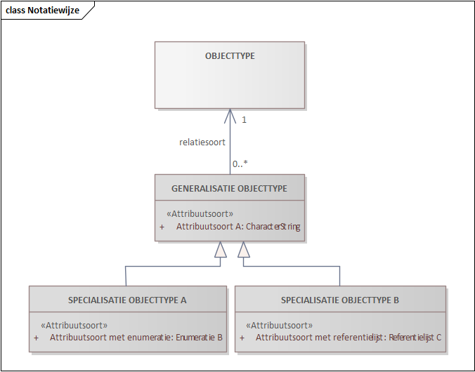
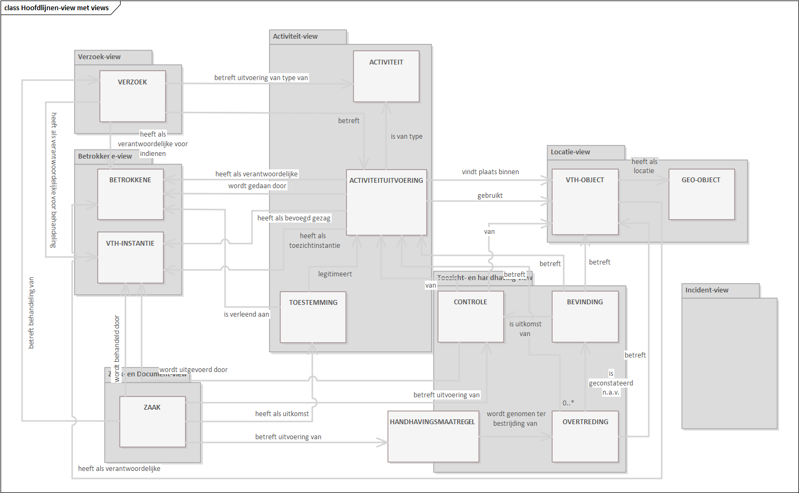

# Informatiemodel op hoofdlijnen {#6CCEB4B8}
## Introductie {#5BF1720C}
In dit en de volgende hoofdstukken beschrijven we het informatiemodel. Het gaat hier om een zgn. conceptueel informatiemodel (CIm), de modellering van de werkelijkheid binnen het beschouwde domein door middel van de structuur, semantiek en de eigenschappen van informatie over dingen in die werkelijkheid. Een conceptueel informatiemodel is onafhankelijk van het ontwerp van en de implementatie in systemen. Het geeft een zo getrouw mogelijke beschrijving van die werkelijkheid en is in natuurlijke taal geformuleerd (dit kan op gespannen voet staan voor modelelementen die overgenomen zijn uit andere informatiemodellen). 
</img>
We lichten het informatiemodel toe aan de hand van zgn. views, een selectie van onderdelen van het informatiemodel voor een bepaald thema. Per view is het desbetreffende deel van het informatiemodel in twee diagrammen uitgewerkt. Het telkens eerste diagram bevat de objecttypen die tot de kern van die view behoren (in donkerder grijs) met alle daaraan gerelateerde andere objecttypen (in lichter grijs). Eventuele relaties tussen de laatstgenoemde objecttypen zijn niet weergegeven (zie daarvoor de view waarop het desbetreffende objecttype tot de kern behoort). Het telkens tweede diagram bevat de objecttypen die tot de kern van de view behoren, hun attribuutsoorten en hun relaties naar andere objecttypen (dus niet relaties vanuit andere objecttypen naar de ‘kern-objecttypen’). Op deze wijze zijn in een dergelijk diagram alle eigenschappen van ‘kern-objecttypen’ verbeeld. 
Bijlage 1 bevat een overzicht van de views met hun ‘kern-objecttypen’. Daarin is snel te vinden in welke view een objecttype als ‘kern-objecttype’ is uitgewerkt.   
In de volgende paragraaf beschrijven we de structuur van het informatiemodel op hoofdlijnen, in hoofdstuk 3 in meer detail aan de hand van de views en diagrammen. In hoofdstuk 4 specificeren we de objecttypen, in hoofdstuk 5 de attribuut- en relatiesoorten en in hoofdstuk 6 de waardenlijsten. 
## 825547752000De hoofdlijnen {#12E3403A}
191414258673

Figuur 3: CIm VTH FLo op hoofdlijnen

Figuur 3: CIm VTH FLo op hoofdlijnen

Deze view geeft een overzicht van de belangrijkste objecttypen in het model. Lang niet alle objecttypen zijn hierin opgenomen, evenmin als alle relaties. Zie daarvoor de detail-views.  
Centraal staan de Activiteituitvoering, de uitvoering van een (type) Activiteit door een Betrokkene in, op of met een VTH-object, en dat VTH-object zelf. Qua informatie hierover gaat het om zowel de gereguleerde situatie (wat is er vergund, gemeld et cetera) als de feitelijke situatie (dit geldt ook voor andere objecttypen, indien van toepassing). Om een Activiteit uit te mogen voeren (een Activiteituitvoering) moet voor veel Activiteiten een Verzoek ingediend worden en een Toestemming (in een vergunning) verleend zijn (of een melding zijn gedaan of voldaan zijn aan een informatieplicht). Die uitvoering vindt plaats binnen, of maakt gebruik van een zgn. VTH-object.   
Op de Activiteituitvoeringen en bepaalde VTH-objecten wordt toezicht gehouden en waar nodig gehandhaafd. Centraal daarin staat de Controle op naleving van de gestelde regels. Een aanleiding voor een Controle is bijvoorbeeld een Incident (niet vermeld in de figuur). Naar aanleiding van Bevindingen bij een Controle kan geoordeeld worden dat er sprake is van Overtredingen. Deze kunnen leiden tot handhaving door middel van het opleggen van Handhavingsmaatregelen.  
Processen voor bijvoorbeeld het verlenen van Toestemmingen of het uitvoeren van Controles worden zaakgericht uitgevoerd. De gegevens over die procesuitvoering worden als Zaak vastgelegd.
In onderstaande figuur wordt gevisualiseerd in welke view de getoonde objecttypen te vinden zijn; de views zelf bevatten meer objecttypen.
 
 
<figure id='d4e1411'></img>
<figcaption>Figuur 4: CIm VTH FLo op hoofdlijnen met views</figcaption></figure>

