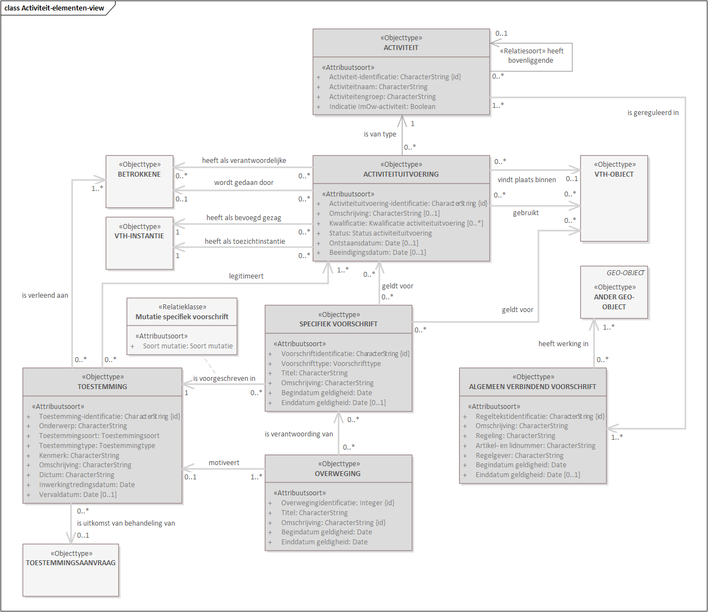
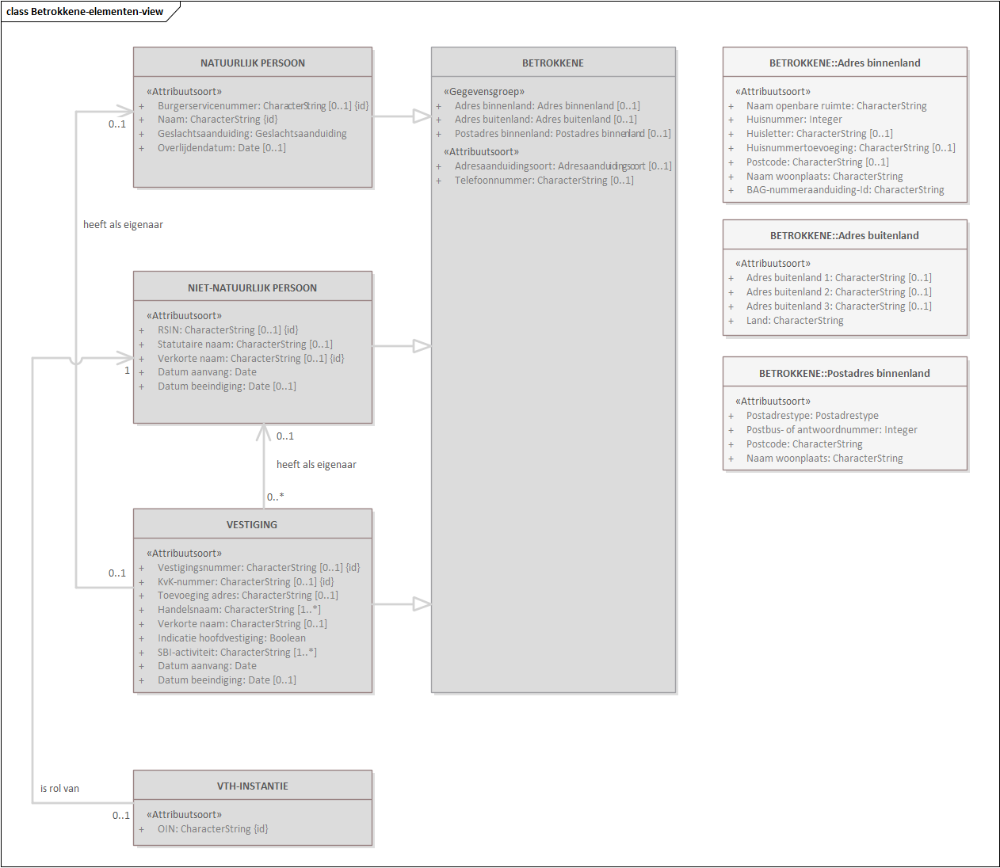
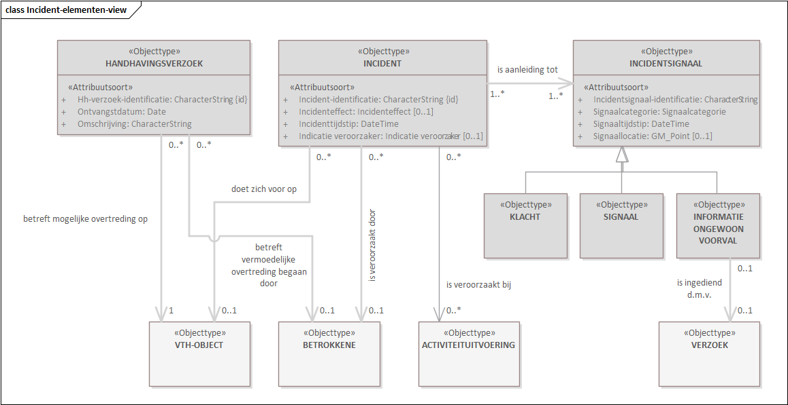
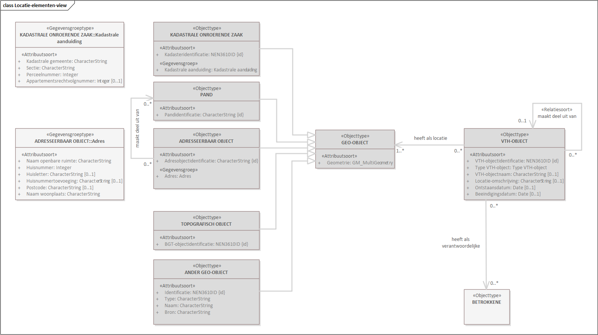
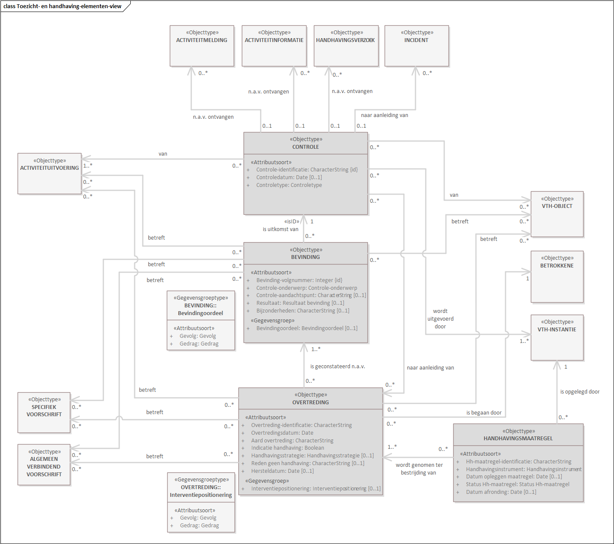
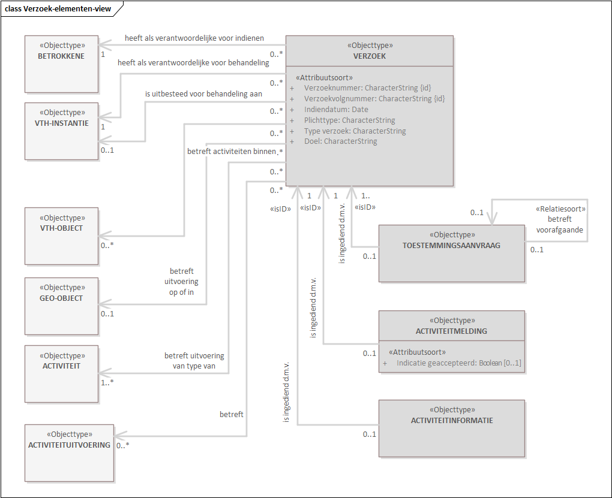
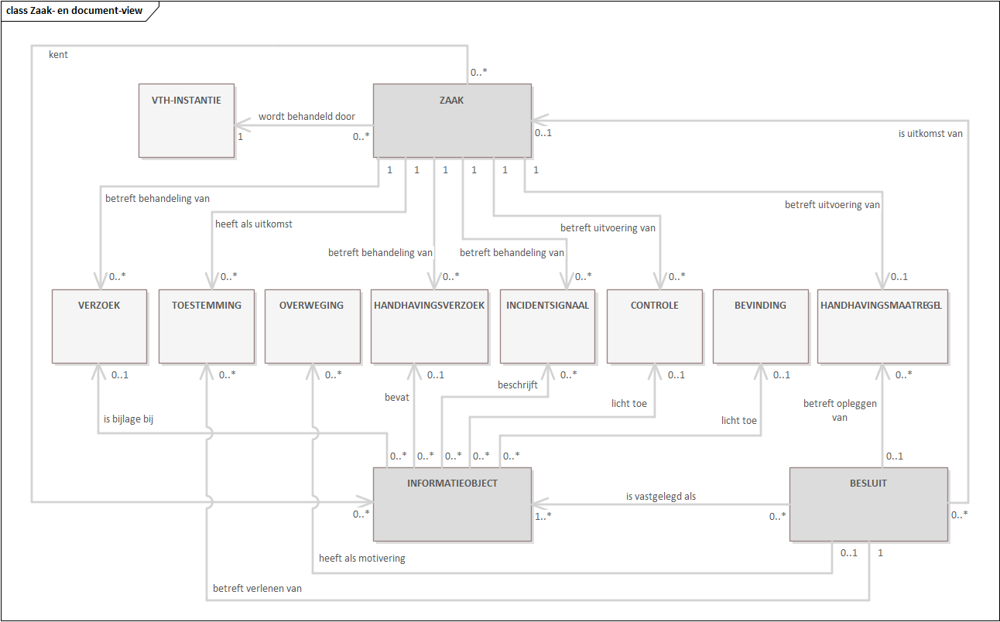
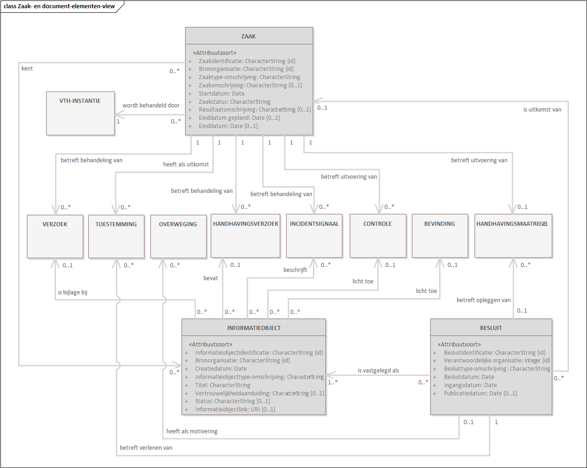

# Informatiemodel in detail {#3177618B}
In dit hoofdstuk visualiseren we de structuur van het informatiemodel en lichten deze toe. We doen dat door middel van een aantal ‘views’ waarin we telkens een deel van het informatiemodel belichten. Per view twee diagrammen, zie par. 2.1. Om een goed beeld te krijgen van de samenhang en het geheel, overlappen de views. De specificaties van de in de views vermelde objecttypen en relatiesoorten vermelden we in de volgende hoofdstukken. De views zijn hieronder in alfabetische volgorde opgenomen. Het betreffen:
<ul><li>Activiteitview</li>
<li>Betrokkene-view</li>
<li>Incident-view</li>
<li>Locatie-view</li>
<li>Toezicht- en handhaving-view</li>
<li>Verzoek-view</li>
<li>Zaak- en documentview.</li>
</ul>
## 275775384709

Figuur 5: Activiteit-view

Figuur 5: Activiteit-view

left31559500Activiteit-view {#4DAAA8AE}
Deze view toont het deel van het model dat gaat over activiteiten met effect op de fysieke leefomgeving en de daarvoor gestelde regels. Daarin is de Activiteituitvoering één van de twee kernen van het model (de ander is het VTH-object), zijnde een door een Betrokkene op of in een VTH-object uitgevoerde (of voorgenomen) Activiteit. 
Qua informatie over een Activiteituitvoering gaat het om zowel de gereguleerde situatie (wat is er toegestaan, gemeld et cetera) als de feitelijke situatie (wat vindt er daadwerkelijk plaats). Een Activiteituitvoering is altijd van een type Activiteit, een soort van tabel met alle mogelijke typen activiteiten (‘activiteitnamen’), zoals 'lassen van metalen' en 'dakkapel bouwen', die in wet- en regelgeving genoemd zijn. Voor elke Activiteit zijn Algemeen verbindende voorschriften van toepassing, de voor die Activiteit geldende wet- en regelgeving waaraan eenieder zich dient te houden.  
Er zijn allerlei Activiteituitvoeringen.   
- die waarvoor geen vergunning, melding en informatieplicht van toepassing is om de activiteit te mogen starten,   
- waarvoor een Toestemming is verleend (zoals een vergunning),  
- waarvoor een Activiteitmelding is gedaan, en
- waarvoor voldaan is aan een informatieplicht.  
Een Toestemming is verleend, aan de desbetreffende Betrokkene, middels een Besluit zijnde een beschikking n.a.v. een Toestemmingsaanvraag en is de uitkomst van een Zaak waarin die aanvraag behandeld is. Als er sprake is van een Toestemming, dan kunnen er Specifieke voorschriften van toepassing zijn op die Activiteituitvoering. Ook kunnen die specifiek van toepassing zijn op het VTH-object waarbinnen de Activiteituitvoering plaats vindt (bijvoorbeeld een windturbine). En een Activiteituitvoering kan ook plaats vinden in of met behulp van een technische eenheid (installatie, voorziening e.d.), waarvoor Specifieke voorschriften kunnen gelden. Een dergelijke technische eenheid wordt tevens als VTH-object vastgelegd.  
De Activiteituitvoering vindt plaats door een Betrokkene zijnde een rechtspersoon. Die Betrokkene voert haar activiteiten uit op of in een VTH-object. De Betrokkene die de activiteit uitvoert kan een ander zijn dan de Betrokkene (een rechtspersoon) die verantwoordelijk is voor die uitvoering van de activiteit (laatstgenoemde is veelal degene aan wie de Toestemming is verleend, door wie de Activiteitmelding is gedaan dan wel die de Activiteitinformatie heeft verstrekt).  
Voor vergunningverlening, toezicht en handhaving betreffende de Activiteituitvoering is een VTH-instantie als bevoegd gezag verantwoordelijk. Het feitelijke toezicht en handhaving kan plaatsvinden door een andere VTH-instantie, namens het bevoegd gezag, zoals een Omgevingsdienst.
</img>
## 69855722620

Figuur 7: Betrokkene-view

Figuur 7: Betrokkene-view

left29781500Betrokkene-view {#2406E209}
Deze view toont het deel van het model dat gaat over de Betrokkene. Een Betrokkene is een actor die in één of meer rollen direct of indirect betrokken is bij de uitvoering in het VTH-stelsel (bevoegd gezag, initiatiefnemer, handhavende instantie, vergunninghouder e.d.). Die rollen zijn gemodelleerd in relaties naar desbetreffende objecttypen. Zo vinden Activiteituitvoeringen in de fysieke leefomgeving plaats door een Betrokkene. Indien een rol uitgeoefend wordt door een organisatie die op wettelijke grondslag VTH-taken uitoefent, zoals een bevoegd gezag, dan is dat gemodelleerd als generieke rol VTH-instantie.    
Een Betrokkene is een zgn. generalisatie van andere objecttypen d.w.z. is telkens of een Natuurlijk persoon, een Niet-natuurlijk persoon of een Vestiging. Het kan dus grofweg een 'mens' zijn of een bedrijf of organisatie, zoals een uitvoerder van milieubelastende activiteiten of een gemeente als bevoegd gezag. In het laatstgenoemde geval is er sprake van een Niet-natuurlijk persoon in haar rol als VTH-instantie. 
De zgn. maatschappelijke activiteit uit het Handelsregister (KvK), met als identificatie het KvK-nummer, is hier gemodelleerd in combinatie met Vestiging. De maatschappelijke activiteit heeft een eigenaar. In het geval van een eenmanszaak is dat een Natuurlijk persoon, in andere gevallen een Niet-natuurlijk persoon. 
Een Natuurlijk persoon en een Niet-natuurlijk persoon oefent haar (economische) activiteiten uit in Vestigingen (voor in het HR ingeschreven maatschappelijke activiteiten), geïdentificeerd met behulp van een Vestigingsnummer. Daar waar Natuurlijke en Niet-natuurlijke personen rechten kunnen hebben (en als rechtspersoon kunnen acteren), geldt dat niet voor een Vestiging. Wel kan een Vestiging relevant zijn om contact mee te hebben inzake gebeurtenissen in de fysieke leefomgeving v.w.b. het VTH-stelsel (bijvoorbeeld vanwege geluidsoverlast bij het lossen van vrachtwagens bij een vestiging van een supermarktketen).  
</img>
## 03529330

Figuur 9: Incident-view

Figuur 9: Incident-view

left22860000Incident-view {#35BC15E6}
Deze view toont het deel van het model dat gaat over incidenten en handhavingsverzoeken. Zij vormen een aanleiding om een Controle uit te voeren.  
Een Incident wordt geconstateerd naar aanleiding van een Signaal dat er ergens wellicht 'iets aan de hand is', een ontvangen Klacht of verstrekte Informatie (over een) ongewoon voorval. Meerdere Incidentsignalen kunnen betrekking hebben op hetzelfde Incident (bijvoorbeeld meerdere klachten over dezelfde stankoverlast).    
Een Handhavingsverzoek wordt ontvangen, met opgave van door wie en waar de vermoedelijke overtreding begaan is.  
Incidenten en Handhavingsverzoeken vormen een aanleiding om een Controle uit te voeren. 
 
 
</img>
## 1968528257500184155329555

Figuur 11: Locatie-view

Figuur 11: Locatie-view

Locatie-view {#5728FBE1}
Deze view zoomt in op de relevantie van ruimtelijke objecten voor het informatiemodel. Er worden op hoofdlijnen twee soorten objecten onderscheiden: het VTH-OBJECT en het GEO-OBJECT.  
Het VTH-object vormt, naast ACTIVITEITUITVOERING, de tweede kern van het model. Het gaat dan om een fysieke locatie met opstallen, een dergelijke opstal zelf, een technische installatie of voorziening of combinaties hiervan waar activiteiten plaatsvinden waarvoor wet- en regelgeving geldt. Die kan betrekking hebben op een activiteituitvoering maar ook op een VTH-object zelf.  
Het is de samenhang van locaties, installaties e.d. en de context waarin die samenhang gebruikt wordt wat de aard en omvang van een VTH-object bepaalt. Eenzelfde deel van de fysieke leefomgeving, zoals een gebouw of een perceel, kan dus deel uitmaken van verschillende VTH-objecten, afhankelijk van de context. De feitelijke 'plek op aarde' van een VTH-object wordt vastgelegd door middel van één of meer gerelateerde Geo-objecten.
Een individueel Geo-object betreft een ruimtelijk object ('een plek' in Nederland dan wel het object wat op een plek staat) dat relevant is voor het VTH-stelsel. Wat de relevantie van dat Geo-object is, wordt pas duidelijk door de relatie van dat Geo-object met één of meer instanties van een ander objecttype, zoals met een VTH-object (de locatie van het VTH-object) of met een Verzoek (de zgn. projectlocatie of locatie van het initiatief). Vice versa verkrijgt bijvoorbeeld een VTH-object zijn 'plek op aarde' door daaraan één of meer Geo-objecten te relateren.  
</img>
15423838394

Figuur 12: Locatie-view met attribuutsoorten van 'kern-objecttypen' in deze view

Figuur 12: Locatie-view met attribuutsoorten van 'kern-objecttypen' in deze view

.
## left4976858

Figuur 13: Toezicht- en handhaving-view

0

Figuur 13: Toezicht- en handhaving-view

left29337000Toezicht- en handhaving-view {#302AA412}
Deze view toont het deel van het model dat gaat over toezicht en handhaving. Toezicht wordt vorm gegeven met Controles.  
Een Controle kan plaatsvinden vanwege diverse redenen, zoals een reguliere controle, projectmatig toezicht, een incident, ontvangen Activiteitinformatie, een Handhavingsverzoek of vanwege een hercontrole om te bezien of een Overtreding (blijvend) is beëindigd.     
Een Controle kan zowel ter plekke uitgevoerd worden als een administratieve controle ('bureau-controle') betreffen. Een Controle leidt tot Bevindingen. Daaruit kan geconstateerd worden dat er sprake is van een Overtreding(en). Door toepassing van de handhavingsstrategie kan hierop een Handhavingsmaatregel getroffen worden in een handhavingsBesluit en ten uitvoer gelegd worden.  
Wat het 'object van toezicht' is, verschilt naar gelang de aard van de Controle en de overtreden Activiteituitvoering. Bij bijvoorbeeld verschillende Controles van dezelfde verantwoordelijke voor hetzelfde VTH-object kan het de ene keer gaan om een deel van dat VTH-object voor een groep van activiteiten en de andere keer om één activiteit in een bepaalde installatie. Wat telkens het 'object van toezicht' is blijkt uit de combinatie van gecontroleerde Activiteituitvoeringen, de verantwoordelijke daarvoor en de locatie(s) (VTH-objecten) waar die Activiteituitvoeringen plaats vinden. 

</img>
## 38104066540

Figuur 15: Verzoek-view

Figuur 15: Verzoek-view

1905030652300Verzoek-view {#06D7D3D0}
Deze view toont het deel van het model dat gaat over het indienen en behandelen van verzoeken (zoals in het DSO bedoeld), zoals vergunningaanvragen, activiteitmeldingen en ingediende activiteitinformatie (i.v.m. een informatieplicht). Centraal hierin staat het Verzoek. 
Het Verzoek wordt hier onderscheiden in vier subtypen (Toestemmingsaanvraag, Activiteitmelding, Activiteitinformatie en Informatie ongewoon voorval). Een verzoek wordt ingediend door, in Omgevingswettermen, een initiatiefnemer, die hier beschouwd wordt als een rol van een Betrokkene in zijn of haar verantwoordelijkheid voor het indienen van een verzoek. Een verzoek gaat altijd over één of meer typen Activiteiten op een verzameling Geo-objecten. Een Verzoek kan nieuwe maar ook bestaande Activiteituitvoeringen betreffen d.w.z. Activiteiten die al eerder vergund of gemeld zijn en/of al in uitvoering zijn. Het VTH-object (of: de VTH-objecten) dat het betreft volgt dan uit die Activiteituitvoeringen. Betreft het nog niet eerder bekende Activiteituitvoeringen dan wordt het desbetreffende VTH-object expliciet vastgelegd.  
Voor de behandeling van een Verzoek is een VTH-instantie in zijn rol als bevoegd gezag verantwoordelijk. Die behandeling vindt plaats in een Zaak door een VTH-instantie in zijn rol als behandelaar van verzoeken. 
Een uitkomst van die Zaak cq. de behandeling van dat Verzoek kan een (eventueel gewijzigde) Toestemming zijn (tenzij de aanvraag wordt afgewezen) of een verwerkte Activiteitmelding, Activiteitinformatie of Informatie ongewoon voorval. Een Activiteitmelding wordt 'slechts' verwerkt (en leidt niet tot een uitkomst vergelijkbaar met een Toestemming) en kan evenals een verwerkte ActiviteitInformatie of Informatie ongewoon voorval aanleiding geven tot het houden van toezicht, zie de Toezicht- en handhaving-view.
</img>
## Zaak- en document-view {#7622E1FB}
<figure id='d4e3764'></img>
<figcaption>Figuur 17: Zaak- en document-view</figcaption></figure>

Deze view toont hoe zaken, besluiten en informatieobjecten (documenten en andere bestanden) hun rol in het beoogde domein spelen ter uitvoering en documentatie van de desbetreffende processen.  
Er zijn meerdere aanleidingen om een zaak te starten en te behandelen. Informatie over die aanleidingen is opgenomen bij de desbetreffende objecttypen, zoals Verzoek en Controle. Zaken worden behandeld door VTH-instanties. De uitkomst van een zaak kan een Besluit zijn, zoals de vergunning waarmee Toestemming wordt verleend of een handhavingsbesluit waarmee een Handhavingsmaatregel wordt opgelegd.  
Informatie over de onderwerpen waarop een zaak betrekking heeft, wordt zoveel mogelijk gestructureerd vastgelegd d.m.v. de desbetreffende objecttypen. In sommige gevallen wordt informatie vastgelegd in een Informatieobject. In de view is opgenomen welke gevallen dat betreft d.w.z. om welke objecttypen het gaat.
 
 
</img>
