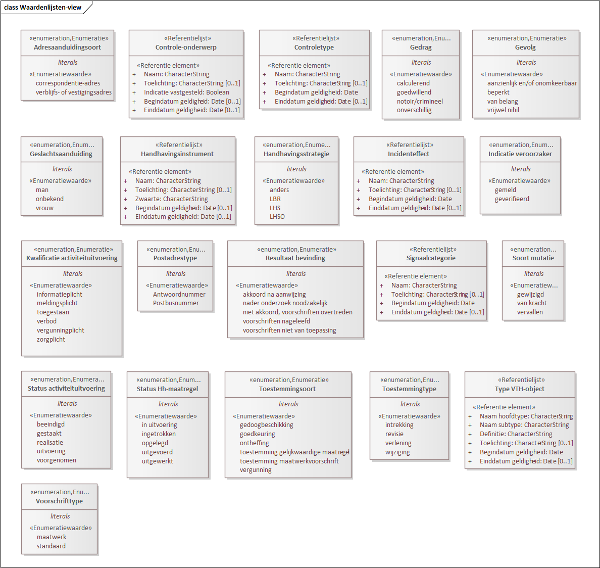

# Waardenlijsten {#289DE600}
</img>
## Enumeratie Adresaanduidingsoort {#59353AC6}
<table id='d4e218301' style='width: 100%;'><colgroup><col id='col1' style='width: 100%;'>
</colgroup>
<tbody><tr><td class='left' style='border-top: 0pt none #; border-left: 0pt none #; border-bottom: 0pt none #; border-right: 0pt none #;'>
Waarden van de aanduiding van de aard van het adres bij de Betrokkene.
</td>
</tr>
</tbody>
</table>

<table id='d4e218342' style='width: 100%;'><colgroup><col id='col1' style='width: 40.10852896071723%;'>
<col id='col2' style='width: 59.89147103928276%;'>
</colgroup>
<tbody><tr><td class='left' style='border-top: 0pt none #; border-left: 0pt none #; border-bottom: 0pt none #; border-right: 0pt none #;'>
<i>Waarde</i>
</td>
<td class='left' style='border-top: 0pt none #; border-left: 0pt none #; border-bottom: 0pt none #; border-right: 0pt none #;'>
<i>Omschrijving</i>
</td>
</tr>
<tr><td class='left' style='border-top: 0pt none #; border-left: 0pt none #; border-bottom: 0pt none #; border-right: 0pt none #;'>
<b>correspondentie</b><b>-adres</b>
</td>
<td class='left' style='border-top: 0pt none #; border-left: 0pt none #; border-bottom: 0pt none #; border-right: 0pt none #;'></td>
</tr>
<tr><td class='left' style='border-top: 0pt none #; border-left: 0pt none #; border-bottom: 0pt none #; border-right: 0pt none #;'>
<b>verblijfs</b><b>- of vestigingsadres</b>
</td>
<td class='left' style='border-top: 0pt none #; border-left: 0pt none #; border-bottom: 0pt none #; border-right: 0pt none #;'></td>
</tr>
</tbody>
</table>

## Referentielijst Controletype {#4C8D59E7}
<table id='d4e218506' style='width: 100%;'><colgroup><col id='col1' style='width: 30.211159608352013%;'>
<col id='col2' style='width: 69.788840391648%;'>
</colgroup>
<tbody><tr><td class='left' style='border-top: 0pt none #; border-left: 0pt none #; border-bottom: 0pt none #; border-right: 0pt none #;'>
<b>Naam</b>
</td>
<td class='left' style='border-top: 0pt none #; border-left: 0pt none #; border-bottom: 0pt none #; border-right: 0pt none #;'>
Controletype
</td>
</tr>
<tr><td class='left' style='border-top: 0pt none #; border-left: 0pt none #; border-bottom: 0pt none #; border-right: 0pt none #;'>
<b>Mnemonic</b>
</td>
<td class='left' style='border-top: 0pt none #; border-left: 0pt none #; border-bottom: 0pt none #; border-right: 0pt none #;'></td>
</tr>
<tr><td class='left' style='border-top: 0pt none #; border-left: 0pt none #; border-bottom: 0pt none #; border-right: 0pt none #;'>
<b>Herkomst</b>
</td>
<td class='left' style='border-top: 0pt none #; border-left: 0pt none #; border-bottom: 0pt none #; border-right: 0pt none #;'>
DigiVTH
</td>
</tr>
<tr><td class='left' style='border-top: 0pt none #; border-left: 0pt none #; border-bottom: 0pt none #; border-right: 0pt none #;'>
<b>Definitie</b>
</td>
<td class='left' style='border-top: 0pt none #; border-left: 0pt none #; border-bottom: 0pt none #; border-right: 0pt none #;'>
Benaming van de aanduiding van de aard en diepgang van de controle van de activiteituitvoering(en).
</td>
</tr>
<tr><td class='left' style='border-top: 0pt none #; border-left: 0pt none #; border-bottom: 0pt none #; border-right: 0pt none #;'>
<b>Herkomst definitie</b>
</td>
<td class='left' style='border-top: 0pt none #; border-left: 0pt none #; border-bottom: 0pt none #; border-right: 0pt none #;'></td>
</tr>
<tr><td class='left' style='border-top: 0pt none #; border-left: 0pt none #; border-bottom: 0pt none #; border-right: 0pt none #;'>
<b>Datum opname</b>
</td>
<td class='left' style='border-top: 0pt none #; border-left: 0pt none #; border-bottom: 0pt none #; border-right: 0pt none #;'>
12-6-2025
</td>
</tr>
<tr><td class='left' style='border-top: 0pt none #; border-left: 0pt none #; border-bottom: 0pt none #; border-right: 0pt none #;'>
<b>Data locatie</b>
</td>
<td class='left' style='border-top: 0pt none #; border-left: 0pt none #; border-bottom: 0pt none #; border-right: 0pt none #;'></td>
</tr>
<tr><td class='left' style='border-top: 0pt none #; border-left: 0pt none #; border-bottom: 0pt none #; border-right: 0pt none #;'>
<b>Unieke aanduiding</b>
</td>
<td class='left' style='border-top: 0pt none #; border-left: 0pt none #; border-bottom: 0pt none #; border-right: 0pt none #;'></td>
</tr>
</tbody>
</table>

### Overzicht referentie elementen {#7B4B6987}
<table id='d4e218829' style='width: 100%;'><colgroup><col id='col1' style='width: 3.6687507372891353%;'>
<col id='col2' style='width: 23.062404152412412%;'>
<col id='col3' style='width: 47.540403444614846%;'>
<col id='col4' style='width: 17.164091069953994%;'>
<col id='col5' style='width: 8.564350595729621%;'>
</colgroup>
<tbody><tr><td class='left' style='border-top: 0pt none #; border-left: 0pt none #; border-bottom: 0pt none #; border-right: 0pt none #;'></td>
<td class='left' style='border-top: 0pt none #; border-left: 0pt none #; border-bottom: 0pt none #; border-right: 0pt none #;'>
<i>Referentie element</i>
</td>
<td class='left' style='border-top: 0pt none #; border-left: 0pt none #; border-bottom: 0pt none #; border-right: 0pt none #;'>
<i>Definitie</i>
</td>
<td class='left' style='border-top: 0pt none #; border-left: 0pt none #; border-bottom: 0pt none #; border-right: 0pt none #;'>
<i>Formaat</i>
</td>
<td class='left' style='border-top: 0pt none #; border-left: 0pt none #; border-bottom: 0pt none #; border-right: 0pt none #;'>
<i>Card</i>
</td>
</tr>
<tr><td class='left' style='border-top: 0pt none #; border-left: 0pt none #; border-bottom: 0pt none #; border-right: 0pt none #;'>
 
</td>
<td class='left' style='border-top: 0pt none #; border-left: 0pt none #; border-bottom: 0pt none #; border-right: 0pt none #;'>
Naam
</td>
<td class='left' style='border-top: 0pt none #; border-left: 0pt none #; border-bottom: 0pt none #; border-right: 0pt none #;'>
Benaming van het controletype.
</td>
<td class='left' style='border-top: 0pt none #; border-left: 0pt none #; border-bottom: 0pt none #; border-right: 0pt none #;'>
CharacterString
</td>
<td class='left' style='border-top: 0pt none #; border-left: 0pt none #; border-bottom: 0pt none #; border-right: 0pt none #;'>
1
</td>
</tr>
<tr><td class='left' style='border-top: 0pt none #; border-left: 0pt none #; border-bottom: 0pt none #; border-right: 0pt none #;'>
 
</td>
<td class='left' style='border-top: 0pt none #; border-left: 0pt none #; border-bottom: 0pt none #; border-right: 0pt none #;'>
Toelichting
</td>
<td class='left' style='border-top: 0pt none #; border-left: 0pt none #; border-bottom: 0pt none #; border-right: 0pt none #;'>
Verduidelijking van het controletype teneinde dat begrijpelijker te maken.
</td>
<td class='left' style='border-top: 0pt none #; border-left: 0pt none #; border-bottom: 0pt none #; border-right: 0pt none #;'>
CharacterString
</td>
<td class='left' style='border-top: 0pt none #; border-left: 0pt none #; border-bottom: 0pt none #; border-right: 0pt none #;'>
0 .. 1
</td>
</tr>
<tr><td class='left' style='border-top: 0pt none #; border-left: 0pt none #; border-bottom: 0pt none #; border-right: 0pt none #;'>
 
</td>
<td class='left' style='border-top: 0pt none #; border-left: 0pt none #; border-bottom: 0pt none #; border-right: 0pt none #;'>
Begindatum geldigheid
</td>
<td class='left' style='border-top: 0pt none #; border-left: 0pt none #; border-bottom: 0pt none #; border-right: 0pt none #;'>
De datum vanaf wanneer (de naam van) het controletype een landelijke standaardwaarde is.
</td>
<td class='left' style='border-top: 0pt none #; border-left: 0pt none #; border-bottom: 0pt none #; border-right: 0pt none #;'>
Date
</td>
<td class='left' style='border-top: 0pt none #; border-left: 0pt none #; border-bottom: 0pt none #; border-right: 0pt none #;'>
1
</td>
</tr>
<tr><td class='left' style='border-top: 0pt none #; border-left: 0pt none #; border-bottom: 0pt none #; border-right: 0pt none #;'>
 
</td>
<td class='left' style='border-top: 0pt none #; border-left: 0pt none #; border-bottom: 0pt none #; border-right: 0pt none #;'>
Einddatum geldigheid
</td>
<td class='left' style='border-top: 0pt none #; border-left: 0pt none #; border-bottom: 0pt none #; border-right: 0pt none #;'>
De datum vanaf wanneer het controletype geen landelijke standaardwaarde meer is.
</td>
<td class='left' style='border-top: 0pt none #; border-left: 0pt none #; border-bottom: 0pt none #; border-right: 0pt none #;'>
Date
</td>
<td class='left' style='border-top: 0pt none #; border-left: 0pt none #; border-bottom: 0pt none #; border-right: 0pt none #;'>
0 .. 1
</td>
</tr>
</tbody>
</table>

<table id='d4e219318' style='width: 100%;'><colgroup><col id='col1' style='width: 100%;'>
</colgroup>
<tbody><tr><td class='left' style='border-top: 0pt none #; border-left: 0pt none #; border-bottom: 0pt none #; border-right: 0pt none #;'>
<b>Toelichting</b>
</td>
</tr>
</tbody>
</table>

<table id='d4e219361' style='width: 100%;'><colgroup><col id='col1' style='width: 5.473634540521411%;'>
<col id='col2' style='width: 94.52636545947858%;'>
</colgroup>
<tbody><tr><td class='left' style='border-top: 0pt none #; border-left: 0pt none #; border-bottom: 0pt none #; border-right: 0pt none #;'>
 
</td>
<td class='left' style='border-top: 0pt none #; border-left: 0pt none #; border-bottom: 0pt none #; border-right: 0pt none #;'>
Het betreft de landelijk te gebruiken lijst met waarden voor controletypen.
</td>
</tr>
</tbody>
</table>

## Referentielijst Controle-onderwerp {#53961A96}
<table id='d4e219440' style='width: 100%;'><colgroup><col id='col1' style='width: 30.211159608352013%;'>
<col id='col2' style='width: 69.788840391648%;'>
</colgroup>
<tbody><tr><td class='left' style='border-top: 0pt none #; border-left: 0pt none #; border-bottom: 0pt none #; border-right: 0pt none #;'>
<b>Naam</b>
</td>
<td class='left' style='border-top: 0pt none #; border-left: 0pt none #; border-bottom: 0pt none #; border-right: 0pt none #;'>
Controle-onderwerp
</td>
</tr>
<tr><td class='left' style='border-top: 0pt none #; border-left: 0pt none #; border-bottom: 0pt none #; border-right: 0pt none #;'>
<b>Mnemonic</b>
</td>
<td class='left' style='border-top: 0pt none #; border-left: 0pt none #; border-bottom: 0pt none #; border-right: 0pt none #;'></td>
</tr>
<tr><td class='left' style='border-top: 0pt none #; border-left: 0pt none #; border-bottom: 0pt none #; border-right: 0pt none #;'>
<b>Herkomst</b>
</td>
<td class='left' style='border-top: 0pt none #; border-left: 0pt none #; border-bottom: 0pt none #; border-right: 0pt none #;'>
DigiVTH
</td>
</tr>
<tr><td class='left' style='border-top: 0pt none #; border-left: 0pt none #; border-bottom: 0pt none #; border-right: 0pt none #;'>
<b>Definitie</b>
</td>
<td class='left' style='border-top: 0pt none #; border-left: 0pt none #; border-bottom: 0pt none #; border-right: 0pt none #;'>
Benaming van een aspect van de uitvoering van activiteiten dat tijdens een Controle wordt onderzocht op de naleving van de geldende regels voor die activiteiten.
</td>
</tr>
<tr><td class='left' style='border-top: 0pt none #; border-left: 0pt none #; border-bottom: 0pt none #; border-right: 0pt none #;'>
<b>Herkomst definitie</b>
</td>
<td class='left' style='border-top: 0pt none #; border-left: 0pt none #; border-bottom: 0pt none #; border-right: 0pt none #;'></td>
</tr>
<tr><td class='left' style='border-top: 0pt none #; border-left: 0pt none #; border-bottom: 0pt none #; border-right: 0pt none #;'>
<b>Datum opname</b>
</td>
<td class='left' style='border-top: 0pt none #; border-left: 0pt none #; border-bottom: 0pt none #; border-right: 0pt none #;'>
22-5-2025
</td>
</tr>
<tr><td class='left' style='border-top: 0pt none #; border-left: 0pt none #; border-bottom: 0pt none #; border-right: 0pt none #;'>
<b>Data locatie</b>
</td>
<td class='left' style='border-top: 0pt none #; border-left: 0pt none #; border-bottom: 0pt none #; border-right: 0pt none #;'></td>
</tr>
<tr><td class='left' style='border-top: 0pt none #; border-left: 0pt none #; border-bottom: 0pt none #; border-right: 0pt none #;'>
<b>Unieke aanduiding</b>
</td>
<td class='left' style='border-top: 0pt none #; border-left: 0pt none #; border-bottom: 0pt none #; border-right: 0pt none #;'></td>
</tr>
</tbody>
</table>

### Overzicht referentie elementen {#652789F4}
<table id='d4e219763' style='width: 100%;'><colgroup><col id='col1' style='width: 3.6687507372891353%;'>
<col id='col2' style='width: 23.062404152412412%;'>
<col id='col3' style='width: 47.540403444614846%;'>
<col id='col4' style='width: 17.164091069953994%;'>
<col id='col5' style='width: 8.564350595729621%;'>
</colgroup>
<tbody><tr><td class='left' style='border-top: 0pt none #; border-left: 0pt none #; border-bottom: 0pt none #; border-right: 0pt none #;'></td>
<td class='left' style='border-top: 0pt none #; border-left: 0pt none #; border-bottom: 0pt none #; border-right: 0pt none #;'>
<i>Referentie element</i>
</td>
<td class='left' style='border-top: 0pt none #; border-left: 0pt none #; border-bottom: 0pt none #; border-right: 0pt none #;'>
<i>Definitie</i>
</td>
<td class='left' style='border-top: 0pt none #; border-left: 0pt none #; border-bottom: 0pt none #; border-right: 0pt none #;'>
<i>Formaat</i>
</td>
<td class='left' style='border-top: 0pt none #; border-left: 0pt none #; border-bottom: 0pt none #; border-right: 0pt none #;'>
<i>Card</i>
</td>
</tr>
<tr><td class='left' style='border-top: 0pt none #; border-left: 0pt none #; border-bottom: 0pt none #; border-right: 0pt none #;'>
 
</td>
<td class='left' style='border-top: 0pt none #; border-left: 0pt none #; border-bottom: 0pt none #; border-right: 0pt none #;'>
Naam
</td>
<td class='left' style='border-top: 0pt none #; border-left: 0pt none #; border-bottom: 0pt none #; border-right: 0pt none #;'>
Benaming van het controle-onderwerp.
</td>
<td class='left' style='border-top: 0pt none #; border-left: 0pt none #; border-bottom: 0pt none #; border-right: 0pt none #;'>
CharacterString
</td>
<td class='left' style='border-top: 0pt none #; border-left: 0pt none #; border-bottom: 0pt none #; border-right: 0pt none #;'>
1
</td>
</tr>
<tr><td class='left' style='border-top: 0pt none #; border-left: 0pt none #; border-bottom: 0pt none #; border-right: 0pt none #;'>
 
</td>
<td class='left' style='border-top: 0pt none #; border-left: 0pt none #; border-bottom: 0pt none #; border-right: 0pt none #;'>
Toelichting
</td>
<td class='left' style='border-top: 0pt none #; border-left: 0pt none #; border-bottom: 0pt none #; border-right: 0pt none #;'>
Verduidelijking van het controle-onderwerp teneinde dat begrijpelijker te maken.
</td>
<td class='left' style='border-top: 0pt none #; border-left: 0pt none #; border-bottom: 0pt none #; border-right: 0pt none #;'>
CharacterString
</td>
<td class='left' style='border-top: 0pt none #; border-left: 0pt none #; border-bottom: 0pt none #; border-right: 0pt none #;'>
0 .. 1
</td>
</tr>
<tr><td class='left' style='border-top: 0pt none #; border-left: 0pt none #; border-bottom: 0pt none #; border-right: 0pt none #;'>
 
</td>
<td class='left' style='border-top: 0pt none #; border-left: 0pt none #; border-bottom: 0pt none #; border-right: 0pt none #;'>
Indicatie vastgesteld
</td>
<td class='left' style='border-top: 0pt none #; border-left: 0pt none #; border-bottom: 0pt none #; border-right: 0pt none #;'>
Aanduiding of het controle-onderwerp een standaard en landelijk te gebruiken waarde betreft.
</td>
<td class='left' style='border-top: 0pt none #; border-left: 0pt none #; border-bottom: 0pt none #; border-right: 0pt none #;'>
Boolean
</td>
<td class='left' style='border-top: 0pt none #; border-left: 0pt none #; border-bottom: 0pt none #; border-right: 0pt none #;'>
1
</td>
</tr>
<tr><td class='left' style='border-top: 0pt none #; border-left: 0pt none #; border-bottom: 0pt none #; border-right: 0pt none #;'>
 
</td>
<td class='left' style='border-top: 0pt none #; border-left: 0pt none #; border-bottom: 0pt none #; border-right: 0pt none #;'>
Begindatum geldigheid
</td>
<td class='left' style='border-top: 0pt none #; border-left: 0pt none #; border-bottom: 0pt none #; border-right: 0pt none #;'>
De datum vanaf wanneer (de naam van) het controle-onderwerp een landelijke standaardwaarde is.
</td>
<td class='left' style='border-top: 0pt none #; border-left: 0pt none #; border-bottom: 0pt none #; border-right: 0pt none #;'>
Date
</td>
<td class='left' style='border-top: 0pt none #; border-left: 0pt none #; border-bottom: 0pt none #; border-right: 0pt none #;'>
0 .. 1
</td>
</tr>
<tr><td class='left' style='border-top: 0pt none #; border-left: 0pt none #; border-bottom: 0pt none #; border-right: 0pt none #;'>
 
</td>
<td class='left' style='border-top: 0pt none #; border-left: 0pt none #; border-bottom: 0pt none #; border-right: 0pt none #;'>
Einddatum geldigheid
</td>
<td class='left' style='border-top: 0pt none #; border-left: 0pt none #; border-bottom: 0pt none #; border-right: 0pt none #;'>
De datum vanaf wanneer het controle-onderwerp geen landelijke standaardwaarde meer is.
</td>
<td class='left' style='border-top: 0pt none #; border-left: 0pt none #; border-bottom: 0pt none #; border-right: 0pt none #;'>
Date
</td>
<td class='left' style='border-top: 0pt none #; border-left: 0pt none #; border-bottom: 0pt none #; border-right: 0pt none #;'>
0 .. 1
</td>
</tr>
</tbody>
</table>

<table id='d4e220347' style='width: 100%;'><colgroup><col id='col1' style='width: 100%;'>
</colgroup>
<tbody><tr><td class='left' style='border-top: 0pt none #; border-left: 0pt none #; border-bottom: 0pt none #; border-right: 0pt none #;'>
<b>Toelichting</b>
</td>
</tr>
</tbody>
</table>

<table id='d4e220390' style='width: 100%;'><colgroup><col id='col1' style='width: 5.473634540521411%;'>
<col id='col2' style='width: 94.52636545947858%;'>
</colgroup>
<tbody><tr><td class='left' style='border-top: 0pt none #; border-left: 0pt none #; border-bottom: 0pt none #; border-right: 0pt none #;'>
 
</td>
<td class='left' style='border-top: 0pt none #; border-left: 0pt none #; border-bottom: 0pt none #; border-right: 0pt none #;'>
 
Het betreft de landelijk te gebruiken lijst met waarden voor controle-elementen. Zoveel mogelijk gaat het om landelijk vastgestelde standaardwaarden. De opzet biedt aan organisaties de mogelijkheid om tijdelijk waarden te hanteren die voorgelegd worden ter vaststelling als standaardwaarden. 
Eén van de standaardwaarden is "niet van toepassing" om te voorzien in de situatie waarin een organisatie alleen controle-aandachtspunten gebruikt en geen (bovenliggende) controle-onderwerpen.
</td>
</tr>
</tbody>
</table>

## Enumeratie Gedrag {#2A038366}
<table id='d4e220460' style='width: 100%;'><colgroup><col id='col1' style='width: 100%;'>
</colgroup>
<tbody><tr><td class='left' style='border-top: 0pt none #; border-left: 0pt none #; border-bottom: 0pt none #; border-right: 0pt none #;'>
Waarden voor de typering van degene die niet voldoet aan de voorschriften voor de fysieke leefomgeving naar de aard van zijn of haar opstelling ten aanzien van het niet voldoen.
</td>
</tr>
</tbody>
</table>

<table id='d4e220501' style='width: 100%;'><colgroup><col id='col1' style='width: 40.10852896071723%;'>
<col id='col2' style='width: 59.89147103928276%;'>
</colgroup>
<tbody><tr><td class='left' style='border-top: 0pt none #; border-left: 0pt none #; border-bottom: 0pt none #; border-right: 0pt none #;'>
<i>Waarde</i>
</td>
<td class='left' style='border-top: 0pt none #; border-left: 0pt none #; border-bottom: 0pt none #; border-right: 0pt none #;'>
<i>Omschrijving</i>
</td>
</tr>
<tr><td class='left' style='border-top: 0pt none #; border-left: 0pt none #; border-bottom: 0pt none #; border-right: 0pt none #;'>
<b>calculerend</b>
</td>
<td class='left' style='border-top: 0pt none #; border-left: 0pt none #; border-bottom: 0pt none #; border-right: 0pt none #;'>
[definitie] 
Code: C
</td>
</tr>
<tr><td class='left' style='border-top: 0pt none #; border-left: 0pt none #; border-bottom: 0pt none #; border-right: 0pt none #;'>
<b>goedwillend</b>
</td>
<td class='left' style='border-top: 0pt none #; border-left: 0pt none #; border-bottom: 0pt none #; border-right: 0pt none #;'>
[definitie] 
Code: A
</td>
</tr>
<tr><td class='left' style='border-top: 0pt none #; border-left: 0pt none #; border-bottom: 0pt none #; border-right: 0pt none #;'>
<b>notoir</b><b>/crimineel</b>
</td>
<td class='left' style='border-top: 0pt none #; border-left: 0pt none #; border-bottom: 0pt none #; border-right: 0pt none #;'>
[definitie] 
Code: D
</td>
</tr>
<tr><td class='left' style='border-top: 0pt none #; border-left: 0pt none #; border-bottom: 0pt none #; border-right: 0pt none #;'>
<b>onverschillig</b>
</td>
<td class='left' style='border-top: 0pt none #; border-left: 0pt none #; border-bottom: 0pt none #; border-right: 0pt none #;'>
[definitie] 
Code: B
</td>
</tr>
</tbody>
</table>

## Enumeratie Geslachtsaanduiding {#7CF26132}
<table id='d4e220768' style='width: 100%;'><colgroup><col id='col1' style='width: 100%;'>
</colgroup>
<tbody><tr><td class='left' style='border-top: 0pt none #; border-left: 0pt none #; border-bottom: 0pt none #; border-right: 0pt none #;'>
Waarden van de aanduiding die aangeeft dat de ingeschrevene een man of een vrouw is, of dat het geslacht (nog) onbekend is.
</td>
</tr>
</tbody>
</table>

<table id='d4e220809' style='width: 100%;'><colgroup><col id='col1' style='width: 40.10852896071723%;'>
<col id='col2' style='width: 59.89147103928276%;'>
</colgroup>
<tbody><tr><td class='left' style='border-top: 0pt none #; border-left: 0pt none #; border-bottom: 0pt none #; border-right: 0pt none #;'>
<i>Waarde</i>
</td>
<td class='left' style='border-top: 0pt none #; border-left: 0pt none #; border-bottom: 0pt none #; border-right: 0pt none #;'>
<i>Omschrijving</i>
</td>
</tr>
<tr><td class='left' style='border-top: 0pt none #; border-left: 0pt none #; border-bottom: 0pt none #; border-right: 0pt none #;'>
<b>man</b>
</td>
<td class='left' style='border-top: 0pt none #; border-left: 0pt none #; border-bottom: 0pt none #; border-right: 0pt none #;'></td>
</tr>
<tr><td class='left' style='border-top: 0pt none #; border-left: 0pt none #; border-bottom: 0pt none #; border-right: 0pt none #;'>
<b>onbekend</b>
</td>
<td class='left' style='border-top: 0pt none #; border-left: 0pt none #; border-bottom: 0pt none #; border-right: 0pt none #;'></td>
</tr>
<tr><td class='left' style='border-top: 0pt none #; border-left: 0pt none #; border-bottom: 0pt none #; border-right: 0pt none #;'>
<b>vrouw</b>
</td>
<td class='left' style='border-top: 0pt none #; border-left: 0pt none #; border-bottom: 0pt none #; border-right: 0pt none #;'></td>
</tr>
</tbody>
</table>

## Enumeratie Gevolg {#378FA99E}
<table id='d4e220987' style='width: 100%;'><colgroup><col id='col1' style='width: 100%;'>
</colgroup>
<tbody><tr><td class='left' style='border-top: 0pt none #; border-left: 0pt none #; border-bottom: 0pt none #; border-right: 0pt none #;'>
Waarden voor de beoordeling van de gevolgen van het niet voldoen aan de voorschriften voor de fysieke leefomgeving.
</td>
</tr>
</tbody>
</table>

<table id='d4e221028' style='width: 100%;'><colgroup><col id='col1' style='width: 40.10852896071723%;'>
<col id='col2' style='width: 59.89147103928276%;'>
</colgroup>
<tbody><tr><td class='left' style='border-top: 0pt none #; border-left: 0pt none #; border-bottom: 0pt none #; border-right: 0pt none #;'>
<i>Waarde</i>
</td>
<td class='left' style='border-top: 0pt none #; border-left: 0pt none #; border-bottom: 0pt none #; border-right: 0pt none #;'>
<i>Omschrijving</i>
</td>
</tr>
<tr><td class='left' style='border-top: 0pt none #; border-left: 0pt none #; border-bottom: 0pt none #; border-right: 0pt none #;'>
<b>aanzienlijk</b><b> en/of onomkeerbaar</b>
</td>
<td class='left' style='border-top: 0pt none #; border-left: 0pt none #; border-bottom: 0pt none #; border-right: 0pt none #;'>
[definitie] 
Code: 4
</td>
</tr>
<tr><td class='left' style='border-top: 0pt none #; border-left: 0pt none #; border-bottom: 0pt none #; border-right: 0pt none #;'>
<b>beperkt</b>
</td>
<td class='left' style='border-top: 0pt none #; border-left: 0pt none #; border-bottom: 0pt none #; border-right: 0pt none #;'>
[definitie] 
Code: 2
</td>
</tr>
<tr><td class='left' style='border-top: 0pt none #; border-left: 0pt none #; border-bottom: 0pt none #; border-right: 0pt none #;'>
<b>van</b><b> belang</b>
</td>
<td class='left' style='border-top: 0pt none #; border-left: 0pt none #; border-bottom: 0pt none #; border-right: 0pt none #;'>
[definitie] 
Code: 3
</td>
</tr>
<tr><td class='left' style='border-top: 0pt none #; border-left: 0pt none #; border-bottom: 0pt none #; border-right: 0pt none #;'>
<b>vrijwel</b><b> nihil</b>
</td>
<td class='left' style='border-top: 0pt none #; border-left: 0pt none #; border-bottom: 0pt none #; border-right: 0pt none #;'>
[definitie] 
Code: 1
</td>
</tr>
</tbody>
</table>

## Referentielijst Handhavingsinstrument {#44F0BAFA}
<table id='d4e221317' style='width: 100%;'><colgroup><col id='col1' style='width: 30.211159608352013%;'>
<col id='col2' style='width: 69.788840391648%;'>
</colgroup>
<tbody><tr><td class='left' style='border-top: 0pt none #; border-left: 0pt none #; border-bottom: 0pt none #; border-right: 0pt none #;'>
<b>Naam</b>
</td>
<td class='left' style='border-top: 0pt none #; border-left: 0pt none #; border-bottom: 0pt none #; border-right: 0pt none #;'>
Handhavingsinstrument
</td>
</tr>
<tr><td class='left' style='border-top: 0pt none #; border-left: 0pt none #; border-bottom: 0pt none #; border-right: 0pt none #;'>
<b>Mnemonic</b>
</td>
<td class='left' style='border-top: 0pt none #; border-left: 0pt none #; border-bottom: 0pt none #; border-right: 0pt none #;'></td>
</tr>
<tr><td class='left' style='border-top: 0pt none #; border-left: 0pt none #; border-bottom: 0pt none #; border-right: 0pt none #;'>
<b>Herkomst</b>
</td>
<td class='left' style='border-top: 0pt none #; border-left: 0pt none #; border-bottom: 0pt none #; border-right: 0pt none #;'>
DigiVTH
</td>
</tr>
<tr><td class='left' style='border-top: 0pt none #; border-left: 0pt none #; border-bottom: 0pt none #; border-right: 0pt none #;'>
<b>Definitie</b>
</td>
<td class='left' style='border-top: 0pt none #; border-left: 0pt none #; border-bottom: 0pt none #; border-right: 0pt none #;'>
Benaming van de aard van de opgelegde Handhavingsmaatregel.
</td>
</tr>
<tr><td class='left' style='border-top: 0pt none #; border-left: 0pt none #; border-bottom: 0pt none #; border-right: 0pt none #;'>
<b>Herkomst definitie</b>
</td>
<td class='left' style='border-top: 0pt none #; border-left: 0pt none #; border-bottom: 0pt none #; border-right: 0pt none #;'></td>
</tr>
<tr><td class='left' style='border-top: 0pt none #; border-left: 0pt none #; border-bottom: 0pt none #; border-right: 0pt none #;'>
<b>Datum opname</b>
</td>
<td class='left' style='border-top: 0pt none #; border-left: 0pt none #; border-bottom: 0pt none #; border-right: 0pt none #;'>
12-6-2025
</td>
</tr>
<tr><td class='left' style='border-top: 0pt none #; border-left: 0pt none #; border-bottom: 0pt none #; border-right: 0pt none #;'>
<b>Data locatie</b>
</td>
<td class='left' style='border-top: 0pt none #; border-left: 0pt none #; border-bottom: 0pt none #; border-right: 0pt none #;'></td>
</tr>
<tr><td class='left' style='border-top: 0pt none #; border-left: 0pt none #; border-bottom: 0pt none #; border-right: 0pt none #;'>
<b>Unieke aanduiding</b>
</td>
<td class='left' style='border-top: 0pt none #; border-left: 0pt none #; border-bottom: 0pt none #; border-right: 0pt none #;'></td>
</tr>
</tbody>
</table>

### Overzicht referentie elementen {#3CD07568}
<table id='d4e221640' style='width: 100%;'><colgroup><col id='col1' style='width: 3.6687507372891353%;'>
<col id='col2' style='width: 23.062404152412412%;'>
<col id='col3' style='width: 47.540403444614846%;'>
<col id='col4' style='width: 17.164091069953994%;'>
<col id='col5' style='width: 8.564350595729621%;'>
</colgroup>
<tbody><tr><td class='left' style='border-top: 0pt none #; border-left: 0pt none #; border-bottom: 0pt none #; border-right: 0pt none #;'></td>
<td class='left' style='border-top: 0pt none #; border-left: 0pt none #; border-bottom: 0pt none #; border-right: 0pt none #;'>
<i>Referentie element</i>
</td>
<td class='left' style='border-top: 0pt none #; border-left: 0pt none #; border-bottom: 0pt none #; border-right: 0pt none #;'>
<i>Definitie</i>
</td>
<td class='left' style='border-top: 0pt none #; border-left: 0pt none #; border-bottom: 0pt none #; border-right: 0pt none #;'>
<i>Formaat</i>
</td>
<td class='left' style='border-top: 0pt none #; border-left: 0pt none #; border-bottom: 0pt none #; border-right: 0pt none #;'>
<i>Card</i>
</td>
</tr>
<tr><td class='left' style='border-top: 0pt none #; border-left: 0pt none #; border-bottom: 0pt none #; border-right: 0pt none #;'>
 
</td>
<td class='left' style='border-top: 0pt none #; border-left: 0pt none #; border-bottom: 0pt none #; border-right: 0pt none #;'>
Naam
</td>
<td class='left' style='border-top: 0pt none #; border-left: 0pt none #; border-bottom: 0pt none #; border-right: 0pt none #;'>
Benaming van het handhavingsinstrument.
</td>
<td class='left' style='border-top: 0pt none #; border-left: 0pt none #; border-bottom: 0pt none #; border-right: 0pt none #;'>
CharacterString
</td>
<td class='left' style='border-top: 0pt none #; border-left: 0pt none #; border-bottom: 0pt none #; border-right: 0pt none #;'>
1
</td>
</tr>
<tr><td class='left' style='border-top: 0pt none #; border-left: 0pt none #; border-bottom: 0pt none #; border-right: 0pt none #;'>
 
</td>
<td class='left' style='border-top: 0pt none #; border-left: 0pt none #; border-bottom: 0pt none #; border-right: 0pt none #;'>
Toelichting
</td>
<td class='left' style='border-top: 0pt none #; border-left: 0pt none #; border-bottom: 0pt none #; border-right: 0pt none #;'>
Verduidelijking van het handhavingsinstrument teneinde dat begrijpelijker te maken.
</td>
<td class='left' style='border-top: 0pt none #; border-left: 0pt none #; border-bottom: 0pt none #; border-right: 0pt none #;'>
CharacterString
</td>
<td class='left' style='border-top: 0pt none #; border-left: 0pt none #; border-bottom: 0pt none #; border-right: 0pt none #;'>
0 .. 1
</td>
</tr>
<tr><td class='left' style='border-top: 0pt none #; border-left: 0pt none #; border-bottom: 0pt none #; border-right: 0pt none #;'>
 
</td>
<td class='left' style='border-top: 0pt none #; border-left: 0pt none #; border-bottom: 0pt none #; border-right: 0pt none #;'>
Zwaarte
</td>
<td class='left' style='border-top: 0pt none #; border-left: 0pt none #; border-bottom: 0pt none #; border-right: 0pt none #;'>
Aanduiding van de ernst van de handhavingsmaatregel voor degene aan wie die opgelegd is.
</td>
<td class='left' style='border-top: 0pt none #; border-left: 0pt none #; border-bottom: 0pt none #; border-right: 0pt none #;'>
CharacterString
</td>
<td class='left' style='border-top: 0pt none #; border-left: 0pt none #; border-bottom: 0pt none #; border-right: 0pt none #;'>
1
</td>
</tr>
<tr><td class='left' style='border-top: 0pt none #; border-left: 0pt none #; border-bottom: 0pt none #; border-right: 0pt none #;'>
 
</td>
<td class='left' style='border-top: 0pt none #; border-left: 0pt none #; border-bottom: 0pt none #; border-right: 0pt none #;'>
Begindatum geldigheid
</td>
<td class='left' style='border-top: 0pt none #; border-left: 0pt none #; border-bottom: 0pt none #; border-right: 0pt none #;'>
De datum vanaf wanneer (de naam van) het handhavingsinstrument een landelijke standaardwaarde is.
</td>
<td class='left' style='border-top: 0pt none #; border-left: 0pt none #; border-bottom: 0pt none #; border-right: 0pt none #;'>
Date
</td>
<td class='left' style='border-top: 0pt none #; border-left: 0pt none #; border-bottom: 0pt none #; border-right: 0pt none #;'>
0 .. 1
</td>
</tr>
<tr><td class='left' style='border-top: 0pt none #; border-left: 0pt none #; border-bottom: 0pt none #; border-right: 0pt none #;'>
 
</td>
<td class='left' style='border-top: 0pt none #; border-left: 0pt none #; border-bottom: 0pt none #; border-right: 0pt none #;'>
Einddatum geldigheid
</td>
<td class='left' style='border-top: 0pt none #; border-left: 0pt none #; border-bottom: 0pt none #; border-right: 0pt none #;'>
De datum vanaf wanneer het handhavingsinstrument geen landelijke standaardwaarde meer is.
</td>
<td class='left' style='border-top: 0pt none #; border-left: 0pt none #; border-bottom: 0pt none #; border-right: 0pt none #;'>
Date
</td>
<td class='left' style='border-top: 0pt none #; border-left: 0pt none #; border-bottom: 0pt none #; border-right: 0pt none #;'>
0 .. 1
</td>
</tr>
</tbody>
</table>

<table id='d4e222223' style='width: 100%;'><colgroup><col id='col1' style='width: 100%;'>
</colgroup>
<tbody><tr><td class='left' style='border-top: 0pt none #; border-left: 0pt none #; border-bottom: 0pt none #; border-right: 0pt none #;'>
<b>Toelichting</b>
</td>
</tr>
</tbody>
</table>

<table id='d4e222266' style='width: 100%;'><colgroup><col id='col1' style='width: 5.473634540521411%;'>
<col id='col2' style='width: 94.52636545947858%;'>
</colgroup>
<tbody><tr><td class='left' style='border-top: 0pt none #; border-left: 0pt none #; border-bottom: 0pt none #; border-right: 0pt none #;'>
 
</td>
<td class='left' style='border-top: 0pt none #; border-left: 0pt none #; border-bottom: 0pt none #; border-right: 0pt none #;'>
 
Het betreft de landelijk te gebruiken lijst met waarden voor handhavingsinstrumenten, zoals: 
[ontleend aan LBR:] 
- waarschuwing; 
- eis; 
- last onder dwangsom; 
- last onder bestuursdwang; 
- bestuurlijke boete; 
- boeterapport; 
- bevel tot stillegging; 
- verzegelen of verwijderen van hetgeen zich in de inrichting bevindt; 
- exploitatieverbod; 
- geheel of gedeeltelijk buitenwerking stellen; 
- zorginstrument 
en ook: 
- informatie/voorlichting geven 
- bestuurlijk gesprek 
- strafrechtelijk
</td>
</tr>
</tbody>
</table>

## Enumeratie Handhavingsstrategie {#2276D31A}
<table id='d4e222386' style='width: 100%;'><colgroup><col id='col1' style='width: 100%;'>
</colgroup>
<tbody><tr><td class='left' style='border-top: 0pt none #; border-left: 0pt none #; border-bottom: 0pt none #; border-right: 0pt none #;'>
Waarden van de aanduiding van de toegepaste handhavingsstrategie om de handhavingsmaatregel te bepalen.
</td>
</tr>
</tbody>
</table>

<table id='d4e222427' style='width: 100%;'><colgroup><col id='col1' style='width: 40.10852896071723%;'>
<col id='col2' style='width: 59.89147103928276%;'>
</colgroup>
<tbody><tr><td class='left' style='border-top: 0pt none #; border-left: 0pt none #; border-bottom: 0pt none #; border-right: 0pt none #;'>
<i>Waarde</i>
</td>
<td class='left' style='border-top: 0pt none #; border-left: 0pt none #; border-bottom: 0pt none #; border-right: 0pt none #;'>
<i>Omschrijving</i>
</td>
</tr>
<tr><td class='left' style='border-top: 0pt none #; border-left: 0pt none #; border-bottom: 0pt none #; border-right: 0pt none #;'>
<b>anders</b>
</td>
<td class='left' style='border-top: 0pt none #; border-left: 0pt none #; border-bottom: 0pt none #; border-right: 0pt none #;'>
Een andere handhavingsstrategie dan LBR, LHS en LHSO.
</td>
</tr>
<tr><td class='left' style='border-top: 0pt none #; border-left: 0pt none #; border-bottom: 0pt none #; border-right: 0pt none #;'>
<b>LBR</b>
</td>
<td class='left' style='border-top: 0pt none #; border-left: 0pt none #; border-bottom: 0pt none #; border-right: 0pt none #;'>
Landelijke Benadering Risicobedrijven
</td>
</tr>
<tr><td class='left' style='border-top: 0pt none #; border-left: 0pt none #; border-bottom: 0pt none #; border-right: 0pt none #;'>
<b>LHS</b>
</td>
<td class='left' style='border-top: 0pt none #; border-left: 0pt none #; border-bottom: 0pt none #; border-right: 0pt none #;'>
Landelijke Handhavingstrategie (Wabo)
</td>
</tr>
<tr><td class='left' style='border-top: 0pt none #; border-left: 0pt none #; border-bottom: 0pt none #; border-right: 0pt none #;'>
<b>LHSO</b>
</td>
<td class='left' style='border-top: 0pt none #; border-left: 0pt none #; border-bottom: 0pt none #; border-right: 0pt none #;'>
Landelijke HandhavingStrategie Omgevingsrecht
</td>
</tr>
</tbody>
</table>

## Referentielijst Incidenteffect {#46E58024}
<table id='d4e222682' style='width: 100%;'><colgroup><col id='col1' style='width: 30.211159608352013%;'>
<col id='col2' style='width: 69.788840391648%;'>
</colgroup>
<tbody><tr><td class='left' style='border-top: 0pt none #; border-left: 0pt none #; border-bottom: 0pt none #; border-right: 0pt none #;'>
<b>Naam</b>
</td>
<td class='left' style='border-top: 0pt none #; border-left: 0pt none #; border-bottom: 0pt none #; border-right: 0pt none #;'>
Incidenteffect
</td>
</tr>
<tr><td class='left' style='border-top: 0pt none #; border-left: 0pt none #; border-bottom: 0pt none #; border-right: 0pt none #;'>
<b>Mnemonic</b>
</td>
<td class='left' style='border-top: 0pt none #; border-left: 0pt none #; border-bottom: 0pt none #; border-right: 0pt none #;'></td>
</tr>
<tr><td class='left' style='border-top: 0pt none #; border-left: 0pt none #; border-bottom: 0pt none #; border-right: 0pt none #;'>
<b>Herkomst</b>
</td>
<td class='left' style='border-top: 0pt none #; border-left: 0pt none #; border-bottom: 0pt none #; border-right: 0pt none #;'>
DigiVTH
</td>
</tr>
<tr><td class='left' style='border-top: 0pt none #; border-left: 0pt none #; border-bottom: 0pt none #; border-right: 0pt none #;'>
<b>Definitie</b>
</td>
<td class='left' style='border-top: 0pt none #; border-left: 0pt none #; border-bottom: 0pt none #; border-right: 0pt none #;'>
Waarden van de korte omschrijving van het effect van het Incident op de leefomgeving.
</td>
</tr>
<tr><td class='left' style='border-top: 0pt none #; border-left: 0pt none #; border-bottom: 0pt none #; border-right: 0pt none #;'>
<b>Herkomst definitie</b>
</td>
<td class='left' style='border-top: 0pt none #; border-left: 0pt none #; border-bottom: 0pt none #; border-right: 0pt none #;'></td>
</tr>
<tr><td class='left' style='border-top: 0pt none #; border-left: 0pt none #; border-bottom: 0pt none #; border-right: 0pt none #;'>
<b>Datum opname</b>
</td>
<td class='left' style='border-top: 0pt none #; border-left: 0pt none #; border-bottom: 0pt none #; border-right: 0pt none #;'>
1-12-2025
</td>
</tr>
<tr><td class='left' style='border-top: 0pt none #; border-left: 0pt none #; border-bottom: 0pt none #; border-right: 0pt none #;'>
<b>Data locatie</b>
</td>
<td class='left' style='border-top: 0pt none #; border-left: 0pt none #; border-bottom: 0pt none #; border-right: 0pt none #;'></td>
</tr>
<tr><td class='left' style='border-top: 0pt none #; border-left: 0pt none #; border-bottom: 0pt none #; border-right: 0pt none #;'>
<b>Unieke aanduiding</b>
</td>
<td class='left' style='border-top: 0pt none #; border-left: 0pt none #; border-bottom: 0pt none #; border-right: 0pt none #;'></td>
</tr>
</tbody>
</table>

### Overzicht referentie elementen {#0A4B6E65}
<table id='d4e223005' style='width: 100%;'><colgroup><col id='col1' style='width: 3.6687507372891353%;'>
<col id='col2' style='width: 23.062404152412412%;'>
<col id='col3' style='width: 47.540403444614846%;'>
<col id='col4' style='width: 17.164091069953994%;'>
<col id='col5' style='width: 8.564350595729621%;'>
</colgroup>
<tbody><tr><td class='left' style='border-top: 0pt none #; border-left: 0pt none #; border-bottom: 0pt none #; border-right: 0pt none #;'></td>
<td class='left' style='border-top: 0pt none #; border-left: 0pt none #; border-bottom: 0pt none #; border-right: 0pt none #;'>
<i>Referentie element</i>
</td>
<td class='left' style='border-top: 0pt none #; border-left: 0pt none #; border-bottom: 0pt none #; border-right: 0pt none #;'>
<i>Definitie</i>
</td>
<td class='left' style='border-top: 0pt none #; border-left: 0pt none #; border-bottom: 0pt none #; border-right: 0pt none #;'>
<i>Formaat</i>
</td>
<td class='left' style='border-top: 0pt none #; border-left: 0pt none #; border-bottom: 0pt none #; border-right: 0pt none #;'>
<i>Card</i>
</td>
</tr>
<tr><td class='left' style='border-top: 0pt none #; border-left: 0pt none #; border-bottom: 0pt none #; border-right: 0pt none #;'>
 
</td>
<td class='left' style='border-top: 0pt none #; border-left: 0pt none #; border-bottom: 0pt none #; border-right: 0pt none #;'>
Naam
</td>
<td class='left' style='border-top: 0pt none #; border-left: 0pt none #; border-bottom: 0pt none #; border-right: 0pt none #;'>
Benaming van het incidenteffect.
</td>
<td class='left' style='border-top: 0pt none #; border-left: 0pt none #; border-bottom: 0pt none #; border-right: 0pt none #;'>
CharacterString
</td>
<td class='left' style='border-top: 0pt none #; border-left: 0pt none #; border-bottom: 0pt none #; border-right: 0pt none #;'>
1
</td>
</tr>
<tr><td class='left' style='border-top: 0pt none #; border-left: 0pt none #; border-bottom: 0pt none #; border-right: 0pt none #;'>
 
</td>
<td class='left' style='border-top: 0pt none #; border-left: 0pt none #; border-bottom: 0pt none #; border-right: 0pt none #;'>
Toelichting
</td>
<td class='left' style='border-top: 0pt none #; border-left: 0pt none #; border-bottom: 0pt none #; border-right: 0pt none #;'>
Verduidelijking van (de naam van) het Incidenteffect teneinde dat begrijpelijker te maken.
</td>
<td class='left' style='border-top: 0pt none #; border-left: 0pt none #; border-bottom: 0pt none #; border-right: 0pt none #;'>
CharacterString
</td>
<td class='left' style='border-top: 0pt none #; border-left: 0pt none #; border-bottom: 0pt none #; border-right: 0pt none #;'>
0 .. 1
</td>
</tr>
<tr><td class='left' style='border-top: 0pt none #; border-left: 0pt none #; border-bottom: 0pt none #; border-right: 0pt none #;'>
 
</td>
<td class='left' style='border-top: 0pt none #; border-left: 0pt none #; border-bottom: 0pt none #; border-right: 0pt none #;'>
Begindatum geldigheid
</td>
<td class='left' style='border-top: 0pt none #; border-left: 0pt none #; border-bottom: 0pt none #; border-right: 0pt none #;'>
De datum vanaf wanneer (de naam van) het Incidenteffect een landelijke standaardwaarde is.
</td>
<td class='left' style='border-top: 0pt none #; border-left: 0pt none #; border-bottom: 0pt none #; border-right: 0pt none #;'>
Date
</td>
<td class='left' style='border-top: 0pt none #; border-left: 0pt none #; border-bottom: 0pt none #; border-right: 0pt none #;'>
1
</td>
</tr>
<tr><td class='left' style='border-top: 0pt none #; border-left: 0pt none #; border-bottom: 0pt none #; border-right: 0pt none #;'>
 
</td>
<td class='left' style='border-top: 0pt none #; border-left: 0pt none #; border-bottom: 0pt none #; border-right: 0pt none #;'>
Einddatum geldigheid
</td>
<td class='left' style='border-top: 0pt none #; border-left: 0pt none #; border-bottom: 0pt none #; border-right: 0pt none #;'>
De datum vanaf wanneer (de naam van) het Incidenteffect geen landelijke standaardwaarde meer is.
</td>
<td class='left' style='border-top: 0pt none #; border-left: 0pt none #; border-bottom: 0pt none #; border-right: 0pt none #;'>
Date
</td>
<td class='left' style='border-top: 0pt none #; border-left: 0pt none #; border-bottom: 0pt none #; border-right: 0pt none #;'>
0 .. 1
</td>
</tr>
</tbody>
</table>

<table id='d4e223494' style='width: 100%;'><colgroup><col id='col1' style='width: 100%;'>
</colgroup>
<tbody><tr><td class='left' style='border-top: 0pt none #; border-left: 0pt none #; border-bottom: 0pt none #; border-right: 0pt none #;'>
<b>Toelichting</b>
</td>
</tr>
</tbody>
</table>

<table id='d4e223538' style='width: 100%;'><colgroup><col id='col1' style='width: 5.473634540521411%;'>
<col id='col2' style='width: 94.52636545947858%;'>
</colgroup>
<tbody><tr><td class='left' style='border-top: 0pt none #; border-left: 0pt none #; border-bottom: 0pt none #; border-right: 0pt none #;'>
 
</td>
<td class='left' style='border-top: 0pt none #; border-left: 0pt none #; border-bottom: 0pt none #; border-right: 0pt none #;'>
Externe waardenlijst bij de gelijknamige attribuutsoort van het objecttype Incident.
</td>
</tr>
</tbody>
</table>

## Enumeratie Indicatie veroorzaker {#39922A37}
<table id='d4e223605' style='width: 100%;'><colgroup><col id='col1' style='width: 100%;'>
</colgroup>
<tbody><tr><td class='left' style='border-top: 0pt none #; border-left: 0pt none #; border-bottom: 0pt none #; border-right: 0pt none #;'>
Waarden van de aanduiding in hoeverre zeker is dat een Incident zich voordoet of voordeed bij het VTH-object.
</td>
</tr>
</tbody>
</table>

<table id='d4e223646' style='width: 100%;'><colgroup><col id='col1' style='width: 40.10852896071723%;'>
<col id='col2' style='width: 59.89147103928276%;'>
</colgroup>
<tbody><tr><td class='left' style='border-top: 0pt none #; border-left: 0pt none #; border-bottom: 0pt none #; border-right: 0pt none #;'>
<i>Waarde</i>
</td>
<td class='left' style='border-top: 0pt none #; border-left: 0pt none #; border-bottom: 0pt none #; border-right: 0pt none #;'>
<i>Omschrijving</i>
</td>
</tr>
<tr><td class='left' style='border-top: 0pt none #; border-left: 0pt none #; border-bottom: 0pt none #; border-right: 0pt none #;'>
<b>gemeld</b>
</td>
<td class='left' style='border-top: 0pt none #; border-left: 0pt none #; border-bottom: 0pt none #; border-right: 0pt none #;'>
De melder van het Incident heeft de vermoedelijke veroorzaker geduid.
</td>
</tr>
<tr><td class='left' style='border-top: 0pt none #; border-left: 0pt none #; border-bottom: 0pt none #; border-right: 0pt none #;'>
<b>geverifieerd</b>
</td>
<td class='left' style='border-top: 0pt none #; border-left: 0pt none #; border-bottom: 0pt none #; border-right: 0pt none #;'>
De behandelende organisatie heeft vastgesteld wie de veroorzaker van het Incident is.
</td>
</tr>
</tbody>
</table>

## Enumeratie Kwalificatie activiteituitvoering {#0A0186F1}
<table id='d4e223794' style='width: 100%;'><colgroup><col id='col1' style='width: 100%;'>
</colgroup>
<tbody><tr><td class='left' style='border-top: 0pt none #; border-left: 0pt none #; border-bottom: 0pt none #; border-right: 0pt none #;'>
Waarden van de naam van de juridische verplichting voor de Activiteituitvoering. 
 
De waarden zijn ontleend aan de Activiteitregelkwalificatie in de STOP/TPOD-standaard.
</td>
</tr>
</tbody>
</table>

<table id='d4e223839' style='width: 100%;'><colgroup><col id='col1' style='width: 40.10852896071723%;'>
<col id='col2' style='width: 59.89147103928276%;'>
</colgroup>
<tbody><tr><td class='left' style='border-top: 0pt none #; border-left: 0pt none #; border-bottom: 0pt none #; border-right: 0pt none #;'>
<i>Waarde</i>
</td>
<td class='left' style='border-top: 0pt none #; border-left: 0pt none #; border-bottom: 0pt none #; border-right: 0pt none #;'>
<i>Omschrijving</i>
</td>
</tr>
<tr><td class='left' style='border-top: 0pt none #; border-left: 0pt none #; border-bottom: 0pt none #; border-right: 0pt none #;'>
<b>informatieplicht</b>
</td>
<td class='left' style='border-top: 0pt none #; border-left: 0pt none #; border-bottom: 0pt none #; border-right: 0pt none #;'></td>
</tr>
<tr><td class='left' style='border-top: 0pt none #; border-left: 0pt none #; border-bottom: 0pt none #; border-right: 0pt none #;'>
<b>meldingsplicht</b>
</td>
<td class='left' style='border-top: 0pt none #; border-left: 0pt none #; border-bottom: 0pt none #; border-right: 0pt none #;'></td>
</tr>
<tr><td class='left' style='border-top: 0pt none #; border-left: 0pt none #; border-bottom: 0pt none #; border-right: 0pt none #;'>
<b>toegestaan</b>
</td>
<td class='left' style='border-top: 0pt none #; border-left: 0pt none #; border-bottom: 0pt none #; border-right: 0pt none #;'></td>
</tr>
<tr><td class='left' style='border-top: 0pt none #; border-left: 0pt none #; border-bottom: 0pt none #; border-right: 0pt none #;'>
<b>verbod</b>
</td>
<td class='left' style='border-top: 0pt none #; border-left: 0pt none #; border-bottom: 0pt none #; border-right: 0pt none #;'></td>
</tr>
<tr><td class='left' style='border-top: 0pt none #; border-left: 0pt none #; border-bottom: 0pt none #; border-right: 0pt none #;'>
<b>vergunningplicht</b>
</td>
<td class='left' style='border-top: 0pt none #; border-left: 0pt none #; border-bottom: 0pt none #; border-right: 0pt none #;'></td>
</tr>
<tr><td class='left' style='border-top: 0pt none #; border-left: 0pt none #; border-bottom: 0pt none #; border-right: 0pt none #;'>
<b>zorgplicht</b>
</td>
<td class='left' style='border-top: 0pt none #; border-left: 0pt none #; border-bottom: 0pt none #; border-right: 0pt none #;'></td>
</tr>
</tbody>
</table>

## Enumeratie Postadrestype {#24137440}
<table id='d4e224125' style='width: 100%;'><colgroup><col id='col1' style='width: 100%;'>
</colgroup>
<tbody><tr><td class='left' style='border-top: 0pt none #; border-left: 0pt none #; border-bottom: 0pt none #; border-right: 0pt none #;'>
Waarden van de aanduiding van het soort postadres.
</td>
</tr>
</tbody>
</table>

<table id='d4e224166' style='width: 100%;'><colgroup><col id='col1' style='width: 40.10852896071723%;'>
<col id='col2' style='width: 59.89147103928276%;'>
</colgroup>
<tbody><tr><td class='left' style='border-top: 0pt none #; border-left: 0pt none #; border-bottom: 0pt none #; border-right: 0pt none #;'>
<i>Waarde</i>
</td>
<td class='left' style='border-top: 0pt none #; border-left: 0pt none #; border-bottom: 0pt none #; border-right: 0pt none #;'>
<i>Omschrijving</i>
</td>
</tr>
<tr><td class='left' style='border-top: 0pt none #; border-left: 0pt none #; border-bottom: 0pt none #; border-right: 0pt none #;'>
<b>Antwoordnummer</b>
</td>
<td class='left' style='border-top: 0pt none #; border-left: 0pt none #; border-bottom: 0pt none #; border-right: 0pt none #;'></td>
</tr>
<tr><td class='left' style='border-top: 0pt none #; border-left: 0pt none #; border-bottom: 0pt none #; border-right: 0pt none #;'>
<b>Postbusnummer</b>
</td>
<td class='left' style='border-top: 0pt none #; border-left: 0pt none #; border-bottom: 0pt none #; border-right: 0pt none #;'></td>
</tr>
</tbody>
</table>

## Enumeratie Resultaat bevinding {#673FDAFD}
<table id='d4e224308' style='width: 100%;'><colgroup><col id='col1' style='width: 100%;'>
</colgroup>
<tbody><tr><td class='left' style='border-top: 0pt none #; border-left: 0pt none #; border-bottom: 0pt none #; border-right: 0pt none #;'>
Waarden van de aanduiding van de uitkomst van het onderzoek naar een aspect van een controle-onderwerp aan de hand van een controle-aandachtspunt. 
 
De classificatie is overgenomen van ITP.
</td>
</tr>
</tbody>
</table>

<table id='d4e224353' style='width: 100%;'><colgroup><col id='col1' style='width: 40.10852896071723%;'>
<col id='col2' style='width: 59.89147103928276%;'>
</colgroup>
<tbody><tr><td class='left' style='border-top: 0pt none #; border-left: 0pt none #; border-bottom: 0pt none #; border-right: 0pt none #;'>
<i>Waarde</i>
</td>
<td class='left' style='border-top: 0pt none #; border-left: 0pt none #; border-bottom: 0pt none #; border-right: 0pt none #;'>
<i>Omschrijving</i>
</td>
</tr>
<tr><td class='left' style='border-top: 0pt none #; border-left: 0pt none #; border-bottom: 0pt none #; border-right: 0pt none #;'>
<b>akkoord</b><b> na aanwijzing</b>
</td>
<td class='left' style='border-top: 0pt none #; border-left: 0pt none #; border-bottom: 0pt none #; border-right: 0pt none #;'>
Betreft een akkoord na aanwijzing door de toezichthouder.
</td>
</tr>
<tr><td class='left' style='border-top: 0pt none #; border-left: 0pt none #; border-bottom: 0pt none #; border-right: 0pt none #;'>
<b>nader</b><b> onderzoek noodzakelijk</b>
</td>
<td class='left' style='border-top: 0pt none #; border-left: 0pt none #; border-bottom: 0pt none #; border-right: 0pt none #;'></td>
</tr>
<tr><td class='left' style='border-top: 0pt none #; border-left: 0pt none #; border-bottom: 0pt none #; border-right: 0pt none #;'>
<b>niet</b><b> akkoord, voorschriften overtreden</b>
</td>
<td class='left' style='border-top: 0pt none #; border-left: 0pt none #; border-bottom: 0pt none #; border-right: 0pt none #;'></td>
</tr>
<tr><td class='left' style='border-top: 0pt none #; border-left: 0pt none #; border-bottom: 0pt none #; border-right: 0pt none #;'>
<b>voorschriften</b><b> nageleefd</b>
</td>
<td class='left' style='border-top: 0pt none #; border-left: 0pt none #; border-bottom: 0pt none #; border-right: 0pt none #;'></td>
</tr>
<tr><td class='left' style='border-top: 0pt none #; border-left: 0pt none #; border-bottom: 0pt none #; border-right: 0pt none #;'>
<b>voorschriften</b><b> niet van toepassing</b>
</td>
<td class='left' style='border-top: 0pt none #; border-left: 0pt none #; border-bottom: 0pt none #; border-right: 0pt none #;'></td>
</tr>
</tbody>
</table>

## Referentielijst Signaalcategorie {#24B06F9F}
<table id='d4e224643' style='width: 100%;'><colgroup><col id='col1' style='width: 30.211159608352013%;'>
<col id='col2' style='width: 69.788840391648%;'>
</colgroup>
<tbody><tr><td class='left' style='border-top: 0pt none #; border-left: 0pt none #; border-bottom: 0pt none #; border-right: 0pt none #;'>
<b>Naam</b>
</td>
<td class='left' style='border-top: 0pt none #; border-left: 0pt none #; border-bottom: 0pt none #; border-right: 0pt none #;'>
Signaalcategorie
</td>
</tr>
<tr><td class='left' style='border-top: 0pt none #; border-left: 0pt none #; border-bottom: 0pt none #; border-right: 0pt none #;'>
<b>Mnemonic</b>
</td>
<td class='left' style='border-top: 0pt none #; border-left: 0pt none #; border-bottom: 0pt none #; border-right: 0pt none #;'></td>
</tr>
<tr><td class='left' style='border-top: 0pt none #; border-left: 0pt none #; border-bottom: 0pt none #; border-right: 0pt none #;'>
<b>Herkomst</b>
</td>
<td class='left' style='border-top: 0pt none #; border-left: 0pt none #; border-bottom: 0pt none #; border-right: 0pt none #;'>
DigiVTH
</td>
</tr>
<tr><td class='left' style='border-top: 0pt none #; border-left: 0pt none #; border-bottom: 0pt none #; border-right: 0pt none #;'>
<b>Definitie</b>
</td>
<td class='left' style='border-top: 0pt none #; border-left: 0pt none #; border-bottom: 0pt none #; border-right: 0pt none #;'>
Waarden van de typering van het soort Incidentsignaal op inhoudelijk niveau.
</td>
</tr>
<tr><td class='left' style='border-top: 0pt none #; border-left: 0pt none #; border-bottom: 0pt none #; border-right: 0pt none #;'>
<b>Herkomst definitie</b>
</td>
<td class='left' style='border-top: 0pt none #; border-left: 0pt none #; border-bottom: 0pt none #; border-right: 0pt none #;'></td>
</tr>
<tr><td class='left' style='border-top: 0pt none #; border-left: 0pt none #; border-bottom: 0pt none #; border-right: 0pt none #;'>
<b>Datum opname</b>
</td>
<td class='left' style='border-top: 0pt none #; border-left: 0pt none #; border-bottom: 0pt none #; border-right: 0pt none #;'>
1-12-2025
</td>
</tr>
<tr><td class='left' style='border-top: 0pt none #; border-left: 0pt none #; border-bottom: 0pt none #; border-right: 0pt none #;'>
<b>Data locatie</b>
</td>
<td class='left' style='border-top: 0pt none #; border-left: 0pt none #; border-bottom: 0pt none #; border-right: 0pt none #;'></td>
</tr>
<tr><td class='left' style='border-top: 0pt none #; border-left: 0pt none #; border-bottom: 0pt none #; border-right: 0pt none #;'>
<b>Unieke aanduiding</b>
</td>
<td class='left' style='border-top: 0pt none #; border-left: 0pt none #; border-bottom: 0pt none #; border-right: 0pt none #;'></td>
</tr>
</tbody>
</table>

### Overzicht referentie elementen {#641F6D65}
<table id='d4e224966' style='width: 100%;'><colgroup><col id='col1' style='width: 3.6687507372891353%;'>
<col id='col2' style='width: 23.062404152412412%;'>
<col id='col3' style='width: 47.540403444614846%;'>
<col id='col4' style='width: 17.164091069953994%;'>
<col id='col5' style='width: 8.564350595729621%;'>
</colgroup>
<tbody><tr><td class='left' style='border-top: 0pt none #; border-left: 0pt none #; border-bottom: 0pt none #; border-right: 0pt none #;'></td>
<td class='left' style='border-top: 0pt none #; border-left: 0pt none #; border-bottom: 0pt none #; border-right: 0pt none #;'>
<i>Referentie element</i>
</td>
<td class='left' style='border-top: 0pt none #; border-left: 0pt none #; border-bottom: 0pt none #; border-right: 0pt none #;'>
<i>Definitie</i>
</td>
<td class='left' style='border-top: 0pt none #; border-left: 0pt none #; border-bottom: 0pt none #; border-right: 0pt none #;'>
<i>Formaat</i>
</td>
<td class='left' style='border-top: 0pt none #; border-left: 0pt none #; border-bottom: 0pt none #; border-right: 0pt none #;'>
<i>Card</i>
</td>
</tr>
<tr><td class='left' style='border-top: 0pt none #; border-left: 0pt none #; border-bottom: 0pt none #; border-right: 0pt none #;'>
 
</td>
<td class='left' style='border-top: 0pt none #; border-left: 0pt none #; border-bottom: 0pt none #; border-right: 0pt none #;'>
Naam
</td>
<td class='left' style='border-top: 0pt none #; border-left: 0pt none #; border-bottom: 0pt none #; border-right: 0pt none #;'>
Benaming van de Signaalcategorie.
</td>
<td class='left' style='border-top: 0pt none #; border-left: 0pt none #; border-bottom: 0pt none #; border-right: 0pt none #;'>
CharacterString
</td>
<td class='left' style='border-top: 0pt none #; border-left: 0pt none #; border-bottom: 0pt none #; border-right: 0pt none #;'>
1
</td>
</tr>
<tr><td class='left' style='border-top: 0pt none #; border-left: 0pt none #; border-bottom: 0pt none #; border-right: 0pt none #;'>
 
</td>
<td class='left' style='border-top: 0pt none #; border-left: 0pt none #; border-bottom: 0pt none #; border-right: 0pt none #;'>
Toelichting
</td>
<td class='left' style='border-top: 0pt none #; border-left: 0pt none #; border-bottom: 0pt none #; border-right: 0pt none #;'>
Verduidelijking van de (naam van de) Signaalcategorie teneinde dat begrijpelijker te maken.
</td>
<td class='left' style='border-top: 0pt none #; border-left: 0pt none #; border-bottom: 0pt none #; border-right: 0pt none #;'>
CharacterString
</td>
<td class='left' style='border-top: 0pt none #; border-left: 0pt none #; border-bottom: 0pt none #; border-right: 0pt none #;'>
0 .. 1
</td>
</tr>
<tr><td class='left' style='border-top: 0pt none #; border-left: 0pt none #; border-bottom: 0pt none #; border-right: 0pt none #;'>
 
</td>
<td class='left' style='border-top: 0pt none #; border-left: 0pt none #; border-bottom: 0pt none #; border-right: 0pt none #;'>
Begindatum geldigheid
</td>
<td class='left' style='border-top: 0pt none #; border-left: 0pt none #; border-bottom: 0pt none #; border-right: 0pt none #;'>
De datum vanaf wanneer (de naam van) de Signaalcategorie een landelijke standaardwaarde is.
</td>
<td class='left' style='border-top: 0pt none #; border-left: 0pt none #; border-bottom: 0pt none #; border-right: 0pt none #;'>
Date
</td>
<td class='left' style='border-top: 0pt none #; border-left: 0pt none #; border-bottom: 0pt none #; border-right: 0pt none #;'>
1
</td>
</tr>
<tr><td class='left' style='border-top: 0pt none #; border-left: 0pt none #; border-bottom: 0pt none #; border-right: 0pt none #;'>
 
</td>
<td class='left' style='border-top: 0pt none #; border-left: 0pt none #; border-bottom: 0pt none #; border-right: 0pt none #;'>
Einddatum geldigheid
</td>
<td class='left' style='border-top: 0pt none #; border-left: 0pt none #; border-bottom: 0pt none #; border-right: 0pt none #;'>
De datum vanaf wanneer (de naam van) de Signaalcategorie geen landelijke standaardwaarde meer is.
</td>
<td class='left' style='border-top: 0pt none #; border-left: 0pt none #; border-bottom: 0pt none #; border-right: 0pt none #;'>
Date
</td>
<td class='left' style='border-top: 0pt none #; border-left: 0pt none #; border-bottom: 0pt none #; border-right: 0pt none #;'>
0 .. 1
</td>
</tr>
</tbody>
</table>

<table id='d4e225455' style='width: 100%;'><colgroup><col id='col1' style='width: 100%;'>
</colgroup>
<tbody><tr><td class='left' style='border-top: 0pt none #; border-left: 0pt none #; border-bottom: 0pt none #; border-right: 0pt none #;'>
<b>Toelichting</b>
</td>
</tr>
</tbody>
</table>

<table id='d4e225498' style='width: 100%;'><colgroup><col id='col1' style='width: 5.473634540521411%;'>
<col id='col2' style='width: 94.52636545947858%;'>
</colgroup>
<tbody><tr><td class='left' style='border-top: 0pt none #; border-left: 0pt none #; border-bottom: 0pt none #; border-right: 0pt none #;'>
 
</td>
<td class='left' style='border-top: 0pt none #; border-left: 0pt none #; border-bottom: 0pt none #; border-right: 0pt none #;'>
 
Het betreft de waarden in een externe waardenlijst van de gelijknamige attribuutsoort van het objecttype Incidentsignaal. 
Voorbeelden van benamingen voor het milieudomein zijn: “Stankoverlast”, "Geurklacht", "Geluidsklacht", "Stofmelding" en "Calamiteit". Hier kan desgewenst ook een classificatie zoals BARIM opgenomen worden.
</td>
</tr>
</tbody>
</table>

## Enumeratie Soort mutatie {#05938483}
<table id='d4e225568' style='width: 100%;'><colgroup><col id='col1' style='width: 100%;'>
</colgroup>
<tbody><tr><td class='left' style='border-top: 0pt none #; border-left: 0pt none #; border-bottom: 0pt none #; border-right: 0pt none #;'>
Waarden van de aard van de mutatie van het Specifiek voorschrift als gevolg van de Toestemming.
</td>
</tr>
</tbody>
</table>

<table id='d4e225609' style='width: 100%;'><colgroup><col id='col1' style='width: 40.10852896071723%;'>
<col id='col2' style='width: 59.89147103928276%;'>
</colgroup>
<tbody><tr><td class='left' style='border-top: 0pt none #; border-left: 0pt none #; border-bottom: 0pt none #; border-right: 0pt none #;'>
<i>Waarde</i>
</td>
<td class='left' style='border-top: 0pt none #; border-left: 0pt none #; border-bottom: 0pt none #; border-right: 0pt none #;'>
<i>Omschrijving</i>
</td>
</tr>
<tr><td class='left' style='border-top: 0pt none #; border-left: 0pt none #; border-bottom: 0pt none #; border-right: 0pt none #;'>
<b>gewijzigd</b>
</td>
<td class='left' style='border-top: 0pt none #; border-left: 0pt none #; border-bottom: 0pt none #; border-right: 0pt none #;'>
De Toestemming wijzigt het Specifiek voorschrift.
</td>
</tr>
<tr><td class='left' style='border-top: 0pt none #; border-left: 0pt none #; border-bottom: 0pt none #; border-right: 0pt none #;'>
<b>van</b><b> kracht</b>
</td>
<td class='left' style='border-top: 0pt none #; border-left: 0pt none #; border-bottom: 0pt none #; border-right: 0pt none #;'>
De Toestemming stelt het Specifiek voorschrift.
</td>
</tr>
<tr><td class='left' style='border-top: 0pt none #; border-left: 0pt none #; border-bottom: 0pt none #; border-right: 0pt none #;'>
<b>vervallen</b>
</td>
<td class='left' style='border-top: 0pt none #; border-left: 0pt none #; border-bottom: 0pt none #; border-right: 0pt none #;'>
De Toestemming laat het Specifiek voorschrift vervallen.
</td>
</tr>
</tbody>
</table>

## Enumeratie Status activiteituitvoering {#00633C5F}
<table id='d4e225801' style='width: 100%;'><colgroup><col id='col1' style='width: 100%;'>
</colgroup>
<tbody><tr><td class='left' style='border-top: 0pt none #; border-left: 0pt none #; border-bottom: 0pt none #; border-right: 0pt none #;'>
Waarden van de benamingen van de fase in de levenscyclus van de Activiteituitvoering.
</td>
</tr>
</tbody>
</table>

<table id='d4e225842' style='width: 100%;'><colgroup><col id='col1' style='width: 40.10852896071723%;'>
<col id='col2' style='width: 59.89147103928276%;'>
</colgroup>
<tbody><tr><td class='left' style='border-top: 0pt none #; border-left: 0pt none #; border-bottom: 0pt none #; border-right: 0pt none #;'>
<i>Waarde</i>
</td>
<td class='left' style='border-top: 0pt none #; border-left: 0pt none #; border-bottom: 0pt none #; border-right: 0pt none #;'>
<i>Omschrijving</i>
</td>
</tr>
<tr><td class='left' style='border-top: 0pt none #; border-left: 0pt none #; border-bottom: 0pt none #; border-right: 0pt none #;'>
<b>beeindigd</b>
</td>
<td class='left' style='border-top: 0pt none #; border-left: 0pt none #; border-bottom: 0pt none #; border-right: 0pt none #;'></td>
</tr>
<tr><td class='left' style='border-top: 0pt none #; border-left: 0pt none #; border-bottom: 0pt none #; border-right: 0pt none #;'>
<b>gestaakt</b>
</td>
<td class='left' style='border-top: 0pt none #; border-left: 0pt none #; border-bottom: 0pt none #; border-right: 0pt none #;'></td>
</tr>
<tr><td class='left' style='border-top: 0pt none #; border-left: 0pt none #; border-bottom: 0pt none #; border-right: 0pt none #;'>
<b>realisatie</b>
</td>
<td class='left' style='border-top: 0pt none #; border-left: 0pt none #; border-bottom: 0pt none #; border-right: 0pt none #;'></td>
</tr>
<tr><td class='left' style='border-top: 0pt none #; border-left: 0pt none #; border-bottom: 0pt none #; border-right: 0pt none #;'>
<b>uitvoering</b>
</td>
<td class='left' style='border-top: 0pt none #; border-left: 0pt none #; border-bottom: 0pt none #; border-right: 0pt none #;'></td>
</tr>
<tr><td class='left' style='border-top: 0pt none #; border-left: 0pt none #; border-bottom: 0pt none #; border-right: 0pt none #;'>
<b>voorgenomen</b>
</td>
<td class='left' style='border-top: 0pt none #; border-left: 0pt none #; border-bottom: 0pt none #; border-right: 0pt none #;'></td>
</tr>
</tbody>
</table>

## Enumeratie Status Hh-maatregel {#71DE4C71}
<table id='d4e226099' style='width: 100%;'><colgroup><col id='col1' style='width: 100%;'>
</colgroup>
<tbody><tr><td class='left' style='border-top: 0pt none #; border-left: 0pt none #; border-bottom: 0pt none #; border-right: 0pt none #;'>
De waarden van de fase in de uitvoering van de handhavingsmaatregel.
</td>
</tr>
</tbody>
</table>

<table id='d4e226140' style='width: 100%;'><colgroup><col id='col1' style='width: 40.10852896071723%;'>
<col id='col2' style='width: 59.89147103928276%;'>
</colgroup>
<tbody><tr><td class='left' style='border-top: 0pt none #; border-left: 0pt none #; border-bottom: 0pt none #; border-right: 0pt none #;'>
<i>Waarde</i>
</td>
<td class='left' style='border-top: 0pt none #; border-left: 0pt none #; border-bottom: 0pt none #; border-right: 0pt none #;'>
<i>Omschrijving</i>
</td>
</tr>
<tr><td class='left' style='border-top: 0pt none #; border-left: 0pt none #; border-bottom: 0pt none #; border-right: 0pt none #;'>
<b>in</b><b> uitvoering</b>
</td>
<td class='left' style='border-top: 0pt none #; border-left: 0pt none #; border-bottom: 0pt none #; border-right: 0pt none #;'></td>
</tr>
<tr><td class='left' style='border-top: 0pt none #; border-left: 0pt none #; border-bottom: 0pt none #; border-right: 0pt none #;'>
<b>ingetrokken</b>
</td>
<td class='left' style='border-top: 0pt none #; border-left: 0pt none #; border-bottom: 0pt none #; border-right: 0pt none #;'></td>
</tr>
<tr><td class='left' style='border-top: 0pt none #; border-left: 0pt none #; border-bottom: 0pt none #; border-right: 0pt none #;'>
<b>opgelegd</b>
</td>
<td class='left' style='border-top: 0pt none #; border-left: 0pt none #; border-bottom: 0pt none #; border-right: 0pt none #;'></td>
</tr>
<tr><td class='left' style='border-top: 0pt none #; border-left: 0pt none #; border-bottom: 0pt none #; border-right: 0pt none #;'>
<b>uitgevoerd</b>
</td>
<td class='left' style='border-top: 0pt none #; border-left: 0pt none #; border-bottom: 0pt none #; border-right: 0pt none #;'></td>
</tr>
<tr><td class='left' style='border-top: 0pt none #; border-left: 0pt none #; border-bottom: 0pt none #; border-right: 0pt none #;'>
<b>uitgewerkt</b>
</td>
<td class='left' style='border-top: 0pt none #; border-left: 0pt none #; border-bottom: 0pt none #; border-right: 0pt none #;'>
De situatie waarin een last onder dwangsom is 'volgelopen' terwijl de overtreding niet is opgeheven.
</td>
</tr>
</tbody>
</table>

## Enumeratie Toestemmingsoort {#244CD64A}
<table id='d4e226398' style='width: 100%;'><colgroup><col id='col1' style='width: 100%;'>
</colgroup>
<tbody><tr><td class='left' style='border-top: 0pt none #; border-left: 0pt none #; border-bottom: 0pt none #; border-right: 0pt none #;'>
Waarden van de aanduiding van de aard van de Toestemming.
</td>
</tr>
</tbody>
</table>

<table id='d4e226439' style='width: 100%;'><colgroup><col id='col1' style='width: 40.10852896071723%;'>
<col id='col2' style='width: 59.89147103928276%;'>
</colgroup>
<tbody><tr><td class='left' style='border-top: 0pt none #; border-left: 0pt none #; border-bottom: 0pt none #; border-right: 0pt none #;'>
<i>Waarde</i>
</td>
<td class='left' style='border-top: 0pt none #; border-left: 0pt none #; border-bottom: 0pt none #; border-right: 0pt none #;'>
<i>Omschrijving</i>
</td>
</tr>
<tr><td class='left' style='border-top: 0pt none #; border-left: 0pt none #; border-bottom: 0pt none #; border-right: 0pt none #;'>
<b>gedoogbeschikking</b>
</td>
<td class='left' style='border-top: 0pt none #; border-left: 0pt none #; border-bottom: 0pt none #; border-right: 0pt none #;'>
Een besluit (onder voorwaarden) waarin het bevoegd gezag (al dan niet op verzoek van de initiatiefnemer) aangeeft niet handhavend op te treden bij een illegale situatie.
</td>
</tr>
<tr><td class='left' style='border-top: 0pt none #; border-left: 0pt none #; border-bottom: 0pt none #; border-right: 0pt none #;'>
<b>goedkeuring</b>
</td>
<td class='left' style='border-top: 0pt none #; border-left: 0pt none #; border-bottom: 0pt none #; border-right: 0pt none #;'></td>
</tr>
<tr><td class='left' style='border-top: 0pt none #; border-left: 0pt none #; border-bottom: 0pt none #; border-right: 0pt none #;'>
<b>ontheffing</b>
</td>
<td class='left' style='border-top: 0pt none #; border-left: 0pt none #; border-bottom: 0pt none #; border-right: 0pt none #;'></td>
</tr>
<tr><td class='left' style='border-top: 0pt none #; border-left: 0pt none #; border-bottom: 0pt none #; border-right: 0pt none #;'>
<b>toestemming</b><b> gelijkwaardige maatregel</b>
</td>
<td class='left' style='border-top: 0pt none #; border-left: 0pt none #; border-bottom: 0pt none #; border-right: 0pt none #;'></td>
</tr>
<tr><td class='left' style='border-top: 0pt none #; border-left: 0pt none #; border-bottom: 0pt none #; border-right: 0pt none #;'>
<b>toestemming</b><b> maatwerkvoorschrift</b>
</td>
<td class='left' style='border-top: 0pt none #; border-left: 0pt none #; border-bottom: 0pt none #; border-right: 0pt none #;'></td>
</tr>
<tr><td class='left' style='border-top: 0pt none #; border-left: 0pt none #; border-bottom: 0pt none #; border-right: 0pt none #;'>
<b>vergunning</b>
</td>
<td class='left' style='border-top: 0pt none #; border-left: 0pt none #; border-bottom: 0pt none #; border-right: 0pt none #;'></td>
</tr>
</tbody>
</table>

## Enumeratie Toestemmingtype {#3C206B84}
<table id='d4e226738' style='width: 100%;'><colgroup><col id='col1' style='width: 100%;'>
</colgroup>
<tbody><tr><td class='left' style='border-top: 0pt none #; border-left: 0pt none #; border-bottom: 0pt none #; border-right: 0pt none #;'>
Waarden van de generieke aanduiding van de fase in de levensloop van de toegestemde situatie waarin de Toestemming voorziet.
</td>
</tr>
</tbody>
</table>

<table id='d4e226779' style='width: 100%;'><colgroup><col id='col1' style='width: 40.10852896071723%;'>
<col id='col2' style='width: 59.89147103928276%;'>
</colgroup>
<tbody><tr><td class='left' style='border-top: 0pt none #; border-left: 0pt none #; border-bottom: 0pt none #; border-right: 0pt none #;'>
<i>Waarde</i>
</td>
<td class='left' style='border-top: 0pt none #; border-left: 0pt none #; border-bottom: 0pt none #; border-right: 0pt none #;'>
<i>Omschrijving</i>
</td>
</tr>
<tr><td class='left' style='border-top: 0pt none #; border-left: 0pt none #; border-bottom: 0pt none #; border-right: 0pt none #;'>
<b>intrekking</b>
</td>
<td class='left' style='border-top: 0pt none #; border-left: 0pt none #; border-bottom: 0pt none #; border-right: 0pt none #;'>
Beëindigt het rechtsgevolg van de toestemming. 
Kan op aanvraag en ambtshalve plaatsvinden. Veelgebruikte praktijktermen zijn beëindiging, vervallen, opheffing, e.d.
</td>
</tr>
<tr><td class='left' style='border-top: 0pt none #; border-left: 0pt none #; border-bottom: 0pt none #; border-right: 0pt none #;'>
<b>revisie</b>
</td>
<td class='left' style='border-top: 0pt none #; border-left: 0pt none #; border-bottom: 0pt none #; border-right: 0pt none #;'>
Nieuwe vergunde situatie die de eerdere (administratief gezien) vervangt. 
Vooral relevant bij vergunningen, minder relevant bij andere toestemmingen. Veelgebruikte praktijktermen zijn herziening, samenvoegen, opschonen, e.d.
</td>
</tr>
<tr><td class='left' style='border-top: 0pt none #; border-left: 0pt none #; border-bottom: 0pt none #; border-right: 0pt none #;'>
<b>verlening</b>
</td>
<td class='left' style='border-top: 0pt none #; border-left: 0pt none #; border-bottom: 0pt none #; border-right: 0pt none #;'>
Besluit tot verlening op aanvraag (het startpunt). 
Veelgebruikte praktijktermen zijn afgeven, toekennen, goedkeuren, vaststelling, e.d.
</td>
</tr>
<tr><td class='left' style='border-top: 0pt none #; border-left: 0pt none #; border-bottom: 0pt none #; border-right: 0pt none #;'>
<b>wijziging</b>
</td>
<td class='left' style='border-top: 0pt none #; border-left: 0pt none #; border-bottom: 0pt none #; border-right: 0pt none #;'>
Het wijzigen van de voorschriften (of toevoegen), bijv. om gevaar te beperken, nieuwe inzichten te verwerken. 
Kan op aanvraag en ambtshalve plaatsvinden. Veelgebruikte praktijk termen zijn uitbreiding, aanpassing, verlenging, actualisatie, e.d.
</td>
</tr>
</tbody>
</table>

## Referentielijst Type VTH-object {#3CE2597D}
<table id='d4e227029' style='width: 100%;'><colgroup><col id='col1' style='width: 30.211159608352013%;'>
<col id='col2' style='width: 69.788840391648%;'>
</colgroup>
<tbody><tr><td class='left' style='border-top: 0pt none #; border-left: 0pt none #; border-bottom: 0pt none #; border-right: 0pt none #;'>
<b>Naam</b>
</td>
<td class='left' style='border-top: 0pt none #; border-left: 0pt none #; border-bottom: 0pt none #; border-right: 0pt none #;'>
Type VTH-object
</td>
</tr>
<tr><td class='left' style='border-top: 0pt none #; border-left: 0pt none #; border-bottom: 0pt none #; border-right: 0pt none #;'>
<b>Mnemonic</b>
</td>
<td class='left' style='border-top: 0pt none #; border-left: 0pt none #; border-bottom: 0pt none #; border-right: 0pt none #;'></td>
</tr>
<tr><td class='left' style='border-top: 0pt none #; border-left: 0pt none #; border-bottom: 0pt none #; border-right: 0pt none #;'>
<b>Herkomst</b>
</td>
<td class='left' style='border-top: 0pt none #; border-left: 0pt none #; border-bottom: 0pt none #; border-right: 0pt none #;'>
DigiVTH
</td>
</tr>
<tr><td class='left' style='border-top: 0pt none #; border-left: 0pt none #; border-bottom: 0pt none #; border-right: 0pt none #;'>
<b>Definitie</b>
</td>
<td class='left' style='border-top: 0pt none #; border-left: 0pt none #; border-bottom: 0pt none #; border-right: 0pt none #;'>
Benaming van de aard van VTH-objecten.
</td>
</tr>
<tr><td class='left' style='border-top: 0pt none #; border-left: 0pt none #; border-bottom: 0pt none #; border-right: 0pt none #;'>
<b>Herkomst definitie</b>
</td>
<td class='left' style='border-top: 0pt none #; border-left: 0pt none #; border-bottom: 0pt none #; border-right: 0pt none #;'></td>
</tr>
<tr><td class='left' style='border-top: 0pt none #; border-left: 0pt none #; border-bottom: 0pt none #; border-right: 0pt none #;'>
<b>Datum opname</b>
</td>
<td class='left' style='border-top: 0pt none #; border-left: 0pt none #; border-bottom: 0pt none #; border-right: 0pt none #;'>
22-5-2025
</td>
</tr>
<tr><td class='left' style='border-top: 0pt none #; border-left: 0pt none #; border-bottom: 0pt none #; border-right: 0pt none #;'>
<b>Data locatie</b>
</td>
<td class='left' style='border-top: 0pt none #; border-left: 0pt none #; border-bottom: 0pt none #; border-right: 0pt none #;'></td>
</tr>
<tr><td class='left' style='border-top: 0pt none #; border-left: 0pt none #; border-bottom: 0pt none #; border-right: 0pt none #;'>
<b>Unieke aanduiding</b>
</td>
<td class='left' style='border-top: 0pt none #; border-left: 0pt none #; border-bottom: 0pt none #; border-right: 0pt none #;'></td>
</tr>
</tbody>
</table>

### Overzicht referentie elementen {#2B0B0B42}
<table id='d4e227352' style='width: 100%;'><colgroup><col id='col1' style='width: 3.6687507372891353%;'>
<col id='col2' style='width: 23.062404152412412%;'>
<col id='col3' style='width: 47.540403444614846%;'>
<col id='col4' style='width: 17.164091069953994%;'>
<col id='col5' style='width: 8.564350595729621%;'>
</colgroup>
<tbody><tr><td class='left' style='border-top: 0pt none #; border-left: 0pt none #; border-bottom: 0pt none #; border-right: 0pt none #;'></td>
<td class='left' style='border-top: 0pt none #; border-left: 0pt none #; border-bottom: 0pt none #; border-right: 0pt none #;'>
<i>Referentie element</i>
</td>
<td class='left' style='border-top: 0pt none #; border-left: 0pt none #; border-bottom: 0pt none #; border-right: 0pt none #;'>
<i>Definitie</i>
</td>
<td class='left' style='border-top: 0pt none #; border-left: 0pt none #; border-bottom: 0pt none #; border-right: 0pt none #;'>
<i>Formaat</i>
</td>
<td class='left' style='border-top: 0pt none #; border-left: 0pt none #; border-bottom: 0pt none #; border-right: 0pt none #;'>
<i>Card</i>
</td>
</tr>
<tr><td class='left' style='border-top: 0pt none #; border-left: 0pt none #; border-bottom: 0pt none #; border-right: 0pt none #;'>
 
</td>
<td class='left' style='border-top: 0pt none #; border-left: 0pt none #; border-bottom: 0pt none #; border-right: 0pt none #;'>
Naam hoofdtype
</td>
<td class='left' style='border-top: 0pt none #; border-left: 0pt none #; border-bottom: 0pt none #; border-right: 0pt none #;'>
Benaming van het hoofdtype VTH-object.
</td>
<td class='left' style='border-top: 0pt none #; border-left: 0pt none #; border-bottom: 0pt none #; border-right: 0pt none #;'>
CharacterString
</td>
<td class='left' style='border-top: 0pt none #; border-left: 0pt none #; border-bottom: 0pt none #; border-right: 0pt none #;'>
1
</td>
</tr>
<tr><td class='left' style='border-top: 0pt none #; border-left: 0pt none #; border-bottom: 0pt none #; border-right: 0pt none #;'>
 
</td>
<td class='left' style='border-top: 0pt none #; border-left: 0pt none #; border-bottom: 0pt none #; border-right: 0pt none #;'>
Naam subtype
</td>
<td class='left' style='border-top: 0pt none #; border-left: 0pt none #; border-bottom: 0pt none #; border-right: 0pt none #;'>
Benaming van het subtype VTH-object.
</td>
<td class='left' style='border-top: 0pt none #; border-left: 0pt none #; border-bottom: 0pt none #; border-right: 0pt none #;'>
CharacterString
</td>
<td class='left' style='border-top: 0pt none #; border-left: 0pt none #; border-bottom: 0pt none #; border-right: 0pt none #;'>
1
</td>
</tr>
<tr><td class='left' style='border-top: 0pt none #; border-left: 0pt none #; border-bottom: 0pt none #; border-right: 0pt none #;'>
 
</td>
<td class='left' style='border-top: 0pt none #; border-left: 0pt none #; border-bottom: 0pt none #; border-right: 0pt none #;'>
Definitie
</td>
<td class='left' style='border-top: 0pt none #; border-left: 0pt none #; border-bottom: 0pt none #; border-right: 0pt none #;'>
Bondige, eenduidige en treffende omschrijving van het Type VTH-object.
</td>
<td class='left' style='border-top: 0pt none #; border-left: 0pt none #; border-bottom: 0pt none #; border-right: 0pt none #;'>
CharacterString
</td>
<td class='left' style='border-top: 0pt none #; border-left: 0pt none #; border-bottom: 0pt none #; border-right: 0pt none #;'>
1
</td>
</tr>
<tr><td class='left' style='border-top: 0pt none #; border-left: 0pt none #; border-bottom: 0pt none #; border-right: 0pt none #;'>
 
</td>
<td class='left' style='border-top: 0pt none #; border-left: 0pt none #; border-bottom: 0pt none #; border-right: 0pt none #;'>
Toelichting
</td>
<td class='left' style='border-top: 0pt none #; border-left: 0pt none #; border-bottom: 0pt none #; border-right: 0pt none #;'>
Verduidelijking van het type VTH-object teneinde dat begrijpelijker te maken.
</td>
<td class='left' style='border-top: 0pt none #; border-left: 0pt none #; border-bottom: 0pt none #; border-right: 0pt none #;'>
CharacterString
</td>
<td class='left' style='border-top: 0pt none #; border-left: 0pt none #; border-bottom: 0pt none #; border-right: 0pt none #;'>
0 .. 1
</td>
</tr>
<tr><td class='left' style='border-top: 0pt none #; border-left: 0pt none #; border-bottom: 0pt none #; border-right: 0pt none #;'>
 
</td>
<td class='left' style='border-top: 0pt none #; border-left: 0pt none #; border-bottom: 0pt none #; border-right: 0pt none #;'>
Begindatum geldigheid
</td>
<td class='left' style='border-top: 0pt none #; border-left: 0pt none #; border-bottom: 0pt none #; border-right: 0pt none #;'>
De datum vanaf wanneer (de naam van) het type VTH-object een landelijke standaardwaarde is.
</td>
<td class='left' style='border-top: 0pt none #; border-left: 0pt none #; border-bottom: 0pt none #; border-right: 0pt none #;'>
Date
</td>
<td class='left' style='border-top: 0pt none #; border-left: 0pt none #; border-bottom: 0pt none #; border-right: 0pt none #;'>
1
</td>
</tr>
<tr><td class='left' style='border-top: 0pt none #; border-left: 0pt none #; border-bottom: 0pt none #; border-right: 0pt none #;'>
 
</td>
<td class='left' style='border-top: 0pt none #; border-left: 0pt none #; border-bottom: 0pt none #; border-right: 0pt none #;'>
Einddatum geldigheid
</td>
<td class='left' style='border-top: 0pt none #; border-left: 0pt none #; border-bottom: 0pt none #; border-right: 0pt none #;'>
De datum vanaf wanneer het type VTH-object geen landelijke standaardwaarde meer is.
</td>
<td class='left' style='border-top: 0pt none #; border-left: 0pt none #; border-bottom: 0pt none #; border-right: 0pt none #;'>
Date
</td>
<td class='left' style='border-top: 0pt none #; border-left: 0pt none #; border-bottom: 0pt none #; border-right: 0pt none #;'>
0 .. 1
</td>
</tr>
</tbody>
</table>

<table id='d4e228017' style='width: 100%;'><colgroup><col id='col1' style='width: 100%;'>
</colgroup>
<tbody><tr><td class='left' style='border-top: 0pt none #; border-left: 0pt none #; border-bottom: 0pt none #; border-right: 0pt none #;'>
<b>Toelichting</b>
</td>
</tr>
</tbody>
</table>

<table id='d4e228060' style='width: 100%;'><colgroup><col id='col1' style='width: 5.473634540521411%;'>
<col id='col2' style='width: 94.52636545947858%;'>
</colgroup>
<tbody><tr><td class='left' style='border-top: 0pt none #; border-left: 0pt none #; border-bottom: 0pt none #; border-right: 0pt none #;'>
 
</td>
<td class='left' style='border-top: 0pt none #; border-left: 0pt none #; border-bottom: 0pt none #; border-right: 0pt none #;'>
 
Het type van een VTH-object bestaat uit twee delen: 
- het hoofdtype: de meer generieke aard zoals 'inrichting' en 'installatie'; 
- het subtype: een meer specifieke aard binnen het hoofdtype, zoals 'Seveso' en 'naftakraker'.
</td>
</tr>
</tbody>
</table>

## Enumeratie Voorschrifttype {#311F0919}
<table id='d4e228140' style='width: 100%;'><colgroup><col id='col1' style='width: 100%;'>
</colgroup>
<tbody><tr><td class='left' style='border-top: 0pt none #; border-left: 0pt none #; border-bottom: 0pt none #; border-right: 0pt none #;'>
Waarden van de aanduiding of met het Specifiek voorschrift wordt afgeweken van algemene regels.
</td>
</tr>
</tbody>
</table>

<table id='d4e228181' style='width: 100%;'><colgroup><col id='col1' style='width: 40.10852896071723%;'>
<col id='col2' style='width: 59.89147103928276%;'>
</colgroup>
<tbody><tr><td class='left' style='border-top: 0pt none #; border-left: 0pt none #; border-bottom: 0pt none #; border-right: 0pt none #;'>
<i>Waarde</i>
</td>
<td class='left' style='border-top: 0pt none #; border-left: 0pt none #; border-bottom: 0pt none #; border-right: 0pt none #;'>
<i>Omschrijving</i>
</td>
</tr>
<tr><td class='left' style='border-top: 0pt none #; border-left: 0pt none #; border-bottom: 0pt none #; border-right: 0pt none #;'>
<b>maatwerk</b>
</td>
<td class='left' style='border-top: 0pt none #; border-left: 0pt none #; border-bottom: 0pt none #; border-right: 0pt none #;'></td>
</tr>
<tr><td class='left' style='border-top: 0pt none #; border-left: 0pt none #; border-bottom: 0pt none #; border-right: 0pt none #;'>
<b>standaard</b>
</td>
<td class='left' style='border-top: 0pt none #; border-left: 0pt none #; border-bottom: 0pt none #; border-right: 0pt none #;'></td>
</tr>
</tbody>
</table>

## Attribuutsoorten referentielijsten {#5E288FD1}
### Referentielijst Controletype {#55222C7A}
#### Referentie element Naam {#1B111F36}
<table id='d4e228387' style='width: 100%;'><colgroup><col id='col1' style='width: 30.211159608352013%;'>
<col id='col2' style='width: 69.788840391648%;'>
</colgroup>
<tbody><tr><td class='left' style='border-top: 0pt none #; border-left: 0pt none #; border-bottom: 0pt none #; border-right: 0pt none #;'>
<b>Naam</b>
</td>
<td class='left' style='border-top: 0pt none #; border-left: 0pt none #; border-bottom: 0pt none #; border-right: 0pt none #;'>
Naam
</td>
</tr>
<tr><td class='left' style='border-top: 0pt none #; border-left: 0pt none #; border-bottom: 0pt none #; border-right: 0pt none #;'>
<b>Herkomst</b>
</td>
<td class='left' style='border-top: 0pt none #; border-left: 0pt none #; border-bottom: 0pt none #; border-right: 0pt none #;'></td>
</tr>
<tr><td class='left' style='border-top: 0pt none #; border-left: 0pt none #; border-bottom: 0pt none #; border-right: 0pt none #;'>
<b>Definitie</b>
</td>
<td class='left' style='border-top: 0pt none #; border-left: 0pt none #; border-bottom: 0pt none #; border-right: 0pt none #;'>
Benaming van het controletype.
</td>
</tr>
<tr><td class='left' style='border-top: 0pt none #; border-left: 0pt none #; border-bottom: 0pt none #; border-right: 0pt none #;'>
<b>Herkomst definitie</b>
</td>
<td class='left' style='border-top: 0pt none #; border-left: 0pt none #; border-bottom: 0pt none #; border-right: 0pt none #;'></td>
</tr>
<tr><td class='left' style='border-top: 0pt none #; border-left: 0pt none #; border-bottom: 0pt none #; border-right: 0pt none #;'>
<b>Datum opname</b>
</td>
<td class='left' style='border-top: 0pt none #; border-left: 0pt none #; border-bottom: 0pt none #; border-right: 0pt none #;'>
12-6-2025
</td>
</tr>
<tr><td class='left' style='border-top: 0pt none #; border-left: 0pt none #; border-bottom: 0pt none #; border-right: 0pt none #;'>
<b>Indicatie kardinaliteit</b>
</td>
<td class='left' style='border-top: 0pt none #; border-left: 0pt none #; border-bottom: 0pt none #; border-right: 0pt none #;'>
1
</td>
</tr>
<tr><td class='left' style='border-top: 0pt none #; border-left: 0pt none #; border-bottom: 0pt none #; border-right: 0pt none #;'>
<b>Formaat</b>
</td>
<td class='left' style='border-top: 0pt none #; border-left: 0pt none #; border-bottom: 0pt none #; border-right: 0pt none #;'>
CharacterString
</td>
</tr>
<tr><td class='left' style='border-top: 0pt none #; border-left: 0pt none #; border-bottom: 0pt none #; border-right: 0pt none #;'>
<b>Patroon</b>
</td>
<td class='left' style='border-top: 0pt none #; border-left: 0pt none #; border-bottom: 0pt none #; border-right: 0pt none #;'></td>
</tr>
</tbody>
</table>

#### Referentie element Toelichting {#57860F0F}
<table id='d4e228730' style='width: 100%;'><colgroup><col id='col1' style='width: 30.211159608352013%;'>
<col id='col2' style='width: 69.788840391648%;'>
</colgroup>
<tbody><tr><td class='left' style='border-top: 0pt none #; border-left: 0pt none #; border-bottom: 0pt none #; border-right: 0pt none #;'>
<b>Naam</b>
</td>
<td class='left' style='border-top: 0pt none #; border-left: 0pt none #; border-bottom: 0pt none #; border-right: 0pt none #;'>
Toelichting
</td>
</tr>
<tr><td class='left' style='border-top: 0pt none #; border-left: 0pt none #; border-bottom: 0pt none #; border-right: 0pt none #;'>
<b>Herkomst</b>
</td>
<td class='left' style='border-top: 0pt none #; border-left: 0pt none #; border-bottom: 0pt none #; border-right: 0pt none #;'></td>
</tr>
<tr><td class='left' style='border-top: 0pt none #; border-left: 0pt none #; border-bottom: 0pt none #; border-right: 0pt none #;'>
<b>Definitie</b>
</td>
<td class='left' style='border-top: 0pt none #; border-left: 0pt none #; border-bottom: 0pt none #; border-right: 0pt none #;'>
Verduidelijking van het controletype teneinde dat begrijpelijker te maken.
</td>
</tr>
<tr><td class='left' style='border-top: 0pt none #; border-left: 0pt none #; border-bottom: 0pt none #; border-right: 0pt none #;'>
<b>Herkomst definitie</b>
</td>
<td class='left' style='border-top: 0pt none #; border-left: 0pt none #; border-bottom: 0pt none #; border-right: 0pt none #;'></td>
</tr>
<tr><td class='left' style='border-top: 0pt none #; border-left: 0pt none #; border-bottom: 0pt none #; border-right: 0pt none #;'>
<b>Datum opname</b>
</td>
<td class='left' style='border-top: 0pt none #; border-left: 0pt none #; border-bottom: 0pt none #; border-right: 0pt none #;'>
12-6-2025
</td>
</tr>
<tr><td class='left' style='border-top: 0pt none #; border-left: 0pt none #; border-bottom: 0pt none #; border-right: 0pt none #;'>
<b>Indicatie kardinaliteit</b>
</td>
<td class='left' style='border-top: 0pt none #; border-left: 0pt none #; border-bottom: 0pt none #; border-right: 0pt none #;'>
0 .. 1
</td>
</tr>
<tr><td class='left' style='border-top: 0pt none #; border-left: 0pt none #; border-bottom: 0pt none #; border-right: 0pt none #;'>
<b>Formaat</b>
</td>
<td class='left' style='border-top: 0pt none #; border-left: 0pt none #; border-bottom: 0pt none #; border-right: 0pt none #;'>
CharacterString
</td>
</tr>
<tr><td class='left' style='border-top: 0pt none #; border-left: 0pt none #; border-bottom: 0pt none #; border-right: 0pt none #;'>
<b>Patroon</b>
</td>
<td class='left' style='border-top: 0pt none #; border-left: 0pt none #; border-bottom: 0pt none #; border-right: 0pt none #;'></td>
</tr>
</tbody>
</table>

#### Referentie element Begindatum geldigheid {#7F42CDCE}
<table id='d4e229085' style='width: 100%;'><colgroup><col id='col1' style='width: 30.211159608352013%;'>
<col id='col2' style='width: 69.788840391648%;'>
</colgroup>
<tbody><tr><td class='left' style='border-top: 0pt none #; border-left: 0pt none #; border-bottom: 0pt none #; border-right: 0pt none #;'>
<b>Naam</b>
</td>
<td class='left' style='border-top: 0pt none #; border-left: 0pt none #; border-bottom: 0pt none #; border-right: 0pt none #;'>
Begindatum geldigheid
</td>
</tr>
<tr><td class='left' style='border-top: 0pt none #; border-left: 0pt none #; border-bottom: 0pt none #; border-right: 0pt none #;'>
<b>Herkomst</b>
</td>
<td class='left' style='border-top: 0pt none #; border-left: 0pt none #; border-bottom: 0pt none #; border-right: 0pt none #;'></td>
</tr>
<tr><td class='left' style='border-top: 0pt none #; border-left: 0pt none #; border-bottom: 0pt none #; border-right: 0pt none #;'>
<b>Definitie</b>
</td>
<td class='left' style='border-top: 0pt none #; border-left: 0pt none #; border-bottom: 0pt none #; border-right: 0pt none #;'>
De datum vanaf wanneer (de naam van) het controletype een landelijke standaardwaarde is.
</td>
</tr>
<tr><td class='left' style='border-top: 0pt none #; border-left: 0pt none #; border-bottom: 0pt none #; border-right: 0pt none #;'>
<b>Herkomst definitie</b>
</td>
<td class='left' style='border-top: 0pt none #; border-left: 0pt none #; border-bottom: 0pt none #; border-right: 0pt none #;'></td>
</tr>
<tr><td class='left' style='border-top: 0pt none #; border-left: 0pt none #; border-bottom: 0pt none #; border-right: 0pt none #;'>
<b>Datum opname</b>
</td>
<td class='left' style='border-top: 0pt none #; border-left: 0pt none #; border-bottom: 0pt none #; border-right: 0pt none #;'>
12-6-2025
</td>
</tr>
<tr><td class='left' style='border-top: 0pt none #; border-left: 0pt none #; border-bottom: 0pt none #; border-right: 0pt none #;'>
<b>Indicatie kardinaliteit</b>
</td>
<td class='left' style='border-top: 0pt none #; border-left: 0pt none #; border-bottom: 0pt none #; border-right: 0pt none #;'>
1
</td>
</tr>
<tr><td class='left' style='border-top: 0pt none #; border-left: 0pt none #; border-bottom: 0pt none #; border-right: 0pt none #;'>
<b>Formaat</b>
</td>
<td class='left' style='border-top: 0pt none #; border-left: 0pt none #; border-bottom: 0pt none #; border-right: 0pt none #;'>
Date
</td>
</tr>
<tr><td class='left' style='border-top: 0pt none #; border-left: 0pt none #; border-bottom: 0pt none #; border-right: 0pt none #;'>
<b>Patroon</b>
</td>
<td class='left' style='border-top: 0pt none #; border-left: 0pt none #; border-bottom: 0pt none #; border-right: 0pt none #;'></td>
</tr>
</tbody>
</table>

#### Referentie element Einddatum geldigheid {#2F6B31EB}
<table id='d4e229428' style='width: 100%;'><colgroup><col id='col1' style='width: 30.211159608352013%;'>
<col id='col2' style='width: 69.788840391648%;'>
</colgroup>
<tbody><tr><td class='left' style='border-top: 0pt none #; border-left: 0pt none #; border-bottom: 0pt none #; border-right: 0pt none #;'>
<b>Naam</b>
</td>
<td class='left' style='border-top: 0pt none #; border-left: 0pt none #; border-bottom: 0pt none #; border-right: 0pt none #;'>
Einddatum geldigheid
</td>
</tr>
<tr><td class='left' style='border-top: 0pt none #; border-left: 0pt none #; border-bottom: 0pt none #; border-right: 0pt none #;'>
<b>Herkomst</b>
</td>
<td class='left' style='border-top: 0pt none #; border-left: 0pt none #; border-bottom: 0pt none #; border-right: 0pt none #;'></td>
</tr>
<tr><td class='left' style='border-top: 0pt none #; border-left: 0pt none #; border-bottom: 0pt none #; border-right: 0pt none #;'>
<b>Definitie</b>
</td>
<td class='left' style='border-top: 0pt none #; border-left: 0pt none #; border-bottom: 0pt none #; border-right: 0pt none #;'>
De datum vanaf wanneer het controletype geen landelijke standaardwaarde meer is.
</td>
</tr>
<tr><td class='left' style='border-top: 0pt none #; border-left: 0pt none #; border-bottom: 0pt none #; border-right: 0pt none #;'>
<b>Herkomst definitie</b>
</td>
<td class='left' style='border-top: 0pt none #; border-left: 0pt none #; border-bottom: 0pt none #; border-right: 0pt none #;'></td>
</tr>
<tr><td class='left' style='border-top: 0pt none #; border-left: 0pt none #; border-bottom: 0pt none #; border-right: 0pt none #;'>
<b>Datum opname</b>
</td>
<td class='left' style='border-top: 0pt none #; border-left: 0pt none #; border-bottom: 0pt none #; border-right: 0pt none #;'>
12-6-2025
</td>
</tr>
<tr><td class='left' style='border-top: 0pt none #; border-left: 0pt none #; border-bottom: 0pt none #; border-right: 0pt none #;'>
<b>Indicatie kardinaliteit</b>
</td>
<td class='left' style='border-top: 0pt none #; border-left: 0pt none #; border-bottom: 0pt none #; border-right: 0pt none #;'>
0 .. 1
</td>
</tr>
<tr><td class='left' style='border-top: 0pt none #; border-left: 0pt none #; border-bottom: 0pt none #; border-right: 0pt none #;'>
<b>Formaat</b>
</td>
<td class='left' style='border-top: 0pt none #; border-left: 0pt none #; border-bottom: 0pt none #; border-right: 0pt none #;'>
Date
</td>
</tr>
<tr><td class='left' style='border-top: 0pt none #; border-left: 0pt none #; border-bottom: 0pt none #; border-right: 0pt none #;'>
<b>Patroon</b>
</td>
<td class='left' style='border-top: 0pt none #; border-left: 0pt none #; border-bottom: 0pt none #; border-right: 0pt none #;'></td>
</tr>
</tbody>
</table>

### Referentielijst Controle-onderwerp {#0E34EBAA}
#### Referentie element Naam {#1F419BF9}
<table id='d4e229804' style='width: 100%;'><colgroup><col id='col1' style='width: 30.211159608352013%;'>
<col id='col2' style='width: 69.788840391648%;'>
</colgroup>
<tbody><tr><td class='left' style='border-top: 0pt none #; border-left: 0pt none #; border-bottom: 0pt none #; border-right: 0pt none #;'>
<b>Naam</b>
</td>
<td class='left' style='border-top: 0pt none #; border-left: 0pt none #; border-bottom: 0pt none #; border-right: 0pt none #;'>
Naam
</td>
</tr>
<tr><td class='left' style='border-top: 0pt none #; border-left: 0pt none #; border-bottom: 0pt none #; border-right: 0pt none #;'>
<b>Herkomst</b>
</td>
<td class='left' style='border-top: 0pt none #; border-left: 0pt none #; border-bottom: 0pt none #; border-right: 0pt none #;'></td>
</tr>
<tr><td class='left' style='border-top: 0pt none #; border-left: 0pt none #; border-bottom: 0pt none #; border-right: 0pt none #;'>
<b>Definitie</b>
</td>
<td class='left' style='border-top: 0pt none #; border-left: 0pt none #; border-bottom: 0pt none #; border-right: 0pt none #;'>
Benaming van het controle-onderwerp.
</td>
</tr>
<tr><td class='left' style='border-top: 0pt none #; border-left: 0pt none #; border-bottom: 0pt none #; border-right: 0pt none #;'>
<b>Herkomst definitie</b>
</td>
<td class='left' style='border-top: 0pt none #; border-left: 0pt none #; border-bottom: 0pt none #; border-right: 0pt none #;'></td>
</tr>
<tr><td class='left' style='border-top: 0pt none #; border-left: 0pt none #; border-bottom: 0pt none #; border-right: 0pt none #;'>
<b>Datum opname</b>
</td>
<td class='left' style='border-top: 0pt none #; border-left: 0pt none #; border-bottom: 0pt none #; border-right: 0pt none #;'>
22-5-2025
</td>
</tr>
<tr><td class='left' style='border-top: 0pt none #; border-left: 0pt none #; border-bottom: 0pt none #; border-right: 0pt none #;'>
<b>Indicatie kardinaliteit</b>
</td>
<td class='left' style='border-top: 0pt none #; border-left: 0pt none #; border-bottom: 0pt none #; border-right: 0pt none #;'>
1
</td>
</tr>
<tr><td class='left' style='border-top: 0pt none #; border-left: 0pt none #; border-bottom: 0pt none #; border-right: 0pt none #;'>
<b>Formaat</b>
</td>
<td class='left' style='border-top: 0pt none #; border-left: 0pt none #; border-bottom: 0pt none #; border-right: 0pt none #;'>
CharacterString
</td>
</tr>
<tr><td class='left' style='border-top: 0pt none #; border-left: 0pt none #; border-bottom: 0pt none #; border-right: 0pt none #;'>
<b>Patroon</b>
</td>
<td class='left' style='border-top: 0pt none #; border-left: 0pt none #; border-bottom: 0pt none #; border-right: 0pt none #;'></td>
</tr>
</tbody>
</table>

#### Referentie element Toelichting {#27AF638C}
<table id='d4e230138' style='width: 100%;'><colgroup><col id='col1' style='width: 30.211159608352013%;'>
<col id='col2' style='width: 69.788840391648%;'>
</colgroup>
<tbody><tr><td class='left' style='border-top: 0pt none #; border-left: 0pt none #; border-bottom: 0pt none #; border-right: 0pt none #;'>
<b>Naam</b>
</td>
<td class='left' style='border-top: 0pt none #; border-left: 0pt none #; border-bottom: 0pt none #; border-right: 0pt none #;'>
Toelichting
</td>
</tr>
<tr><td class='left' style='border-top: 0pt none #; border-left: 0pt none #; border-bottom: 0pt none #; border-right: 0pt none #;'>
<b>Herkomst</b>
</td>
<td class='left' style='border-top: 0pt none #; border-left: 0pt none #; border-bottom: 0pt none #; border-right: 0pt none #;'></td>
</tr>
<tr><td class='left' style='border-top: 0pt none #; border-left: 0pt none #; border-bottom: 0pt none #; border-right: 0pt none #;'>
<b>Definitie</b>
</td>
<td class='left' style='border-top: 0pt none #; border-left: 0pt none #; border-bottom: 0pt none #; border-right: 0pt none #;'>
Verduidelijking van het controle-onderwerp teneinde dat begrijpelijker te maken.
</td>
</tr>
<tr><td class='left' style='border-top: 0pt none #; border-left: 0pt none #; border-bottom: 0pt none #; border-right: 0pt none #;'>
<b>Herkomst definitie</b>
</td>
<td class='left' style='border-top: 0pt none #; border-left: 0pt none #; border-bottom: 0pt none #; border-right: 0pt none #;'></td>
</tr>
<tr><td class='left' style='border-top: 0pt none #; border-left: 0pt none #; border-bottom: 0pt none #; border-right: 0pt none #;'>
<b>Datum opname</b>
</td>
<td class='left' style='border-top: 0pt none #; border-left: 0pt none #; border-bottom: 0pt none #; border-right: 0pt none #;'>
22-5-2025
</td>
</tr>
<tr><td class='left' style='border-top: 0pt none #; border-left: 0pt none #; border-bottom: 0pt none #; border-right: 0pt none #;'>
<b>Indicatie kardinaliteit</b>
</td>
<td class='left' style='border-top: 0pt none #; border-left: 0pt none #; border-bottom: 0pt none #; border-right: 0pt none #;'>
0 .. 1
</td>
</tr>
<tr><td class='left' style='border-top: 0pt none #; border-left: 0pt none #; border-bottom: 0pt none #; border-right: 0pt none #;'>
<b>Formaat</b>
</td>
<td class='left' style='border-top: 0pt none #; border-left: 0pt none #; border-bottom: 0pt none #; border-right: 0pt none #;'>
CharacterString
</td>
</tr>
<tr><td class='left' style='border-top: 0pt none #; border-left: 0pt none #; border-bottom: 0pt none #; border-right: 0pt none #;'>
<b>Patroon</b>
</td>
<td class='left' style='border-top: 0pt none #; border-left: 0pt none #; border-bottom: 0pt none #; border-right: 0pt none #;'></td>
</tr>
</tbody>
</table>

#### Referentie element Indicatie vastgesteld {#6EE811E8}
<table id='d4e230484' style='width: 100%;'><colgroup><col id='col1' style='width: 30.211159608352013%;'>
<col id='col2' style='width: 69.788840391648%;'>
</colgroup>
<tbody><tr><td class='left' style='border-top: 0pt none #; border-left: 0pt none #; border-bottom: 0pt none #; border-right: 0pt none #;'>
<b>Naam</b>
</td>
<td class='left' style='border-top: 0pt none #; border-left: 0pt none #; border-bottom: 0pt none #; border-right: 0pt none #;'>
Indicatie vastgesteld
</td>
</tr>
<tr><td class='left' style='border-top: 0pt none #; border-left: 0pt none #; border-bottom: 0pt none #; border-right: 0pt none #;'>
<b>Herkomst</b>
</td>
<td class='left' style='border-top: 0pt none #; border-left: 0pt none #; border-bottom: 0pt none #; border-right: 0pt none #;'></td>
</tr>
<tr><td class='left' style='border-top: 0pt none #; border-left: 0pt none #; border-bottom: 0pt none #; border-right: 0pt none #;'>
<b>Definitie</b>
</td>
<td class='left' style='border-top: 0pt none #; border-left: 0pt none #; border-bottom: 0pt none #; border-right: 0pt none #;'>
Aanduiding of het controle-onderwerp een standaard en landelijk te gebruiken waarde betreft.
</td>
</tr>
<tr><td class='left' style='border-top: 0pt none #; border-left: 0pt none #; border-bottom: 0pt none #; border-right: 0pt none #;'>
<b>Herkomst definitie</b>
</td>
<td class='left' style='border-top: 0pt none #; border-left: 0pt none #; border-bottom: 0pt none #; border-right: 0pt none #;'></td>
</tr>
<tr><td class='left' style='border-top: 0pt none #; border-left: 0pt none #; border-bottom: 0pt none #; border-right: 0pt none #;'>
<b>Datum opname</b>
</td>
<td class='left' style='border-top: 0pt none #; border-left: 0pt none #; border-bottom: 0pt none #; border-right: 0pt none #;'>
22-5-2025
</td>
</tr>
<tr><td class='left' style='border-top: 0pt none #; border-left: 0pt none #; border-bottom: 0pt none #; border-right: 0pt none #;'>
<b>Indicatie kardinaliteit</b>
</td>
<td class='left' style='border-top: 0pt none #; border-left: 0pt none #; border-bottom: 0pt none #; border-right: 0pt none #;'>
1
</td>
</tr>
<tr><td class='left' style='border-top: 0pt none #; border-left: 0pt none #; border-bottom: 0pt none #; border-right: 0pt none #;'>
<b>Formaat</b>
</td>
<td class='left' style='border-top: 0pt none #; border-left: 0pt none #; border-bottom: 0pt none #; border-right: 0pt none #;'>
Boolean
</td>
</tr>
<tr><td class='left' style='border-top: 0pt none #; border-left: 0pt none #; border-bottom: 0pt none #; border-right: 0pt none #;'>
<b>Patroon</b>
</td>
<td class='left' style='border-top: 0pt none #; border-left: 0pt none #; border-bottom: 0pt none #; border-right: 0pt none #;'></td>
</tr>
</tbody>
</table>

<table id='d4e230809' style='width: 100%;'><colgroup><col id='col1' style='width: 100%;'>
</colgroup>
<tbody><tr><td class='left' style='border-top: 0pt none #; border-left: 0pt none #; border-bottom: 0pt none #; border-right: 0pt none #;'>
<b>Toelichting</b>
</td>
</tr>
</tbody>
</table>

<table id='d4e230852' style='width: 100%;'><colgroup><col id='col1' style='width: 5.473634540521411%;'>
<col id='col2' style='width: 94.52636545947858%;'>
</colgroup>
<tbody><tr><td class='left' style='border-top: 0pt none #; border-left: 0pt none #; border-bottom: 0pt none #; border-right: 0pt none #;'>
 
</td>
<td class='left' style='border-top: 0pt none #; border-left: 0pt none #; border-bottom: 0pt none #; border-right: 0pt none #;'>
Het zal in eerste instantie regelmatig voor komen dat organisaties inspectie-onderwerpen gebruiken die nog geen deel uitmaken van de landelijke set aan controle-onderwerpen. Deze attribuutsoort maakt het mogelijk om dergelijke onderwerpen wel uit te wisselen en een vaststellingsproces (voor standaardwaarden) in gang te zetten.
</td>
</tr>
</tbody>
</table>

#### Referentie element Begindatum geldigheid {#307ADDE5}
<table id='d4e230924' style='width: 100%;'><colgroup><col id='col1' style='width: 30.211159608352013%;'>
<col id='col2' style='width: 69.788840391648%;'>
</colgroup>
<tbody><tr><td class='left' style='border-top: 0pt none #; border-left: 0pt none #; border-bottom: 0pt none #; border-right: 0pt none #;'>
<b>Naam</b>
</td>
<td class='left' style='border-top: 0pt none #; border-left: 0pt none #; border-bottom: 0pt none #; border-right: 0pt none #;'>
Begindatum geldigheid
</td>
</tr>
<tr><td class='left' style='border-top: 0pt none #; border-left: 0pt none #; border-bottom: 0pt none #; border-right: 0pt none #;'>
<b>Herkomst</b>
</td>
<td class='left' style='border-top: 0pt none #; border-left: 0pt none #; border-bottom: 0pt none #; border-right: 0pt none #;'></td>
</tr>
<tr><td class='left' style='border-top: 0pt none #; border-left: 0pt none #; border-bottom: 0pt none #; border-right: 0pt none #;'>
<b>Definitie</b>
</td>
<td class='left' style='border-top: 0pt none #; border-left: 0pt none #; border-bottom: 0pt none #; border-right: 0pt none #;'>
De datum vanaf wanneer (de naam van) het controle-onderwerp een landelijke standaardwaarde is.
</td>
</tr>
<tr><td class='left' style='border-top: 0pt none #; border-left: 0pt none #; border-bottom: 0pt none #; border-right: 0pt none #;'>
<b>Herkomst definitie</b>
</td>
<td class='left' style='border-top: 0pt none #; border-left: 0pt none #; border-bottom: 0pt none #; border-right: 0pt none #;'></td>
</tr>
<tr><td class='left' style='border-top: 0pt none #; border-left: 0pt none #; border-bottom: 0pt none #; border-right: 0pt none #;'>
<b>Datum opname</b>
</td>
<td class='left' style='border-top: 0pt none #; border-left: 0pt none #; border-bottom: 0pt none #; border-right: 0pt none #;'>
22-5-2025
</td>
</tr>
<tr><td class='left' style='border-top: 0pt none #; border-left: 0pt none #; border-bottom: 0pt none #; border-right: 0pt none #;'>
<b>Indicatie kardinaliteit</b>
</td>
<td class='left' style='border-top: 0pt none #; border-left: 0pt none #; border-bottom: 0pt none #; border-right: 0pt none #;'>
0 .. 1
</td>
</tr>
<tr><td class='left' style='border-top: 0pt none #; border-left: 0pt none #; border-bottom: 0pt none #; border-right: 0pt none #;'>
<b>Formaat</b>
</td>
<td class='left' style='border-top: 0pt none #; border-left: 0pt none #; border-bottom: 0pt none #; border-right: 0pt none #;'>
Date
</td>
</tr>
<tr><td class='left' style='border-top: 0pt none #; border-left: 0pt none #; border-bottom: 0pt none #; border-right: 0pt none #;'>
<b>Patroon</b>
</td>
<td class='left' style='border-top: 0pt none #; border-left: 0pt none #; border-bottom: 0pt none #; border-right: 0pt none #;'></td>
</tr>
</tbody>
</table>

#### Referentie element Einddatum geldigheid {#535CE0F1}
<table id='d4e231265' style='width: 100%;'><colgroup><col id='col1' style='width: 30.211159608352013%;'>
<col id='col2' style='width: 69.788840391648%;'>
</colgroup>
<tbody><tr><td class='left' style='border-top: 0pt none #; border-left: 0pt none #; border-bottom: 0pt none #; border-right: 0pt none #;'>
<b>Naam</b>
</td>
<td class='left' style='border-top: 0pt none #; border-left: 0pt none #; border-bottom: 0pt none #; border-right: 0pt none #;'>
Einddatum geldigheid
</td>
</tr>
<tr><td class='left' style='border-top: 0pt none #; border-left: 0pt none #; border-bottom: 0pt none #; border-right: 0pt none #;'>
<b>Herkomst</b>
</td>
<td class='left' style='border-top: 0pt none #; border-left: 0pt none #; border-bottom: 0pt none #; border-right: 0pt none #;'></td>
</tr>
<tr><td class='left' style='border-top: 0pt none #; border-left: 0pt none #; border-bottom: 0pt none #; border-right: 0pt none #;'>
<b>Definitie</b>
</td>
<td class='left' style='border-top: 0pt none #; border-left: 0pt none #; border-bottom: 0pt none #; border-right: 0pt none #;'>
De datum vanaf wanneer het controle-onderwerp geen landelijke standaardwaarde meer is.
</td>
</tr>
<tr><td class='left' style='border-top: 0pt none #; border-left: 0pt none #; border-bottom: 0pt none #; border-right: 0pt none #;'>
<b>Herkomst definitie</b>
</td>
<td class='left' style='border-top: 0pt none #; border-left: 0pt none #; border-bottom: 0pt none #; border-right: 0pt none #;'></td>
</tr>
<tr><td class='left' style='border-top: 0pt none #; border-left: 0pt none #; border-bottom: 0pt none #; border-right: 0pt none #;'>
<b>Datum opname</b>
</td>
<td class='left' style='border-top: 0pt none #; border-left: 0pt none #; border-bottom: 0pt none #; border-right: 0pt none #;'>
22-5-2025
</td>
</tr>
<tr><td class='left' style='border-top: 0pt none #; border-left: 0pt none #; border-bottom: 0pt none #; border-right: 0pt none #;'>
<b>Indicatie kardinaliteit</b>
</td>
<td class='left' style='border-top: 0pt none #; border-left: 0pt none #; border-bottom: 0pt none #; border-right: 0pt none #;'>
0 .. 1
</td>
</tr>
<tr><td class='left' style='border-top: 0pt none #; border-left: 0pt none #; border-bottom: 0pt none #; border-right: 0pt none #;'>
<b>Formaat</b>
</td>
<td class='left' style='border-top: 0pt none #; border-left: 0pt none #; border-bottom: 0pt none #; border-right: 0pt none #;'>
Date
</td>
</tr>
<tr><td class='left' style='border-top: 0pt none #; border-left: 0pt none #; border-bottom: 0pt none #; border-right: 0pt none #;'>
<b>Patroon</b>
</td>
<td class='left' style='border-top: 0pt none #; border-left: 0pt none #; border-bottom: 0pt none #; border-right: 0pt none #;'></td>
</tr>
</tbody>
</table>

### Referentielijst Handhavingsinstrument {#26E90E2B}
#### Referentie element Naam {#55D13DCB}
<table id='d4e231640' style='width: 100%;'><colgroup><col id='col1' style='width: 30.211159608352013%;'>
<col id='col2' style='width: 69.788840391648%;'>
</colgroup>
<tbody><tr><td class='left' style='border-top: 0pt none #; border-left: 0pt none #; border-bottom: 0pt none #; border-right: 0pt none #;'>
<b>Naam</b>
</td>
<td class='left' style='border-top: 0pt none #; border-left: 0pt none #; border-bottom: 0pt none #; border-right: 0pt none #;'>
Naam
</td>
</tr>
<tr><td class='left' style='border-top: 0pt none #; border-left: 0pt none #; border-bottom: 0pt none #; border-right: 0pt none #;'>
<b>Herkomst</b>
</td>
<td class='left' style='border-top: 0pt none #; border-left: 0pt none #; border-bottom: 0pt none #; border-right: 0pt none #;'></td>
</tr>
<tr><td class='left' style='border-top: 0pt none #; border-left: 0pt none #; border-bottom: 0pt none #; border-right: 0pt none #;'>
<b>Definitie</b>
</td>
<td class='left' style='border-top: 0pt none #; border-left: 0pt none #; border-bottom: 0pt none #; border-right: 0pt none #;'>
Benaming van het handhavingsinstrument.
</td>
</tr>
<tr><td class='left' style='border-top: 0pt none #; border-left: 0pt none #; border-bottom: 0pt none #; border-right: 0pt none #;'>
<b>Herkomst definitie</b>
</td>
<td class='left' style='border-top: 0pt none #; border-left: 0pt none #; border-bottom: 0pt none #; border-right: 0pt none #;'></td>
</tr>
<tr><td class='left' style='border-top: 0pt none #; border-left: 0pt none #; border-bottom: 0pt none #; border-right: 0pt none #;'>
<b>Datum opname</b>
</td>
<td class='left' style='border-top: 0pt none #; border-left: 0pt none #; border-bottom: 0pt none #; border-right: 0pt none #;'>
12-6-2025
</td>
</tr>
<tr><td class='left' style='border-top: 0pt none #; border-left: 0pt none #; border-bottom: 0pt none #; border-right: 0pt none #;'>
<b>Indicatie kardinaliteit</b>
</td>
<td class='left' style='border-top: 0pt none #; border-left: 0pt none #; border-bottom: 0pt none #; border-right: 0pt none #;'>
1
</td>
</tr>
<tr><td class='left' style='border-top: 0pt none #; border-left: 0pt none #; border-bottom: 0pt none #; border-right: 0pt none #;'>
<b>Formaat</b>
</td>
<td class='left' style='border-top: 0pt none #; border-left: 0pt none #; border-bottom: 0pt none #; border-right: 0pt none #;'>
CharacterString
</td>
</tr>
<tr><td class='left' style='border-top: 0pt none #; border-left: 0pt none #; border-bottom: 0pt none #; border-right: 0pt none #;'>
<b>Patroon</b>
</td>
<td class='left' style='border-top: 0pt none #; border-left: 0pt none #; border-bottom: 0pt none #; border-right: 0pt none #;'></td>
</tr>
</tbody>
</table>

#### Referentie element Toelichting {#2E1CE214}
<table id='d4e231974' style='width: 100%;'><colgroup><col id='col1' style='width: 30.211159608352013%;'>
<col id='col2' style='width: 69.788840391648%;'>
</colgroup>
<tbody><tr><td class='left' style='border-top: 0pt none #; border-left: 0pt none #; border-bottom: 0pt none #; border-right: 0pt none #;'>
<b>Naam</b>
</td>
<td class='left' style='border-top: 0pt none #; border-left: 0pt none #; border-bottom: 0pt none #; border-right: 0pt none #;'>
Toelichting
</td>
</tr>
<tr><td class='left' style='border-top: 0pt none #; border-left: 0pt none #; border-bottom: 0pt none #; border-right: 0pt none #;'>
<b>Herkomst</b>
</td>
<td class='left' style='border-top: 0pt none #; border-left: 0pt none #; border-bottom: 0pt none #; border-right: 0pt none #;'></td>
</tr>
<tr><td class='left' style='border-top: 0pt none #; border-left: 0pt none #; border-bottom: 0pt none #; border-right: 0pt none #;'>
<b>Definitie</b>
</td>
<td class='left' style='border-top: 0pt none #; border-left: 0pt none #; border-bottom: 0pt none #; border-right: 0pt none #;'>
Verduidelijking van het handhavingsinstrument teneinde dat begrijpelijker te maken.
</td>
</tr>
<tr><td class='left' style='border-top: 0pt none #; border-left: 0pt none #; border-bottom: 0pt none #; border-right: 0pt none #;'>
<b>Herkomst definitie</b>
</td>
<td class='left' style='border-top: 0pt none #; border-left: 0pt none #; border-bottom: 0pt none #; border-right: 0pt none #;'></td>
</tr>
<tr><td class='left' style='border-top: 0pt none #; border-left: 0pt none #; border-bottom: 0pt none #; border-right: 0pt none #;'>
<b>Datum opname</b>
</td>
<td class='left' style='border-top: 0pt none #; border-left: 0pt none #; border-bottom: 0pt none #; border-right: 0pt none #;'>
12-6-2025
</td>
</tr>
<tr><td class='left' style='border-top: 0pt none #; border-left: 0pt none #; border-bottom: 0pt none #; border-right: 0pt none #;'>
<b>Indicatie kardinaliteit</b>
</td>
<td class='left' style='border-top: 0pt none #; border-left: 0pt none #; border-bottom: 0pt none #; border-right: 0pt none #;'>
0 .. 1
</td>
</tr>
<tr><td class='left' style='border-top: 0pt none #; border-left: 0pt none #; border-bottom: 0pt none #; border-right: 0pt none #;'>
<b>Formaat</b>
</td>
<td class='left' style='border-top: 0pt none #; border-left: 0pt none #; border-bottom: 0pt none #; border-right: 0pt none #;'>
CharacterString
</td>
</tr>
<tr><td class='left' style='border-top: 0pt none #; border-left: 0pt none #; border-bottom: 0pt none #; border-right: 0pt none #;'>
<b>Patroon</b>
</td>
<td class='left' style='border-top: 0pt none #; border-left: 0pt none #; border-bottom: 0pt none #; border-right: 0pt none #;'></td>
</tr>
</tbody>
</table>

#### Referentie element Zwaarte {#103C0718}
<table id='d4e232321' style='width: 100%;'><colgroup><col id='col1' style='width: 30.211159608352013%;'>
<col id='col2' style='width: 69.788840391648%;'>
</colgroup>
<tbody><tr><td class='left' style='border-top: 0pt none #; border-left: 0pt none #; border-bottom: 0pt none #; border-right: 0pt none #;'>
<b>Naam</b>
</td>
<td class='left' style='border-top: 0pt none #; border-left: 0pt none #; border-bottom: 0pt none #; border-right: 0pt none #;'>
Zwaarte
</td>
</tr>
<tr><td class='left' style='border-top: 0pt none #; border-left: 0pt none #; border-bottom: 0pt none #; border-right: 0pt none #;'>
<b>Herkomst</b>
</td>
<td class='left' style='border-top: 0pt none #; border-left: 0pt none #; border-bottom: 0pt none #; border-right: 0pt none #;'></td>
</tr>
<tr><td class='left' style='border-top: 0pt none #; border-left: 0pt none #; border-bottom: 0pt none #; border-right: 0pt none #;'>
<b>Definitie</b>
</td>
<td class='left' style='border-top: 0pt none #; border-left: 0pt none #; border-bottom: 0pt none #; border-right: 0pt none #;'>
Aanduiding van de ernst van de handhavingsmaatregel voor degene aan wie die opgelegd is.
</td>
</tr>
<tr><td class='left' style='border-top: 0pt none #; border-left: 0pt none #; border-bottom: 0pt none #; border-right: 0pt none #;'>
<b>Herkomst definitie</b>
</td>
<td class='left' style='border-top: 0pt none #; border-left: 0pt none #; border-bottom: 0pt none #; border-right: 0pt none #;'></td>
</tr>
<tr><td class='left' style='border-top: 0pt none #; border-left: 0pt none #; border-bottom: 0pt none #; border-right: 0pt none #;'>
<b>Datum opname</b>
</td>
<td class='left' style='border-top: 0pt none #; border-left: 0pt none #; border-bottom: 0pt none #; border-right: 0pt none #;'>
12-6-2025
</td>
</tr>
<tr><td class='left' style='border-top: 0pt none #; border-left: 0pt none #; border-bottom: 0pt none #; border-right: 0pt none #;'>
<b>Indicatie kardinaliteit</b>
</td>
<td class='left' style='border-top: 0pt none #; border-left: 0pt none #; border-bottom: 0pt none #; border-right: 0pt none #;'>
1
</td>
</tr>
<tr><td class='left' style='border-top: 0pt none #; border-left: 0pt none #; border-bottom: 0pt none #; border-right: 0pt none #;'>
<b>Formaat</b>
</td>
<td class='left' style='border-top: 0pt none #; border-left: 0pt none #; border-bottom: 0pt none #; border-right: 0pt none #;'>
CharacterString
</td>
</tr>
<tr><td class='left' style='border-top: 0pt none #; border-left: 0pt none #; border-bottom: 0pt none #; border-right: 0pt none #;'>
<b>Patroon</b>
</td>
<td class='left' style='border-top: 0pt none #; border-left: 0pt none #; border-bottom: 0pt none #; border-right: 0pt none #;'>
Waarden: licht, middel , zwaar
</td>
</tr>
</tbody>
</table>

#### Referentie element Begindatum geldigheid {#75EFD27A}
<table id='d4e232664' style='width: 100%;'><colgroup><col id='col1' style='width: 30.211159608352013%;'>
<col id='col2' style='width: 69.788840391648%;'>
</colgroup>
<tbody><tr><td class='left' style='border-top: 0pt none #; border-left: 0pt none #; border-bottom: 0pt none #; border-right: 0pt none #;'>
<b>Naam</b>
</td>
<td class='left' style='border-top: 0pt none #; border-left: 0pt none #; border-bottom: 0pt none #; border-right: 0pt none #;'>
Begindatum geldigheid
</td>
</tr>
<tr><td class='left' style='border-top: 0pt none #; border-left: 0pt none #; border-bottom: 0pt none #; border-right: 0pt none #;'>
<b>Herkomst</b>
</td>
<td class='left' style='border-top: 0pt none #; border-left: 0pt none #; border-bottom: 0pt none #; border-right: 0pt none #;'></td>
</tr>
<tr><td class='left' style='border-top: 0pt none #; border-left: 0pt none #; border-bottom: 0pt none #; border-right: 0pt none #;'>
<b>Definitie</b>
</td>
<td class='left' style='border-top: 0pt none #; border-left: 0pt none #; border-bottom: 0pt none #; border-right: 0pt none #;'>
De datum vanaf wanneer (de naam van) het handhavingsinstrument een landelijke standaardwaarde is.
</td>
</tr>
<tr><td class='left' style='border-top: 0pt none #; border-left: 0pt none #; border-bottom: 0pt none #; border-right: 0pt none #;'>
<b>Herkomst definitie</b>
</td>
<td class='left' style='border-top: 0pt none #; border-left: 0pt none #; border-bottom: 0pt none #; border-right: 0pt none #;'></td>
</tr>
<tr><td class='left' style='border-top: 0pt none #; border-left: 0pt none #; border-bottom: 0pt none #; border-right: 0pt none #;'>
<b>Datum opname</b>
</td>
<td class='left' style='border-top: 0pt none #; border-left: 0pt none #; border-bottom: 0pt none #; border-right: 0pt none #;'>
12-6-2025
</td>
</tr>
<tr><td class='left' style='border-top: 0pt none #; border-left: 0pt none #; border-bottom: 0pt none #; border-right: 0pt none #;'>
<b>Indicatie kardinaliteit</b>
</td>
<td class='left' style='border-top: 0pt none #; border-left: 0pt none #; border-bottom: 0pt none #; border-right: 0pt none #;'>
0 .. 1
</td>
</tr>
<tr><td class='left' style='border-top: 0pt none #; border-left: 0pt none #; border-bottom: 0pt none #; border-right: 0pt none #;'>
<b>Formaat</b>
</td>
<td class='left' style='border-top: 0pt none #; border-left: 0pt none #; border-bottom: 0pt none #; border-right: 0pt none #;'>
Date
</td>
</tr>
<tr><td class='left' style='border-top: 0pt none #; border-left: 0pt none #; border-bottom: 0pt none #; border-right: 0pt none #;'>
<b>Patroon</b>
</td>
<td class='left' style='border-top: 0pt none #; border-left: 0pt none #; border-bottom: 0pt none #; border-right: 0pt none #;'></td>
</tr>
</tbody>
</table>

#### Referentie element Einddatum geldigheid {#181E6BBB}
<table id='d4e233005' style='width: 100%;'><colgroup><col id='col1' style='width: 30.211159608352013%;'>
<col id='col2' style='width: 69.788840391648%;'>
</colgroup>
<tbody><tr><td class='left' style='border-top: 0pt none #; border-left: 0pt none #; border-bottom: 0pt none #; border-right: 0pt none #;'>
<b>Naam</b>
</td>
<td class='left' style='border-top: 0pt none #; border-left: 0pt none #; border-bottom: 0pt none #; border-right: 0pt none #;'>
Einddatum geldigheid
</td>
</tr>
<tr><td class='left' style='border-top: 0pt none #; border-left: 0pt none #; border-bottom: 0pt none #; border-right: 0pt none #;'>
<b>Herkomst</b>
</td>
<td class='left' style='border-top: 0pt none #; border-left: 0pt none #; border-bottom: 0pt none #; border-right: 0pt none #;'></td>
</tr>
<tr><td class='left' style='border-top: 0pt none #; border-left: 0pt none #; border-bottom: 0pt none #; border-right: 0pt none #;'>
<b>Definitie</b>
</td>
<td class='left' style='border-top: 0pt none #; border-left: 0pt none #; border-bottom: 0pt none #; border-right: 0pt none #;'>
De datum vanaf wanneer het handhavingsinstrument geen landelijke standaardwaarde meer is.
</td>
</tr>
<tr><td class='left' style='border-top: 0pt none #; border-left: 0pt none #; border-bottom: 0pt none #; border-right: 0pt none #;'>
<b>Herkomst definitie</b>
</td>
<td class='left' style='border-top: 0pt none #; border-left: 0pt none #; border-bottom: 0pt none #; border-right: 0pt none #;'></td>
</tr>
<tr><td class='left' style='border-top: 0pt none #; border-left: 0pt none #; border-bottom: 0pt none #; border-right: 0pt none #;'>
<b>Datum opname</b>
</td>
<td class='left' style='border-top: 0pt none #; border-left: 0pt none #; border-bottom: 0pt none #; border-right: 0pt none #;'>
12-6-2025
</td>
</tr>
<tr><td class='left' style='border-top: 0pt none #; border-left: 0pt none #; border-bottom: 0pt none #; border-right: 0pt none #;'>
<b>Indicatie kardinaliteit</b>
</td>
<td class='left' style='border-top: 0pt none #; border-left: 0pt none #; border-bottom: 0pt none #; border-right: 0pt none #;'>
0 .. 1
</td>
</tr>
<tr><td class='left' style='border-top: 0pt none #; border-left: 0pt none #; border-bottom: 0pt none #; border-right: 0pt none #;'>
<b>Formaat</b>
</td>
<td class='left' style='border-top: 0pt none #; border-left: 0pt none #; border-bottom: 0pt none #; border-right: 0pt none #;'>
Date
</td>
</tr>
<tr><td class='left' style='border-top: 0pt none #; border-left: 0pt none #; border-bottom: 0pt none #; border-right: 0pt none #;'>
<b>Patroon</b>
</td>
<td class='left' style='border-top: 0pt none #; border-left: 0pt none #; border-bottom: 0pt none #; border-right: 0pt none #;'></td>
</tr>
</tbody>
</table>

### Referentielijst Incidenteffect {#4407D7FF}
#### Referentie element Naam {#7BF639EF}
<table id='d4e233381' style='width: 100%;'><colgroup><col id='col1' style='width: 30.211159608352013%;'>
<col id='col2' style='width: 69.788840391648%;'>
</colgroup>
<tbody><tr><td class='left' style='border-top: 0pt none #; border-left: 0pt none #; border-bottom: 0pt none #; border-right: 0pt none #;'>
<b>Naam</b>
</td>
<td class='left' style='border-top: 0pt none #; border-left: 0pt none #; border-bottom: 0pt none #; border-right: 0pt none #;'>
Naam
</td>
</tr>
<tr><td class='left' style='border-top: 0pt none #; border-left: 0pt none #; border-bottom: 0pt none #; border-right: 0pt none #;'>
<b>Herkomst</b>
</td>
<td class='left' style='border-top: 0pt none #; border-left: 0pt none #; border-bottom: 0pt none #; border-right: 0pt none #;'></td>
</tr>
<tr><td class='left' style='border-top: 0pt none #; border-left: 0pt none #; border-bottom: 0pt none #; border-right: 0pt none #;'>
<b>Definitie</b>
</td>
<td class='left' style='border-top: 0pt none #; border-left: 0pt none #; border-bottom: 0pt none #; border-right: 0pt none #;'>
Benaming van het incidenteffect.
</td>
</tr>
<tr><td class='left' style='border-top: 0pt none #; border-left: 0pt none #; border-bottom: 0pt none #; border-right: 0pt none #;'>
<b>Herkomst definitie</b>
</td>
<td class='left' style='border-top: 0pt none #; border-left: 0pt none #; border-bottom: 0pt none #; border-right: 0pt none #;'></td>
</tr>
<tr><td class='left' style='border-top: 0pt none #; border-left: 0pt none #; border-bottom: 0pt none #; border-right: 0pt none #;'>
<b>Datum opname</b>
</td>
<td class='left' style='border-top: 0pt none #; border-left: 0pt none #; border-bottom: 0pt none #; border-right: 0pt none #;'>
1-12-2025
</td>
</tr>
<tr><td class='left' style='border-top: 0pt none #; border-left: 0pt none #; border-bottom: 0pt none #; border-right: 0pt none #;'>
<b>Indicatie kardinaliteit</b>
</td>
<td class='left' style='border-top: 0pt none #; border-left: 0pt none #; border-bottom: 0pt none #; border-right: 0pt none #;'>
1
</td>
</tr>
<tr><td class='left' style='border-top: 0pt none #; border-left: 0pt none #; border-bottom: 0pt none #; border-right: 0pt none #;'>
<b>Formaat</b>
</td>
<td class='left' style='border-top: 0pt none #; border-left: 0pt none #; border-bottom: 0pt none #; border-right: 0pt none #;'>
CharacterString
</td>
</tr>
<tr><td class='left' style='border-top: 0pt none #; border-left: 0pt none #; border-bottom: 0pt none #; border-right: 0pt none #;'>
<b>Patroon</b>
</td>
<td class='left' style='border-top: 0pt none #; border-left: 0pt none #; border-bottom: 0pt none #; border-right: 0pt none #;'></td>
</tr>
</tbody>
</table>

#### Referentie element Toelichting {#29C0E4BC}
<table id='d4e233725' style='width: 100%;'><colgroup><col id='col1' style='width: 30.211159608352013%;'>
<col id='col2' style='width: 69.788840391648%;'>
</colgroup>
<tbody><tr><td class='left' style='border-top: 0pt none #; border-left: 0pt none #; border-bottom: 0pt none #; border-right: 0pt none #;'>
<b>Naam</b>
</td>
<td class='left' style='border-top: 0pt none #; border-left: 0pt none #; border-bottom: 0pt none #; border-right: 0pt none #;'>
Toelichting
</td>
</tr>
<tr><td class='left' style='border-top: 0pt none #; border-left: 0pt none #; border-bottom: 0pt none #; border-right: 0pt none #;'>
<b>Herkomst</b>
</td>
<td class='left' style='border-top: 0pt none #; border-left: 0pt none #; border-bottom: 0pt none #; border-right: 0pt none #;'></td>
</tr>
<tr><td class='left' style='border-top: 0pt none #; border-left: 0pt none #; border-bottom: 0pt none #; border-right: 0pt none #;'>
<b>Definitie</b>
</td>
<td class='left' style='border-top: 0pt none #; border-left: 0pt none #; border-bottom: 0pt none #; border-right: 0pt none #;'>
Verduidelijking van (de naam van) het Incidenteffect teneinde dat begrijpelijker te maken.
</td>
</tr>
<tr><td class='left' style='border-top: 0pt none #; border-left: 0pt none #; border-bottom: 0pt none #; border-right: 0pt none #;'>
<b>Herkomst definitie</b>
</td>
<td class='left' style='border-top: 0pt none #; border-left: 0pt none #; border-bottom: 0pt none #; border-right: 0pt none #;'></td>
</tr>
<tr><td class='left' style='border-top: 0pt none #; border-left: 0pt none #; border-bottom: 0pt none #; border-right: 0pt none #;'>
<b>Datum opname</b>
</td>
<td class='left' style='border-top: 0pt none #; border-left: 0pt none #; border-bottom: 0pt none #; border-right: 0pt none #;'>
1-12-2025
</td>
</tr>
<tr><td class='left' style='border-top: 0pt none #; border-left: 0pt none #; border-bottom: 0pt none #; border-right: 0pt none #;'>
<b>Indicatie kardinaliteit</b>
</td>
<td class='left' style='border-top: 0pt none #; border-left: 0pt none #; border-bottom: 0pt none #; border-right: 0pt none #;'>
0 .. 1
</td>
</tr>
<tr><td class='left' style='border-top: 0pt none #; border-left: 0pt none #; border-bottom: 0pt none #; border-right: 0pt none #;'>
<b>Formaat</b>
</td>
<td class='left' style='border-top: 0pt none #; border-left: 0pt none #; border-bottom: 0pt none #; border-right: 0pt none #;'>
CharacterString
</td>
</tr>
<tr><td class='left' style='border-top: 0pt none #; border-left: 0pt none #; border-bottom: 0pt none #; border-right: 0pt none #;'>
<b>Patroon</b>
</td>
<td class='left' style='border-top: 0pt none #; border-left: 0pt none #; border-bottom: 0pt none #; border-right: 0pt none #;'></td>
</tr>
</tbody>
</table>

#### Referentie element Begindatum geldigheid {#31B40BB5}
<table id='d4e234080' style='width: 100%;'><colgroup><col id='col1' style='width: 30.211159608352013%;'>
<col id='col2' style='width: 69.788840391648%;'>
</colgroup>
<tbody><tr><td class='left' style='border-top: 0pt none #; border-left: 0pt none #; border-bottom: 0pt none #; border-right: 0pt none #;'>
<b>Naam</b>
</td>
<td class='left' style='border-top: 0pt none #; border-left: 0pt none #; border-bottom: 0pt none #; border-right: 0pt none #;'>
Begindatum geldigheid
</td>
</tr>
<tr><td class='left' style='border-top: 0pt none #; border-left: 0pt none #; border-bottom: 0pt none #; border-right: 0pt none #;'>
<b>Herkomst</b>
</td>
<td class='left' style='border-top: 0pt none #; border-left: 0pt none #; border-bottom: 0pt none #; border-right: 0pt none #;'></td>
</tr>
<tr><td class='left' style='border-top: 0pt none #; border-left: 0pt none #; border-bottom: 0pt none #; border-right: 0pt none #;'>
<b>Definitie</b>
</td>
<td class='left' style='border-top: 0pt none #; border-left: 0pt none #; border-bottom: 0pt none #; border-right: 0pt none #;'>
De datum vanaf wanneer (de naam van) het Incidenteffect een landelijke standaardwaarde is.
</td>
</tr>
<tr><td class='left' style='border-top: 0pt none #; border-left: 0pt none #; border-bottom: 0pt none #; border-right: 0pt none #;'>
<b>Herkomst definitie</b>
</td>
<td class='left' style='border-top: 0pt none #; border-left: 0pt none #; border-bottom: 0pt none #; border-right: 0pt none #;'></td>
</tr>
<tr><td class='left' style='border-top: 0pt none #; border-left: 0pt none #; border-bottom: 0pt none #; border-right: 0pt none #;'>
<b>Datum opname</b>
</td>
<td class='left' style='border-top: 0pt none #; border-left: 0pt none #; border-bottom: 0pt none #; border-right: 0pt none #;'>
1-12-2025
</td>
</tr>
<tr><td class='left' style='border-top: 0pt none #; border-left: 0pt none #; border-bottom: 0pt none #; border-right: 0pt none #;'>
<b>Indicatie kardinaliteit</b>
</td>
<td class='left' style='border-top: 0pt none #; border-left: 0pt none #; border-bottom: 0pt none #; border-right: 0pt none #;'>
1
</td>
</tr>
<tr><td class='left' style='border-top: 0pt none #; border-left: 0pt none #; border-bottom: 0pt none #; border-right: 0pt none #;'>
<b>Formaat</b>
</td>
<td class='left' style='border-top: 0pt none #; border-left: 0pt none #; border-bottom: 0pt none #; border-right: 0pt none #;'>
Date
</td>
</tr>
<tr><td class='left' style='border-top: 0pt none #; border-left: 0pt none #; border-bottom: 0pt none #; border-right: 0pt none #;'>
<b>Patroon</b>
</td>
<td class='left' style='border-top: 0pt none #; border-left: 0pt none #; border-bottom: 0pt none #; border-right: 0pt none #;'></td>
</tr>
</tbody>
</table>

#### Referentie element Einddatum geldigheid {#1DF0C878}
<table id='d4e234423' style='width: 100%;'><colgroup><col id='col1' style='width: 30.211159608352013%;'>
<col id='col2' style='width: 69.788840391648%;'>
</colgroup>
<tbody><tr><td class='left' style='border-top: 0pt none #; border-left: 0pt none #; border-bottom: 0pt none #; border-right: 0pt none #;'>
<b>Naam</b>
</td>
<td class='left' style='border-top: 0pt none #; border-left: 0pt none #; border-bottom: 0pt none #; border-right: 0pt none #;'>
Einddatum geldigheid
</td>
</tr>
<tr><td class='left' style='border-top: 0pt none #; border-left: 0pt none #; border-bottom: 0pt none #; border-right: 0pt none #;'>
<b>Herkomst</b>
</td>
<td class='left' style='border-top: 0pt none #; border-left: 0pt none #; border-bottom: 0pt none #; border-right: 0pt none #;'></td>
</tr>
<tr><td class='left' style='border-top: 0pt none #; border-left: 0pt none #; border-bottom: 0pt none #; border-right: 0pt none #;'>
<b>Definitie</b>
</td>
<td class='left' style='border-top: 0pt none #; border-left: 0pt none #; border-bottom: 0pt none #; border-right: 0pt none #;'>
De datum vanaf wanneer (de naam van) het Incidenteffect geen landelijke standaardwaarde meer is.
</td>
</tr>
<tr><td class='left' style='border-top: 0pt none #; border-left: 0pt none #; border-bottom: 0pt none #; border-right: 0pt none #;'>
<b>Herkomst definitie</b>
</td>
<td class='left' style='border-top: 0pt none #; border-left: 0pt none #; border-bottom: 0pt none #; border-right: 0pt none #;'></td>
</tr>
<tr><td class='left' style='border-top: 0pt none #; border-left: 0pt none #; border-bottom: 0pt none #; border-right: 0pt none #;'>
<b>Datum opname</b>
</td>
<td class='left' style='border-top: 0pt none #; border-left: 0pt none #; border-bottom: 0pt none #; border-right: 0pt none #;'>
1-12-2025
</td>
</tr>
<tr><td class='left' style='border-top: 0pt none #; border-left: 0pt none #; border-bottom: 0pt none #; border-right: 0pt none #;'>
<b>Indicatie kardinaliteit</b>
</td>
<td class='left' style='border-top: 0pt none #; border-left: 0pt none #; border-bottom: 0pt none #; border-right: 0pt none #;'>
0 .. 1
</td>
</tr>
<tr><td class='left' style='border-top: 0pt none #; border-left: 0pt none #; border-bottom: 0pt none #; border-right: 0pt none #;'>
<b>Formaat</b>
</td>
<td class='left' style='border-top: 0pt none #; border-left: 0pt none #; border-bottom: 0pt none #; border-right: 0pt none #;'>
Date
</td>
</tr>
<tr><td class='left' style='border-top: 0pt none #; border-left: 0pt none #; border-bottom: 0pt none #; border-right: 0pt none #;'>
<b>Patroon</b>
</td>
<td class='left' style='border-top: 0pt none #; border-left: 0pt none #; border-bottom: 0pt none #; border-right: 0pt none #;'></td>
</tr>
</tbody>
</table>

### Referentielijst Signaalcategorie {#0B2FA599}
#### Referentie element Naam {#3DF099C7}
<table id='d4e234799' style='width: 100%;'><colgroup><col id='col1' style='width: 30.211159608352013%;'>
<col id='col2' style='width: 69.788840391648%;'>
</colgroup>
<tbody><tr><td class='left' style='border-top: 0pt none #; border-left: 0pt none #; border-bottom: 0pt none #; border-right: 0pt none #;'>
<b>Naam</b>
</td>
<td class='left' style='border-top: 0pt none #; border-left: 0pt none #; border-bottom: 0pt none #; border-right: 0pt none #;'>
Naam
</td>
</tr>
<tr><td class='left' style='border-top: 0pt none #; border-left: 0pt none #; border-bottom: 0pt none #; border-right: 0pt none #;'>
<b>Herkomst</b>
</td>
<td class='left' style='border-top: 0pt none #; border-left: 0pt none #; border-bottom: 0pt none #; border-right: 0pt none #;'></td>
</tr>
<tr><td class='left' style='border-top: 0pt none #; border-left: 0pt none #; border-bottom: 0pt none #; border-right: 0pt none #;'>
<b>Definitie</b>
</td>
<td class='left' style='border-top: 0pt none #; border-left: 0pt none #; border-bottom: 0pt none #; border-right: 0pt none #;'>
Benaming van de Signaalcategorie.
</td>
</tr>
<tr><td class='left' style='border-top: 0pt none #; border-left: 0pt none #; border-bottom: 0pt none #; border-right: 0pt none #;'>
<b>Herkomst definitie</b>
</td>
<td class='left' style='border-top: 0pt none #; border-left: 0pt none #; border-bottom: 0pt none #; border-right: 0pt none #;'></td>
</tr>
<tr><td class='left' style='border-top: 0pt none #; border-left: 0pt none #; border-bottom: 0pt none #; border-right: 0pt none #;'>
<b>Datum opname</b>
</td>
<td class='left' style='border-top: 0pt none #; border-left: 0pt none #; border-bottom: 0pt none #; border-right: 0pt none #;'>
1-12-2025
</td>
</tr>
<tr><td class='left' style='border-top: 0pt none #; border-left: 0pt none #; border-bottom: 0pt none #; border-right: 0pt none #;'>
<b>Indicatie kardinaliteit</b>
</td>
<td class='left' style='border-top: 0pt none #; border-left: 0pt none #; border-bottom: 0pt none #; border-right: 0pt none #;'>
1
</td>
</tr>
<tr><td class='left' style='border-top: 0pt none #; border-left: 0pt none #; border-bottom: 0pt none #; border-right: 0pt none #;'>
<b>Formaat</b>
</td>
<td class='left' style='border-top: 0pt none #; border-left: 0pt none #; border-bottom: 0pt none #; border-right: 0pt none #;'>
CharacterString
</td>
</tr>
<tr><td class='left' style='border-top: 0pt none #; border-left: 0pt none #; border-bottom: 0pt none #; border-right: 0pt none #;'>
<b>Patroon</b>
</td>
<td class='left' style='border-top: 0pt none #; border-left: 0pt none #; border-bottom: 0pt none #; border-right: 0pt none #;'></td>
</tr>
</tbody>
</table>

#### Referentie element Toelichting {#1C202284}
<table id='d4e235133' style='width: 100%;'><colgroup><col id='col1' style='width: 30.211159608352013%;'>
<col id='col2' style='width: 69.788840391648%;'>
</colgroup>
<tbody><tr><td class='left' style='border-top: 0pt none #; border-left: 0pt none #; border-bottom: 0pt none #; border-right: 0pt none #;'>
<b>Naam</b>
</td>
<td class='left' style='border-top: 0pt none #; border-left: 0pt none #; border-bottom: 0pt none #; border-right: 0pt none #;'>
Toelichting
</td>
</tr>
<tr><td class='left' style='border-top: 0pt none #; border-left: 0pt none #; border-bottom: 0pt none #; border-right: 0pt none #;'>
<b>Herkomst</b>
</td>
<td class='left' style='border-top: 0pt none #; border-left: 0pt none #; border-bottom: 0pt none #; border-right: 0pt none #;'></td>
</tr>
<tr><td class='left' style='border-top: 0pt none #; border-left: 0pt none #; border-bottom: 0pt none #; border-right: 0pt none #;'>
<b>Definitie</b>
</td>
<td class='left' style='border-top: 0pt none #; border-left: 0pt none #; border-bottom: 0pt none #; border-right: 0pt none #;'>
Verduidelijking van de (naam van de) Signaalcategorie teneinde dat begrijpelijker te maken.
</td>
</tr>
<tr><td class='left' style='border-top: 0pt none #; border-left: 0pt none #; border-bottom: 0pt none #; border-right: 0pt none #;'>
<b>Herkomst definitie</b>
</td>
<td class='left' style='border-top: 0pt none #; border-left: 0pt none #; border-bottom: 0pt none #; border-right: 0pt none #;'></td>
</tr>
<tr><td class='left' style='border-top: 0pt none #; border-left: 0pt none #; border-bottom: 0pt none #; border-right: 0pt none #;'>
<b>Datum opname</b>
</td>
<td class='left' style='border-top: 0pt none #; border-left: 0pt none #; border-bottom: 0pt none #; border-right: 0pt none #;'>
1-12-2025
</td>
</tr>
<tr><td class='left' style='border-top: 0pt none #; border-left: 0pt none #; border-bottom: 0pt none #; border-right: 0pt none #;'>
<b>Indicatie kardinaliteit</b>
</td>
<td class='left' style='border-top: 0pt none #; border-left: 0pt none #; border-bottom: 0pt none #; border-right: 0pt none #;'>
0 .. 1
</td>
</tr>
<tr><td class='left' style='border-top: 0pt none #; border-left: 0pt none #; border-bottom: 0pt none #; border-right: 0pt none #;'>
<b>Formaat</b>
</td>
<td class='left' style='border-top: 0pt none #; border-left: 0pt none #; border-bottom: 0pt none #; border-right: 0pt none #;'>
CharacterString
</td>
</tr>
<tr><td class='left' style='border-top: 0pt none #; border-left: 0pt none #; border-bottom: 0pt none #; border-right: 0pt none #;'>
<b>Patroon</b>
</td>
<td class='left' style='border-top: 0pt none #; border-left: 0pt none #; border-bottom: 0pt none #; border-right: 0pt none #;'></td>
</tr>
</tbody>
</table>

<table id='d4e235470' style='width: 100%;'><colgroup><col id='col1' style='width: 100%;'>
</colgroup>
<tbody><tr><td class='left' style='border-top: 0pt none #; border-left: 0pt none #; border-bottom: 0pt none #; border-right: 0pt none #;'>
<b>Toelichting</b>
</td>
</tr>
</tbody>
</table>

<table id='d4e235513' style='width: 100%;'><colgroup><col id='col1' style='width: 5.473634540521411%;'>
<col id='col2' style='width: 94.52636545947858%;'>
</colgroup>
<tbody><tr><td class='left' style='border-top: 0pt none #; border-left: 0pt none #; border-bottom: 0pt none #; border-right: 0pt none #;'>
 
</td>
<td class='left' style='border-top: 0pt none #; border-left: 0pt none #; border-bottom: 0pt none #; border-right: 0pt none #;'>
Hier kan desgewenst ook een referentie naar een wet(sartikel) opgenomen worden.
</td>
</tr>
</tbody>
</table>

#### Referentie element Begindatum geldigheid {#1D643FCE}
<table id='d4e235587' style='width: 100%;'><colgroup><col id='col1' style='width: 30.211159608352013%;'>
<col id='col2' style='width: 69.788840391648%;'>
</colgroup>
<tbody><tr><td class='left' style='border-top: 0pt none #; border-left: 0pt none #; border-bottom: 0pt none #; border-right: 0pt none #;'>
<b>Naam</b>
</td>
<td class='left' style='border-top: 0pt none #; border-left: 0pt none #; border-bottom: 0pt none #; border-right: 0pt none #;'>
Begindatum geldigheid
</td>
</tr>
<tr><td class='left' style='border-top: 0pt none #; border-left: 0pt none #; border-bottom: 0pt none #; border-right: 0pt none #;'>
<b>Herkomst</b>
</td>
<td class='left' style='border-top: 0pt none #; border-left: 0pt none #; border-bottom: 0pt none #; border-right: 0pt none #;'></td>
</tr>
<tr><td class='left' style='border-top: 0pt none #; border-left: 0pt none #; border-bottom: 0pt none #; border-right: 0pt none #;'>
<b>Definitie</b>
</td>
<td class='left' style='border-top: 0pt none #; border-left: 0pt none #; border-bottom: 0pt none #; border-right: 0pt none #;'>
De datum vanaf wanneer (de naam van) de Signaalcategorie een landelijke standaardwaarde is.
</td>
</tr>
<tr><td class='left' style='border-top: 0pt none #; border-left: 0pt none #; border-bottom: 0pt none #; border-right: 0pt none #;'>
<b>Herkomst definitie</b>
</td>
<td class='left' style='border-top: 0pt none #; border-left: 0pt none #; border-bottom: 0pt none #; border-right: 0pt none #;'></td>
</tr>
<tr><td class='left' style='border-top: 0pt none #; border-left: 0pt none #; border-bottom: 0pt none #; border-right: 0pt none #;'>
<b>Datum opname</b>
</td>
<td class='left' style='border-top: 0pt none #; border-left: 0pt none #; border-bottom: 0pt none #; border-right: 0pt none #;'>
1-12-2025
</td>
</tr>
<tr><td class='left' style='border-top: 0pt none #; border-left: 0pt none #; border-bottom: 0pt none #; border-right: 0pt none #;'>
<b>Indicatie kardinaliteit</b>
</td>
<td class='left' style='border-top: 0pt none #; border-left: 0pt none #; border-bottom: 0pt none #; border-right: 0pt none #;'>
1
</td>
</tr>
<tr><td class='left' style='border-top: 0pt none #; border-left: 0pt none #; border-bottom: 0pt none #; border-right: 0pt none #;'>
<b>Formaat</b>
</td>
<td class='left' style='border-top: 0pt none #; border-left: 0pt none #; border-bottom: 0pt none #; border-right: 0pt none #;'>
Date
</td>
</tr>
<tr><td class='left' style='border-top: 0pt none #; border-left: 0pt none #; border-bottom: 0pt none #; border-right: 0pt none #;'>
<b>Patroon</b>
</td>
<td class='left' style='border-top: 0pt none #; border-left: 0pt none #; border-bottom: 0pt none #; border-right: 0pt none #;'></td>
</tr>
</tbody>
</table>

#### Referentie element Einddatum geldigheid {#26E4A188}
<table id='d4e235922' style='width: 100%;'><colgroup><col id='col1' style='width: 30.211159608352013%;'>
<col id='col2' style='width: 69.788840391648%;'>
</colgroup>
<tbody><tr><td class='left' style='border-top: 0pt none #; border-left: 0pt none #; border-bottom: 0pt none #; border-right: 0pt none #;'>
<b>Naam</b>
</td>
<td class='left' style='border-top: 0pt none #; border-left: 0pt none #; border-bottom: 0pt none #; border-right: 0pt none #;'>
Einddatum geldigheid
</td>
</tr>
<tr><td class='left' style='border-top: 0pt none #; border-left: 0pt none #; border-bottom: 0pt none #; border-right: 0pt none #;'>
<b>Herkomst</b>
</td>
<td class='left' style='border-top: 0pt none #; border-left: 0pt none #; border-bottom: 0pt none #; border-right: 0pt none #;'></td>
</tr>
<tr><td class='left' style='border-top: 0pt none #; border-left: 0pt none #; border-bottom: 0pt none #; border-right: 0pt none #;'>
<b>Definitie</b>
</td>
<td class='left' style='border-top: 0pt none #; border-left: 0pt none #; border-bottom: 0pt none #; border-right: 0pt none #;'>
De datum vanaf wanneer (de naam van) de Signaalcategorie geen landelijke standaardwaarde meer is.
</td>
</tr>
<tr><td class='left' style='border-top: 0pt none #; border-left: 0pt none #; border-bottom: 0pt none #; border-right: 0pt none #;'>
<b>Herkomst definitie</b>
</td>
<td class='left' style='border-top: 0pt none #; border-left: 0pt none #; border-bottom: 0pt none #; border-right: 0pt none #;'></td>
</tr>
<tr><td class='left' style='border-top: 0pt none #; border-left: 0pt none #; border-bottom: 0pt none #; border-right: 0pt none #;'>
<b>Datum opname</b>
</td>
<td class='left' style='border-top: 0pt none #; border-left: 0pt none #; border-bottom: 0pt none #; border-right: 0pt none #;'>
1-12-2025
</td>
</tr>
<tr><td class='left' style='border-top: 0pt none #; border-left: 0pt none #; border-bottom: 0pt none #; border-right: 0pt none #;'>
<b>Indicatie kardinaliteit</b>
</td>
<td class='left' style='border-top: 0pt none #; border-left: 0pt none #; border-bottom: 0pt none #; border-right: 0pt none #;'>
0 .. 1
</td>
</tr>
<tr><td class='left' style='border-top: 0pt none #; border-left: 0pt none #; border-bottom: 0pt none #; border-right: 0pt none #;'>
<b>Formaat</b>
</td>
<td class='left' style='border-top: 0pt none #; border-left: 0pt none #; border-bottom: 0pt none #; border-right: 0pt none #;'>
Date
</td>
</tr>
<tr><td class='left' style='border-top: 0pt none #; border-left: 0pt none #; border-bottom: 0pt none #; border-right: 0pt none #;'>
<b>Patroon</b>
</td>
<td class='left' style='border-top: 0pt none #; border-left: 0pt none #; border-bottom: 0pt none #; border-right: 0pt none #;'></td>
</tr>
</tbody>
</table>

### Referentielijst Type VTH-object {#43AEEDA7}
#### Referentie element Naam hoofdtype {#28E00905}
<table id='d4e236298' style='width: 100%;'><colgroup><col id='col1' style='width: 30.211159608352013%;'>
<col id='col2' style='width: 69.788840391648%;'>
</colgroup>
<tbody><tr><td class='left' style='border-top: 0pt none #; border-left: 0pt none #; border-bottom: 0pt none #; border-right: 0pt none #;'>
<b>Naam</b>
</td>
<td class='left' style='border-top: 0pt none #; border-left: 0pt none #; border-bottom: 0pt none #; border-right: 0pt none #;'>
Naam hoofdtype
</td>
</tr>
<tr><td class='left' style='border-top: 0pt none #; border-left: 0pt none #; border-bottom: 0pt none #; border-right: 0pt none #;'>
<b>Herkomst</b>
</td>
<td class='left' style='border-top: 0pt none #; border-left: 0pt none #; border-bottom: 0pt none #; border-right: 0pt none #;'></td>
</tr>
<tr><td class='left' style='border-top: 0pt none #; border-left: 0pt none #; border-bottom: 0pt none #; border-right: 0pt none #;'>
<b>Definitie</b>
</td>
<td class='left' style='border-top: 0pt none #; border-left: 0pt none #; border-bottom: 0pt none #; border-right: 0pt none #;'>
Benaming van het hoofdtype VTH-object.
</td>
</tr>
<tr><td class='left' style='border-top: 0pt none #; border-left: 0pt none #; border-bottom: 0pt none #; border-right: 0pt none #;'>
<b>Herkomst definitie</b>
</td>
<td class='left' style='border-top: 0pt none #; border-left: 0pt none #; border-bottom: 0pt none #; border-right: 0pt none #;'></td>
</tr>
<tr><td class='left' style='border-top: 0pt none #; border-left: 0pt none #; border-bottom: 0pt none #; border-right: 0pt none #;'>
<b>Datum opname</b>
</td>
<td class='left' style='border-top: 0pt none #; border-left: 0pt none #; border-bottom: 0pt none #; border-right: 0pt none #;'>
22-5-2025
</td>
</tr>
<tr><td class='left' style='border-top: 0pt none #; border-left: 0pt none #; border-bottom: 0pt none #; border-right: 0pt none #;'>
<b>Indicatie kardinaliteit</b>
</td>
<td class='left' style='border-top: 0pt none #; border-left: 0pt none #; border-bottom: 0pt none #; border-right: 0pt none #;'>
1
</td>
</tr>
<tr><td class='left' style='border-top: 0pt none #; border-left: 0pt none #; border-bottom: 0pt none #; border-right: 0pt none #;'>
<b>Formaat</b>
</td>
<td class='left' style='border-top: 0pt none #; border-left: 0pt none #; border-bottom: 0pt none #; border-right: 0pt none #;'>
CharacterString
</td>
</tr>
<tr><td class='left' style='border-top: 0pt none #; border-left: 0pt none #; border-bottom: 0pt none #; border-right: 0pt none #;'>
<b>Patroon</b>
</td>
<td class='left' style='border-top: 0pt none #; border-left: 0pt none #; border-bottom: 0pt none #; border-right: 0pt none #;'></td>
</tr>
</tbody>
</table>

<table id='d4e236623' style='width: 100%;'><colgroup><col id='col1' style='width: 100%;'>
</colgroup>
<tbody><tr><td class='left' style='border-top: 0pt none #; border-left: 0pt none #; border-bottom: 0pt none #; border-right: 0pt none #;'>
<b>Toelichting</b>
</td>
</tr>
</tbody>
</table>

<table id='d4e236666' style='width: 100%;'><colgroup><col id='col1' style='width: 5.473634540521411%;'>
<col id='col2' style='width: 94.52636545947858%;'>
</colgroup>
<tbody><tr><td class='left' style='border-top: 0pt none #; border-left: 0pt none #; border-bottom: 0pt none #; border-right: 0pt none #;'>
 
</td>
<td class='left' style='border-top: 0pt none #; border-left: 0pt none #; border-bottom: 0pt none #; border-right: 0pt none #;'>
Voorbeelden zijn 'inrichting', 'bouwwerk', 'gebied' en 'installatie'.
</td>
</tr>
</tbody>
</table>

#### Referentie element Naam subtype {#4E2214AE}
<table id='d4e236735' style='width: 100%;'><colgroup><col id='col1' style='width: 30.211159608352013%;'>
<col id='col2' style='width: 69.788840391648%;'>
</colgroup>
<tbody><tr><td class='left' style='border-top: 0pt none #; border-left: 0pt none #; border-bottom: 0pt none #; border-right: 0pt none #;'>
<b>Naam</b>
</td>
<td class='left' style='border-top: 0pt none #; border-left: 0pt none #; border-bottom: 0pt none #; border-right: 0pt none #;'>
Naam subtype
</td>
</tr>
<tr><td class='left' style='border-top: 0pt none #; border-left: 0pt none #; border-bottom: 0pt none #; border-right: 0pt none #;'>
<b>Herkomst</b>
</td>
<td class='left' style='border-top: 0pt none #; border-left: 0pt none #; border-bottom: 0pt none #; border-right: 0pt none #;'></td>
</tr>
<tr><td class='left' style='border-top: 0pt none #; border-left: 0pt none #; border-bottom: 0pt none #; border-right: 0pt none #;'>
<b>Definitie</b>
</td>
<td class='left' style='border-top: 0pt none #; border-left: 0pt none #; border-bottom: 0pt none #; border-right: 0pt none #;'>
Benaming van het subtype VTH-object.
</td>
</tr>
<tr><td class='left' style='border-top: 0pt none #; border-left: 0pt none #; border-bottom: 0pt none #; border-right: 0pt none #;'>
<b>Herkomst definitie</b>
</td>
<td class='left' style='border-top: 0pt none #; border-left: 0pt none #; border-bottom: 0pt none #; border-right: 0pt none #;'></td>
</tr>
<tr><td class='left' style='border-top: 0pt none #; border-left: 0pt none #; border-bottom: 0pt none #; border-right: 0pt none #;'>
<b>Datum opname</b>
</td>
<td class='left' style='border-top: 0pt none #; border-left: 0pt none #; border-bottom: 0pt none #; border-right: 0pt none #;'>
22-5-2025
</td>
</tr>
<tr><td class='left' style='border-top: 0pt none #; border-left: 0pt none #; border-bottom: 0pt none #; border-right: 0pt none #;'>
<b>Indicatie kardinaliteit</b>
</td>
<td class='left' style='border-top: 0pt none #; border-left: 0pt none #; border-bottom: 0pt none #; border-right: 0pt none #;'>
1
</td>
</tr>
<tr><td class='left' style='border-top: 0pt none #; border-left: 0pt none #; border-bottom: 0pt none #; border-right: 0pt none #;'>
<b>Formaat</b>
</td>
<td class='left' style='border-top: 0pt none #; border-left: 0pt none #; border-bottom: 0pt none #; border-right: 0pt none #;'>
CharacterString
</td>
</tr>
<tr><td class='left' style='border-top: 0pt none #; border-left: 0pt none #; border-bottom: 0pt none #; border-right: 0pt none #;'>
<b>Patroon</b>
</td>
<td class='left' style='border-top: 0pt none #; border-left: 0pt none #; border-bottom: 0pt none #; border-right: 0pt none #;'></td>
</tr>
</tbody>
</table>

#### Referentie element Definitie {#50E41796}
<table id='d4e237078' style='width: 100%;'><colgroup><col id='col1' style='width: 30.211159608352013%;'>
<col id='col2' style='width: 69.788840391648%;'>
</colgroup>
<tbody><tr><td class='left' style='border-top: 0pt none #; border-left: 0pt none #; border-bottom: 0pt none #; border-right: 0pt none #;'>
<b>Naam</b>
</td>
<td class='left' style='border-top: 0pt none #; border-left: 0pt none #; border-bottom: 0pt none #; border-right: 0pt none #;'>
Definitie
</td>
</tr>
<tr><td class='left' style='border-top: 0pt none #; border-left: 0pt none #; border-bottom: 0pt none #; border-right: 0pt none #;'>
<b>Herkomst</b>
</td>
<td class='left' style='border-top: 0pt none #; border-left: 0pt none #; border-bottom: 0pt none #; border-right: 0pt none #;'></td>
</tr>
<tr><td class='left' style='border-top: 0pt none #; border-left: 0pt none #; border-bottom: 0pt none #; border-right: 0pt none #;'>
<b>Definitie</b>
</td>
<td class='left' style='border-top: 0pt none #; border-left: 0pt none #; border-bottom: 0pt none #; border-right: 0pt none #;'>
Bondige, eenduidige en treffende omschrijving van het Type VTH-object.
</td>
</tr>
<tr><td class='left' style='border-top: 0pt none #; border-left: 0pt none #; border-bottom: 0pt none #; border-right: 0pt none #;'>
<b>Herkomst definitie</b>
</td>
<td class='left' style='border-top: 0pt none #; border-left: 0pt none #; border-bottom: 0pt none #; border-right: 0pt none #;'></td>
</tr>
<tr><td class='left' style='border-top: 0pt none #; border-left: 0pt none #; border-bottom: 0pt none #; border-right: 0pt none #;'>
<b>Datum opname</b>
</td>
<td class='left' style='border-top: 0pt none #; border-left: 0pt none #; border-bottom: 0pt none #; border-right: 0pt none #;'>
22-5-2025
</td>
</tr>
<tr><td class='left' style='border-top: 0pt none #; border-left: 0pt none #; border-bottom: 0pt none #; border-right: 0pt none #;'>
<b>Indicatie kardinaliteit</b>
</td>
<td class='left' style='border-top: 0pt none #; border-left: 0pt none #; border-bottom: 0pt none #; border-right: 0pt none #;'>
1
</td>
</tr>
<tr><td class='left' style='border-top: 0pt none #; border-left: 0pt none #; border-bottom: 0pt none #; border-right: 0pt none #;'>
<b>Formaat</b>
</td>
<td class='left' style='border-top: 0pt none #; border-left: 0pt none #; border-bottom: 0pt none #; border-right: 0pt none #;'>
CharacterString
</td>
</tr>
<tr><td class='left' style='border-top: 0pt none #; border-left: 0pt none #; border-bottom: 0pt none #; border-right: 0pt none #;'>
<b>Patroon</b>
</td>
<td class='left' style='border-top: 0pt none #; border-left: 0pt none #; border-bottom: 0pt none #; border-right: 0pt none #;'></td>
</tr>
</tbody>
</table>

#### Referentie element Toelichting {#03F141DD}
<table id='d4e237421' style='width: 100%;'><colgroup><col id='col1' style='width: 30.211159608352013%;'>
<col id='col2' style='width: 69.788840391648%;'>
</colgroup>
<tbody><tr><td class='left' style='border-top: 0pt none #; border-left: 0pt none #; border-bottom: 0pt none #; border-right: 0pt none #;'>
<b>Naam</b>
</td>
<td class='left' style='border-top: 0pt none #; border-left: 0pt none #; border-bottom: 0pt none #; border-right: 0pt none #;'>
Toelichting
</td>
</tr>
<tr><td class='left' style='border-top: 0pt none #; border-left: 0pt none #; border-bottom: 0pt none #; border-right: 0pt none #;'>
<b>Herkomst</b>
</td>
<td class='left' style='border-top: 0pt none #; border-left: 0pt none #; border-bottom: 0pt none #; border-right: 0pt none #;'></td>
</tr>
<tr><td class='left' style='border-top: 0pt none #; border-left: 0pt none #; border-bottom: 0pt none #; border-right: 0pt none #;'>
<b>Definitie</b>
</td>
<td class='left' style='border-top: 0pt none #; border-left: 0pt none #; border-bottom: 0pt none #; border-right: 0pt none #;'>
Verduidelijking van het type VTH-object teneinde dat begrijpelijker te maken.
</td>
</tr>
<tr><td class='left' style='border-top: 0pt none #; border-left: 0pt none #; border-bottom: 0pt none #; border-right: 0pt none #;'>
<b>Herkomst definitie</b>
</td>
<td class='left' style='border-top: 0pt none #; border-left: 0pt none #; border-bottom: 0pt none #; border-right: 0pt none #;'></td>
</tr>
<tr><td class='left' style='border-top: 0pt none #; border-left: 0pt none #; border-bottom: 0pt none #; border-right: 0pt none #;'>
<b>Datum opname</b>
</td>
<td class='left' style='border-top: 0pt none #; border-left: 0pt none #; border-bottom: 0pt none #; border-right: 0pt none #;'>
22-5-2025
</td>
</tr>
<tr><td class='left' style='border-top: 0pt none #; border-left: 0pt none #; border-bottom: 0pt none #; border-right: 0pt none #;'>
<b>Indicatie kardinaliteit</b>
</td>
<td class='left' style='border-top: 0pt none #; border-left: 0pt none #; border-bottom: 0pt none #; border-right: 0pt none #;'>
0 .. 1
</td>
</tr>
<tr><td class='left' style='border-top: 0pt none #; border-left: 0pt none #; border-bottom: 0pt none #; border-right: 0pt none #;'>
<b>Formaat</b>
</td>
<td class='left' style='border-top: 0pt none #; border-left: 0pt none #; border-bottom: 0pt none #; border-right: 0pt none #;'>
CharacterString
</td>
</tr>
<tr><td class='left' style='border-top: 0pt none #; border-left: 0pt none #; border-bottom: 0pt none #; border-right: 0pt none #;'>
<b>Patroon</b>
</td>
<td class='left' style='border-top: 0pt none #; border-left: 0pt none #; border-bottom: 0pt none #; border-right: 0pt none #;'></td>
</tr>
</tbody>
</table>

#### Referentie element Begindatum geldigheid {#232AB3C5}
<table id='d4e237777' style='width: 100%;'><colgroup><col id='col1' style='width: 30.211159608352013%;'>
<col id='col2' style='width: 69.788840391648%;'>
</colgroup>
<tbody><tr><td class='left' style='border-top: 0pt none #; border-left: 0pt none #; border-bottom: 0pt none #; border-right: 0pt none #;'>
<b>Naam</b>
</td>
<td class='left' style='border-top: 0pt none #; border-left: 0pt none #; border-bottom: 0pt none #; border-right: 0pt none #;'>
Begindatum geldigheid
</td>
</tr>
<tr><td class='left' style='border-top: 0pt none #; border-left: 0pt none #; border-bottom: 0pt none #; border-right: 0pt none #;'>
<b>Herkomst</b>
</td>
<td class='left' style='border-top: 0pt none #; border-left: 0pt none #; border-bottom: 0pt none #; border-right: 0pt none #;'></td>
</tr>
<tr><td class='left' style='border-top: 0pt none #; border-left: 0pt none #; border-bottom: 0pt none #; border-right: 0pt none #;'>
<b>Definitie</b>
</td>
<td class='left' style='border-top: 0pt none #; border-left: 0pt none #; border-bottom: 0pt none #; border-right: 0pt none #;'>
De datum vanaf wanneer (de naam van) het type VTH-object een landelijke standaardwaarde is.
</td>
</tr>
<tr><td class='left' style='border-top: 0pt none #; border-left: 0pt none #; border-bottom: 0pt none #; border-right: 0pt none #;'>
<b>Herkomst definitie</b>
</td>
<td class='left' style='border-top: 0pt none #; border-left: 0pt none #; border-bottom: 0pt none #; border-right: 0pt none #;'></td>
</tr>
<tr><td class='left' style='border-top: 0pt none #; border-left: 0pt none #; border-bottom: 0pt none #; border-right: 0pt none #;'>
<b>Datum opname</b>
</td>
<td class='left' style='border-top: 0pt none #; border-left: 0pt none #; border-bottom: 0pt none #; border-right: 0pt none #;'>
22-5-2025
</td>
</tr>
<tr><td class='left' style='border-top: 0pt none #; border-left: 0pt none #; border-bottom: 0pt none #; border-right: 0pt none #;'>
<b>Indicatie kardinaliteit</b>
</td>
<td class='left' style='border-top: 0pt none #; border-left: 0pt none #; border-bottom: 0pt none #; border-right: 0pt none #;'>
1
</td>
</tr>
<tr><td class='left' style='border-top: 0pt none #; border-left: 0pt none #; border-bottom: 0pt none #; border-right: 0pt none #;'>
<b>Formaat</b>
</td>
<td class='left' style='border-top: 0pt none #; border-left: 0pt none #; border-bottom: 0pt none #; border-right: 0pt none #;'>
Date
</td>
</tr>
<tr><td class='left' style='border-top: 0pt none #; border-left: 0pt none #; border-bottom: 0pt none #; border-right: 0pt none #;'>
<b>Patroon</b>
</td>
<td class='left' style='border-top: 0pt none #; border-left: 0pt none #; border-bottom: 0pt none #; border-right: 0pt none #;'></td>
</tr>
</tbody>
</table>

#### Referentie element Einddatum geldigheid {#66DEAB66}
<table id='d4e238120' style='width: 100%;'><colgroup><col id='col1' style='width: 30.211159608352013%;'>
<col id='col2' style='width: 69.788840391648%;'>
</colgroup>
<tbody><tr><td class='left' style='border-top: 0pt none #; border-left: 0pt none #; border-bottom: 0pt none #; border-right: 0pt none #;'>
<b>Naam</b>
</td>
<td class='left' style='border-top: 0pt none #; border-left: 0pt none #; border-bottom: 0pt none #; border-right: 0pt none #;'>
Einddatum geldigheid
</td>
</tr>
<tr><td class='left' style='border-top: 0pt none #; border-left: 0pt none #; border-bottom: 0pt none #; border-right: 0pt none #;'>
<b>Herkomst</b>
</td>
<td class='left' style='border-top: 0pt none #; border-left: 0pt none #; border-bottom: 0pt none #; border-right: 0pt none #;'></td>
</tr>
<tr><td class='left' style='border-top: 0pt none #; border-left: 0pt none #; border-bottom: 0pt none #; border-right: 0pt none #;'>
<b>Definitie</b>
</td>
<td class='left' style='border-top: 0pt none #; border-left: 0pt none #; border-bottom: 0pt none #; border-right: 0pt none #;'>
De datum vanaf wanneer het type VTH-object geen landelijke standaardwaarde meer is.
</td>
</tr>
<tr><td class='left' style='border-top: 0pt none #; border-left: 0pt none #; border-bottom: 0pt none #; border-right: 0pt none #;'>
<b>Herkomst definitie</b>
</td>
<td class='left' style='border-top: 0pt none #; border-left: 0pt none #; border-bottom: 0pt none #; border-right: 0pt none #;'></td>
</tr>
<tr><td class='left' style='border-top: 0pt none #; border-left: 0pt none #; border-bottom: 0pt none #; border-right: 0pt none #;'>
<b>Datum opname</b>
</td>
<td class='left' style='border-top: 0pt none #; border-left: 0pt none #; border-bottom: 0pt none #; border-right: 0pt none #;'>
22-5-2025
</td>
</tr>
<tr><td class='left' style='border-top: 0pt none #; border-left: 0pt none #; border-bottom: 0pt none #; border-right: 0pt none #;'>
<b>Indicatie kardinaliteit</b>
</td>
<td class='left' style='border-top: 0pt none #; border-left: 0pt none #; border-bottom: 0pt none #; border-right: 0pt none #;'>
0 .. 1
</td>
</tr>
<tr><td class='left' style='border-top: 0pt none #; border-left: 0pt none #; border-bottom: 0pt none #; border-right: 0pt none #;'>
<b>Formaat</b>
</td>
<td class='left' style='border-top: 0pt none #; border-left: 0pt none #; border-bottom: 0pt none #; border-right: 0pt none #;'>
Date
</td>
</tr>
<tr><td class='left' style='border-top: 0pt none #; border-left: 0pt none #; border-bottom: 0pt none #; border-right: 0pt none #;'>
<b>Patroon</b>
</td>
<td class='left' style='border-top: 0pt none #; border-left: 0pt none #; border-bottom: 0pt none #; border-right: 0pt none #;'></td>
</tr>
</tbody>
</table>

