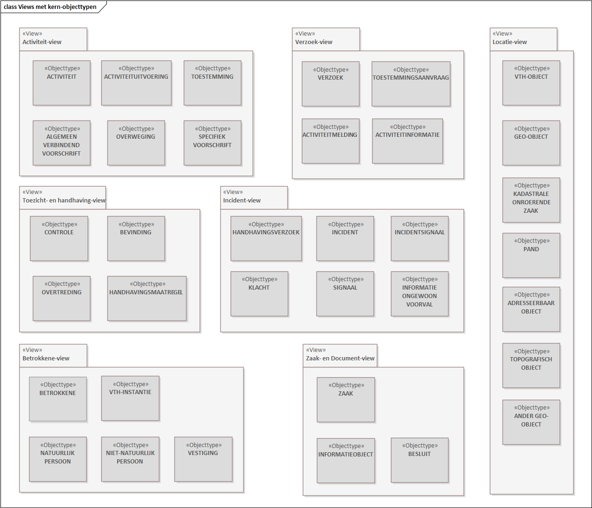

# Gestructureerde datatypen {#69B026E5}
## Gestructureerd datatype NEN3610ID {#25D100C0}
<table id='d4e238510' style='width: 100%;'><colgroup><col id='col1' style='width: 30.211159608352013%;'>
<col id='col2' style='width: 69.788840391648%;'>
</colgroup>
<tbody><tr><td class='left' style='border-top: 0pt none #; border-left: 0pt none #; border-bottom: 0pt none #; border-right: 0pt none #;'>
<b>Naam</b>
</td>
<td class='left' style='border-top: 0pt none #; border-left: 0pt none #; border-bottom: 0pt none #; border-right: 0pt none #;'>
NEN3610ID
</td>
</tr>
<tr><td class='left' style='border-top: 0pt none #; border-left: 0pt none #; border-bottom: 0pt none #; border-right: 0pt none #;'>
<b>Herkomst</b>
</td>
<td class='left' style='border-top: 0pt none #; border-left: 0pt none #; border-bottom: 0pt none #; border-right: 0pt none #;'>
NEN3610
</td>
</tr>
<tr><td class='left' style='border-top: 0pt none #; border-left: 0pt none #; border-bottom: 0pt none #; border-right: 0pt none #;'>
<b>Definitie</b>
</td>
<td class='left' style='border-top: 0pt none #; border-left: 0pt none #; border-bottom: 0pt none #; border-right: 0pt none #;'>
Identificatiegegevens voor de universeel unieke identificatie van een object.
</td>
</tr>
<tr><td class='left' style='border-top: 0pt none #; border-left: 0pt none #; border-bottom: 0pt none #; border-right: 0pt none #;'>
<b>Herkomst definitie</b>
</td>
<td class='left' style='border-top: 0pt none #; border-left: 0pt none #; border-bottom: 0pt none #; border-right: 0pt none #;'></td>
</tr>
<tr><td class='left' style='border-top: 0pt none #; border-left: 0pt none #; border-bottom: 0pt none #; border-right: 0pt none #;'>
<b>Datum opname</b>
</td>
<td class='left' style='border-top: 0pt none #; border-left: 0pt none #; border-bottom: 0pt none #; border-right: 0pt none #;'>
12-6-2025
</td>
</tr>
<tr><td class='left' style='border-top: 0pt none #; border-left: 0pt none #; border-bottom: 0pt none #; border-right: 0pt none #;'>
<b>Lengte</b>
</td>
<td class='left' style='border-top: 0pt none #; border-left: 0pt none #; border-bottom: 0pt none #; border-right: 0pt none #;'></td>
</tr>
<tr><td class='left' style='border-top: 0pt none #; border-left: 0pt none #; border-bottom: 0pt none #; border-right: 0pt none #;'>
<b>Patroon</b>
</td>
<td class='left' style='border-top: 0pt none #; border-left: 0pt none #; border-bottom: 0pt none #; border-right: 0pt none #;'></td>
</tr>
</tbody>
</table>

### Overzicht data elementen {#12750A3A}
<table id='d4e238800' style='width: 100%;'><colgroup><col id='col1' style='width: 3.6687507372891353%;'>
<col id='col2' style='width: 23.062404152412412%;'>
<col id='col3' style='width: 47.52860681844992%;'>
<col id='col4' style='width: 17.164091069953994%;'>
<col id='col5' style='width: 8.576147221894539%;'>
</colgroup>
<tbody><tr><td class='left' style='border-top: 0pt none #; border-left: 0pt none #; border-bottom: 0pt none #; border-right: 0pt none #;'></td>
<td class='left' style='border-top: 0pt none #; border-left: 0pt none #; border-bottom: 0pt none #; border-right: 0pt none #;'>
<i>Data element</i>
</td>
<td class='left' style='border-top: 0pt none #; border-left: 0pt none #; border-bottom: 0pt none #; border-right: 0pt none #;'>
<i>Definitie</i>
</td>
<td class='left' style='border-top: 0pt none #; border-left: 0pt none #; border-bottom: 0pt none #; border-right: 0pt none #;'>
<i>Formaat</i>
</td>
<td class='left' style='border-top: 0pt none #; border-left: 0pt none #; border-bottom: 0pt none #; border-right: 0pt none #;'>
<i>Card</i>
</td>
</tr>
<tr><td class='left' style='border-top: 0pt none #; border-left: 0pt none #; border-bottom: 0pt none #; border-right: 0pt none #;'>
 
</td>
<td class='left' style='border-top: 0pt none #; border-left: 0pt none #; border-bottom: 0pt none #; border-right: 0pt none #;'>
namespace
</td>
<td class='left' style='border-top: 0pt none #; border-left: 0pt none #; border-bottom: 0pt none #; border-right: 0pt none #;'>
Unieke verwijzing naar een registratie van objecten.
</td>
<td class='left' style='border-top: 0pt none #; border-left: 0pt none #; border-bottom: 0pt none #; border-right: 0pt none #;'>
CharacterString
</td>
<td class='left' style='border-top: 0pt none #; border-left: 0pt none #; border-bottom: 0pt none #; border-right: 0pt none #;'>
1
</td>
</tr>
<tr><td class='left' style='border-top: 0pt none #; border-left: 0pt none #; border-bottom: 0pt none #; border-right: 0pt none #;'>
 
</td>
<td class='left' style='border-top: 0pt none #; border-left: 0pt none #; border-bottom: 0pt none #; border-right: 0pt none #;'>
lokaalID
</td>
<td class='left' style='border-top: 0pt none #; border-left: 0pt none #; border-bottom: 0pt none #; border-right: 0pt none #;'></td>
<td class='left' style='border-top: 0pt none #; border-left: 0pt none #; border-bottom: 0pt none #; border-right: 0pt none #;'>
CharacterString
</td>
<td class='left' style='border-top: 0pt none #; border-left: 0pt none #; border-bottom: 0pt none #; border-right: 0pt none #;'>
1
</td>
</tr>
</tbody>
</table>

### Data element namespace {#33542114}
<table id='d4e239125' style='width: 100%;'><colgroup><col id='col1' style='width: 30.211159608352013%;'>
<col id='col2' style='width: 69.788840391648%;'>
</colgroup>
<tbody><tr><td class='left' style='border-top: 0pt none #; border-left: 0pt none #; border-bottom: 0pt none #; border-right: 0pt none #;'>
<b>Naam</b>
</td>
<td class='left' style='border-top: 0pt none #; border-left: 0pt none #; border-bottom: 0pt none #; border-right: 0pt none #;'>
namespace
</td>
</tr>
<tr><td class='left' style='border-top: 0pt none #; border-left: 0pt none #; border-bottom: 0pt none #; border-right: 0pt none #;'>
<b>Herkomst</b>
</td>
<td class='left' style='border-top: 0pt none #; border-left: 0pt none #; border-bottom: 0pt none #; border-right: 0pt none #;'>
NEN3610
</td>
</tr>
<tr><td class='left' style='border-top: 0pt none #; border-left: 0pt none #; border-bottom: 0pt none #; border-right: 0pt none #;'>
<b>Definitie</b>
</td>
<td class='left' style='border-top: 0pt none #; border-left: 0pt none #; border-bottom: 0pt none #; border-right: 0pt none #;'>
Unieke verwijzing naar een registratie van objecten.
</td>
</tr>
<tr><td class='left' style='border-top: 0pt none #; border-left: 0pt none #; border-bottom: 0pt none #; border-right: 0pt none #;'>
<b>Herkomst definitie</b>
</td>
<td class='left' style='border-top: 0pt none #; border-left: 0pt none #; border-bottom: 0pt none #; border-right: 0pt none #;'></td>
</tr>
<tr><td class='left' style='border-top: 0pt none #; border-left: 0pt none #; border-bottom: 0pt none #; border-right: 0pt none #;'>
<b>Indicatie kardinaliteit</b>
</td>
<td class='left' style='border-top: 0pt none #; border-left: 0pt none #; border-bottom: 0pt none #; border-right: 0pt none #;'>
1
</td>
</tr>
<tr><td class='left' style='border-top: 0pt none #; border-left: 0pt none #; border-bottom: 0pt none #; border-right: 0pt none #;'>
<b>Formaat</b>
</td>
<td class='left' style='border-top: 0pt none #; border-left: 0pt none #; border-bottom: 0pt none #; border-right: 0pt none #;'>
CharacterString
</td>
</tr>
<tr><td class='left' style='border-top: 0pt none #; border-left: 0pt none #; border-bottom: 0pt none #; border-right: 0pt none #;'>
<b>Patroon</b>
</td>
<td class='left' style='border-top: 0pt none #; border-left: 0pt none #; border-bottom: 0pt none #; border-right: 0pt none #;'></td>
</tr>
</tbody>
</table>

### Data element lokaalID {#7AB34CC0}
<table id='d4e239445' style='width: 100%;'><colgroup><col id='col1' style='width: 30.211159608352013%;'>
<col id='col2' style='width: 69.788840391648%;'>
</colgroup>
<tbody><tr><td class='left' style='border-top: 0pt none #; border-left: 0pt none #; border-bottom: 0pt none #; border-right: 0pt none #;'>
<b>Naam</b>
</td>
<td class='left' style='border-top: 0pt none #; border-left: 0pt none #; border-bottom: 0pt none #; border-right: 0pt none #;'>
lokaalID
</td>
</tr>
<tr><td class='left' style='border-top: 0pt none #; border-left: 0pt none #; border-bottom: 0pt none #; border-right: 0pt none #;'>
<b>Herkomst</b>
</td>
<td class='left' style='border-top: 0pt none #; border-left: 0pt none #; border-bottom: 0pt none #; border-right: 0pt none #;'>
NEN3610
</td>
</tr>
<tr><td class='left' style='border-top: 0pt none #; border-left: 0pt none #; border-bottom: 0pt none #; border-right: 0pt none #;'>
<b>Definitie</b>
</td>
<td class='left' style='border-top: 0pt none #; border-left: 0pt none #; border-bottom: 0pt none #; border-right: 0pt none #;'>
Unieke identificatiecode binnen een registratie.
</td>
</tr>
<tr><td class='left' style='border-top: 0pt none #; border-left: 0pt none #; border-bottom: 0pt none #; border-right: 0pt none #;'>
<b>Herkomst definitie</b>
</td>
<td class='left' style='border-top: 0pt none #; border-left: 0pt none #; border-bottom: 0pt none #; border-right: 0pt none #;'></td>
</tr>
<tr><td class='left' style='border-top: 0pt none #; border-left: 0pt none #; border-bottom: 0pt none #; border-right: 0pt none #;'>
<b>Indicatie kardinaliteit</b>
</td>
<td class='left' style='border-top: 0pt none #; border-left: 0pt none #; border-bottom: 0pt none #; border-right: 0pt none #;'>
1
</td>
</tr>
<tr><td class='left' style='border-top: 0pt none #; border-left: 0pt none #; border-bottom: 0pt none #; border-right: 0pt none #;'>
<b>Formaat</b>
</td>
<td class='left' style='border-top: 0pt none #; border-left: 0pt none #; border-bottom: 0pt none #; border-right: 0pt none #;'>
CharacterString
</td>
</tr>
<tr><td class='left' style='border-top: 0pt none #; border-left: 0pt none #; border-bottom: 0pt none #; border-right: 0pt none #;'>
<b>Patroon</b>
</td>
<td class='left' style='border-top: 0pt none #; border-left: 0pt none #; border-bottom: 0pt none #; border-right: 0pt none #;'></td>
</tr>
</tbody>
</table>

</img>
 
 
Bijlage 2: Gerefereerde bronnen
In de beschrijving van het informatiemodel wordt d.m.v. afkortingen gerefereerd aan diverse andere informatiemodellen en bronnen. Dit betreffen:
<table id='d4e239908' style='width: 100%;'><colgroup><col id='col1' style='width: 27.65772613747421%;'>
<col id='col2' style='width: 72.34227386252579%;'>
</colgroup>
<tbody><tr><td class='left' style='border-top: 0.5pt solid #000000; border-left: 0.5pt solid #000000; border-bottom: 0.5pt solid #000000; border-right: 0.5pt solid #000000;'>
<b>Afkorting</b>
</td>
<td class='left' style='border-top: 0.5pt solid #000000; border-left: 0.5pt solid #000000; border-bottom: 0.5pt solid #000000; border-right: 0.5pt solid #000000;'>
<b>Naam (en bronhouder)</b>
</td>
</tr>
<tr><td class='left' style='border-top: 0.5pt solid #000000; border-left: 0.5pt solid #000000; border-bottom: 0.5pt solid #000000; border-right: 0.5pt solid #000000;'>
CImAADV (of: AADV)
</td>
<td class='left' style='border-top: 0.5pt solid #000000; border-left: 0.5pt solid #000000; border-bottom: 0.5pt solid #000000; border-right: 0.5pt solid #000000;'>
Informatiemodel Altijd Actuele Digitale Vergunning (Provincie Zuid-Holland)
</td>
</tr>
<tr><td class='left' style='border-top: 0.5pt solid #000000; border-left: 0.5pt solid #000000; border-bottom: 0.5pt solid #000000; border-right: 0.5pt solid #000000;'>
BAG
</td>
<td class='left' style='border-top: 0.5pt solid #000000; border-left: 0.5pt solid #000000; border-bottom: 0.5pt solid #000000; border-right: 0.5pt solid #000000;'>
Basisregistratie Adressen en Gebouwen (Ministerie van […])
</td>
</tr>
<tr><td class='left' style='border-top: 0.5pt solid #000000; border-left: 0.5pt solid #000000; border-bottom: 0.5pt solid #000000; border-right: 0.5pt solid #000000;'>
BAG Begrippenlijst
</td>
<td class='left' style='border-top: 0.5pt solid #000000; border-left: 0.5pt solid #000000; border-bottom: 0.5pt solid #000000; border-right: 0.5pt solid #000000;'>
[…]
</td>
</tr>
<tr><td class='left' style='border-top: 0.5pt solid #000000; border-left: 0.5pt solid #000000; border-bottom: 0.5pt solid #000000; border-right: 0.5pt solid #000000;'>
BGT Gegevenscatalogus 
</td>
<td class='left' style='border-top: 0.5pt solid #000000; border-left: 0.5pt solid #000000; border-bottom: 0.5pt solid #000000; border-right: 0.5pt solid #000000;'>
[…]
</td>
</tr>
<tr><td class='left' style='border-top: 0.5pt solid #000000; border-left: 0.5pt solid #000000; border-bottom: 0.5pt solid #000000; border-right: 0.5pt solid #000000;'>
BRP
</td>
<td class='left' style='border-top: 0.5pt solid #000000; border-left: 0.5pt solid #000000; border-bottom: 0.5pt solid #000000; border-right: 0.5pt solid #000000;'>
Basisregistratie Personen (ministerie van Binnenlandse zaken)
</td>
</tr>
<tr><td class='left' style='border-top: 0.5pt solid #000000; border-left: 0.5pt solid #000000; border-bottom: 0.5pt solid #000000; border-right: 0.5pt solid #000000;'>
CIMOW
</td>
<td class='left' style='border-top: 0.5pt solid #000000; border-left: 0.5pt solid #000000; border-bottom: 0.5pt solid #000000; border-right: 0.5pt solid #000000;'>
Conceptueel informatiemodel Omgevingswet (Geonovum)
</td>
</tr>
<tr><td class='left' style='border-top: 0.5pt solid #000000; border-left: 0.5pt solid #000000; border-bottom: 0.5pt solid #000000; border-right: 0.5pt solid #000000;'>
DigiVTH
</td>
<td class='left' style='border-top: 0.5pt solid #000000; border-left: 0.5pt solid #000000; border-bottom: 0.5pt solid #000000; border-right: 0.5pt solid #000000;'>
Programma Digitalisering VTH (www.digitaliseringVTH.nl). 

Het voorliggende informatiemodel is in belangrijke mate binnen dit programma opgesteld. 
</td>
</tr>
<tr><td class='left' style='border-top: 0.5pt solid #000000; border-left: 0.5pt solid #000000; border-bottom: 0.5pt solid #000000; border-right: 0.5pt solid #000000;'>
DSO-thesaurus
</td>
<td class='left' style='border-top: 0.5pt solid #000000; border-left: 0.5pt solid #000000; border-bottom: 0.5pt solid #000000; border-right: 0.5pt solid #000000;'>
[…] ([…])
</td>
</tr>
<tr><td class='left' style='border-top: 0.5pt solid #000000; border-left: 0.5pt solid #000000; border-bottom: 0.5pt solid #000000; border-right: 0.5pt solid #000000;'>
GIR
</td>
<td class='left' style='border-top: 0.5pt solid #000000; border-left: 0.5pt solid #000000; border-bottom: 0.5pt solid #000000; border-right: 0.5pt solid #000000;'>
Gemeenschappelijke InspectieRuimte ([…])
</td>
</tr>
<tr><td class='left' style='border-top: 0.5pt solid #000000; border-left: 0.5pt solid #000000; border-bottom: 0.5pt solid #000000; border-right: 0.5pt solid #000000;'>
HR
</td>
<td class='left' style='border-top: 0.5pt solid #000000; border-left: 0.5pt solid #000000; border-bottom: 0.5pt solid #000000; border-right: 0.5pt solid #000000;'>
HandelsRegister (Kamer van Koophandel)
</td>
</tr>
<tr><td class='left' style='border-top: 0.5pt solid #000000; border-left: 0.5pt solid #000000; border-bottom: 0.5pt solid #000000; border-right: 0.5pt solid #000000;'>
IBP VTH
</td>
<td class='left' style='border-top: 0.5pt solid #000000; border-left: 0.5pt solid #000000; border-bottom: 0.5pt solid #000000; border-right: 0.5pt solid #000000;'>
Interbestuurlijk Programma Versterking VTH-keten (beeindigd per 1-10-2024)
</td>
</tr>
<tr><td class='left' style='border-top: 0.5pt solid #000000; border-left: 0.5pt solid #000000; border-bottom: 0.5pt solid #000000; border-right: 0.5pt solid #000000;'>
IBV
</td>
<td class='left' style='border-top: 0.5pt solid #000000; border-left: 0.5pt solid #000000; border-bottom: 0.5pt solid #000000; border-right: 0.5pt solid #000000;'>
[…] ([…])
</td>
</tr>
<tr><td class='left' style='border-top: 0.5pt solid #000000; border-left: 0.5pt solid #000000; border-bottom: 0.5pt solid #000000; border-right: 0.5pt solid #000000;'>
IMAM
</td>
<td class='left' style='border-top: 0.5pt solid #000000; border-left: 0.5pt solid #000000; border-bottom: 0.5pt solid #000000; border-right: 0.5pt solid #000000;'>
Informatiemodel Aanvragen en Meldingen (Programma DSO)
</td>
</tr>
<tr><td class='left' style='border-top: 0.5pt solid #000000; border-left: 0.5pt solid #000000; border-bottom: 0.5pt solid #000000; border-right: 0.5pt solid #000000;'>
IMEV
</td>
<td class='left' style='border-top: 0.5pt solid #000000; border-left: 0.5pt solid #000000; border-bottom: 0.5pt solid #000000; border-right: 0.5pt solid #000000;'>
Informatiemodel Externe Veiligheid (Geonovum)
</td>
</tr>
<tr><td class='left' style='border-top: 0.5pt solid #000000; border-left: 0.5pt solid #000000; border-bottom: 0.5pt solid #000000; border-right: 0.5pt solid #000000;'>
IMKAD
</td>
<td class='left' style='border-top: 0.5pt solid #000000; border-left: 0.5pt solid #000000; border-bottom: 0.5pt solid #000000; border-right: 0.5pt solid #000000;'>
[…] (Kadaster)
</td>
</tr>
<tr><td class='left' style='border-top: 0.5pt solid #000000; border-left: 0.5pt solid #000000; border-bottom: 0.5pt solid #000000; border-right: 0.5pt solid #000000;'>
ImIV
</td>
<td class='left' style='border-top: 0.5pt solid #000000; border-left: 0.5pt solid #000000; border-bottom: 0.5pt solid #000000; border-right: 0.5pt solid #000000;'>
Informatiemodel InspectieView (ILT)
</td>
</tr>
<tr><td class='left' style='border-top: 0.5pt solid #000000; border-left: 0.5pt solid #000000; border-bottom: 0.5pt solid #000000; border-right: 0.5pt solid #000000;'>
IPLO
</td>
<td class='left' style='border-top: 0.5pt solid #000000; border-left: 0.5pt solid #000000; border-bottom: 0.5pt solid #000000; border-right: 0.5pt solid #000000;'>
[…] ([…])
</td>
</tr>
<tr><td class='left' style='border-top: 0.5pt solid #000000; border-left: 0.5pt solid #000000; border-bottom: 0.5pt solid #000000; border-right: 0.5pt solid #000000;'>
ImZTC
</td>
<td class='left' style='border-top: 0.5pt solid #000000; border-left: 0.5pt solid #000000; border-bottom: 0.5pt solid #000000; border-right: 0.5pt solid #000000;'>
Informatiemodel ZaakTypeCatalogus (VNG)
</td>
</tr>
<tr><td class='left' style='border-top: 0.5pt solid #000000; border-left: 0.5pt solid #000000; border-bottom: 0.5pt solid #000000; border-right: 0.5pt solid #000000;'>
LBR
</td>
<td class='left' style='border-top: 0.5pt solid #000000; border-left: 0.5pt solid #000000; border-bottom: 0.5pt solid #000000; border-right: 0.5pt solid #000000;'>
Landelijke Benadering Risicobedrijven (BRZO+)
</td>
</tr>
<tr><td class='left' style='border-top: 0.5pt solid #000000; border-left: 0.5pt solid #000000; border-bottom: 0.5pt solid #000000; border-right: 0.5pt solid #000000;'>
NEN3610
</td>
<td class='left' style='border-top: 0.5pt solid #000000; border-left: 0.5pt solid #000000; border-bottom: 0.5pt solid #000000; border-right: 0.5pt solid #000000;'>
[…] (NNI / Geonovum)
</td>
</tr>
<tr><td class='left' style='border-top: 0.5pt solid #000000; border-left: 0.5pt solid #000000; border-bottom: 0.5pt solid #000000; border-right: 0.5pt solid #000000;'>
NORA Geo-katern
</td>
<td class='left' style='border-top: 0.5pt solid #000000; border-left: 0.5pt solid #000000; border-bottom: 0.5pt solid #000000; border-right: 0.5pt solid #000000;'>
[,,,] (NORA)
</td>
</tr>
<tr><td class='left' style='border-top: 0.5pt solid #000000; border-left: 0.5pt solid #000000; border-bottom: 0.5pt solid #000000; border-right: 0.5pt solid #000000;'>
Ow-architectuur provincies
</td>
<td class='left' style='border-top: 0.5pt solid #000000; border-left: 0.5pt solid #000000; border-bottom: 0.5pt solid #000000; border-right: 0.5pt solid #000000;'>
[…] (Interprovinciaal Overleg)
</td>
</tr>
<tr><td class='left' style='border-top: 0.5pt solid #000000; border-left: 0.5pt solid #000000; border-bottom: 0.5pt solid #000000; border-right: 0.5pt solid #000000;'>
Regeling Omgevingsrecht
</td>
<td class='left' style='border-top: 0.5pt solid #000000; border-left: 0.5pt solid #000000; border-bottom: 0.5pt solid #000000; border-right: 0.5pt solid #000000;'></td>
</tr>
<tr><td class='left' style='border-top: 0.5pt solid #000000; border-left: 0.5pt solid #000000; border-bottom: 0.5pt solid #000000; border-right: 0.5pt solid #000000;'>
RIHa
</td>
<td class='left' style='border-top: 0.5pt solid #000000; border-left: 0.5pt solid #000000; border-bottom: 0.5pt solid #000000; border-right: 0.5pt solid #000000;'>
Referentie Informatiemodel Handhaving ([…])
</td>
</tr>
<tr><td class='left' style='border-top: 0.5pt solid #000000; border-left: 0.5pt solid #000000; border-bottom: 0.5pt solid #000000; border-right: 0.5pt solid #000000;'>
RGBZ
</td>
<td class='left' style='border-top: 0.5pt solid #000000; border-left: 0.5pt solid #000000; border-bottom: 0.5pt solid #000000; border-right: 0.5pt solid #000000;'>
Referentiemodel Basisgegevens Zaken (VNG)
</td>
</tr>
<tr><td class='left' style='border-top: 0.5pt solid #000000; border-left: 0.5pt solid #000000; border-bottom: 0.5pt solid #000000; border-right: 0.5pt solid #000000;'></td>
<td class='left' style='border-top: 0.5pt solid #000000; border-left: 0.5pt solid #000000; border-bottom: 0.5pt solid #000000; border-right: 0.5pt solid #000000;'></td>
</tr>
</tbody>
</table>

